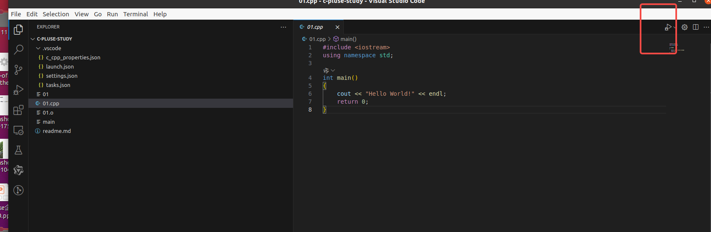
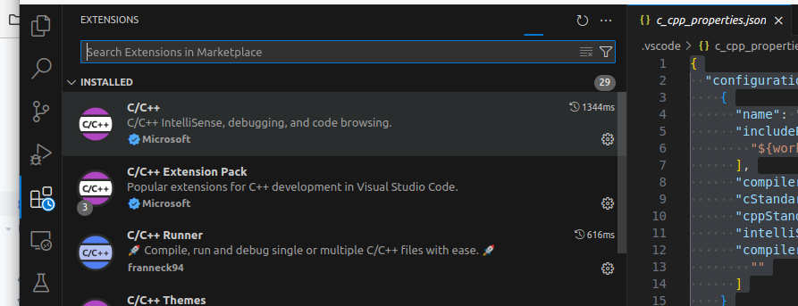

vscode 环境调试







tasks.json

```

{
    "tasks": [
        {
            "type": "cppbuild",
            "label": "C/C++: gcc 生成活动文件",
            "command": "/usr/bin/g++",
            "args": [
                "-fdiagnostics-color=always",
                "-g",
                "${file}",
                "-o",
                "${fileDirname}/${fileBasenameNoExtension}",
                ""
            ],
            "options": {
                "cwd": "${fileDirname}"
            },
            "problemMatcher": [
                "$gcc"
            ],
            "group": {
                "kind": "build",
                "isDefault": true
            },
            "detail": "调试器生成的任务。"
        }
    ],
    "version": "2.0.0"
}

```

settings.json

```

{
  "C_Cpp_Runner.cCompilerPath": "gcc",
  "C_Cpp_Runner.cppCompilerPath": "g++",
  "C_Cpp_Runner.debuggerPath": "gdb",
  "C_Cpp_Runner.cStandard": "",
  "C_Cpp_Runner.cppStandard": "",
  "C_Cpp_Runner.msvcBatchPath": "",
  "C_Cpp_Runner.useMsvc": false,
  "C_Cpp_Runner.warnings": [
    "-Wall",
    "-Wextra",
    "-Wpedantic",
    "-Wshadow",
    "-Wformat=2",
    "-Wcast-align",
    "-Wconversion",
    "-Wsign-conversion",
    "-Wnull-dereference"
  ],
  "C_Cpp_Runner.msvcWarnings": [
    "/W4",
    "/permissive-",
    "/w14242",
    "/w14287",
    "/w14296",
    "/w14311",
    "/w14826",
    "/w44062",
    "/w44242",
    "/w14905",
    "/w14906",
    "/w14263",
    "/w44265",
    "/w14928"
  ],
  "C_Cpp_Runner.enableWarnings": true,
  "C_Cpp_Runner.warningsAsError": false,
  "C_Cpp_Runner.compilerArgs": [],
  "C_Cpp_Runner.linkerArgs": [],
  "C_Cpp_Runner.includePaths": [],
  "C_Cpp_Runner.includeSearch": [
    "*",
    "**/*"
  ],
  "C_Cpp_Runner.excludeSearch": [
    "**/build",
    "**/build/**",
    "**/.*",
    "**/.*/**",
    "**/.vscode",
    "**/.vscode/**"
  ],
  "C_Cpp_Runner.useAddressSanitizer": false,
  "C_Cpp_Runner.useUndefinedSanitizer": false,
  "C_Cpp_Runner.useLeakSanitizer": false,
  "C_Cpp_Runner.showCompilationTime": false,
  "C_Cpp_Runner.useLinkTimeOptimization": false,
  "C_Cpp_Runner.msvcSecureNoWarnings": false,
  "files.associations": {
    "array": "cpp",
    "atomic": "cpp",
    "bit": "cpp",
    "*.tcc": "cpp",
    "cctype": "cpp",
    "clocale": "cpp",
    "cmath": "cpp",
    "cstdarg": "cpp",
    "cstddef": "cpp",
    "cstdint": "cpp",
    "cstdio": "cpp",
    "cstdlib": "cpp",
    "cwchar": "cpp",
    "cwctype": "cpp",
    "deque": "cpp",
    "unordered_map": "cpp",
    "vector": "cpp",
    "exception": "cpp",
    "algorithm": "cpp",
    "functional": "cpp",
    "iterator": "cpp",
    "memory": "cpp",
    "memory_resource": "cpp",
    "numeric": "cpp",
    "optional": "cpp",
    "random": "cpp",
    "string": "cpp",
    "string_view": "cpp",
    "system_error": "cpp",
    "tuple": "cpp",
    "type_traits": "cpp",
    "utility": "cpp",
    "fstream": "cpp",
    "initializer_list": "cpp",
    "iosfwd": "cpp",
    "iostream": "cpp",
    "istream": "cpp",
    "limits": "cpp",
    "new": "cpp",
    "ostream": "cpp",
    "sstream": "cpp",
    "stdexcept": "cpp",
    "streambuf": "cpp",
    "typeinfo": "cpp"
  }
}

```

launch.json

```

{
  "version": "0.2.0",
  "configurations": [
    {
      "name": "C/C++ Runner: Debug Session",
      "type": "cppdbg",
      "request": "launch",
      "args": [],
      "stopAtEntry": false,
      "externalConsole": false,
      "cwd": "/home/dc/wzw/study/c-pluse-study",
      "program": "/home/dc/wzw/study/c-pluse-study/build/Debug/outDebug",
      "MIMode": "gdb",
      "miDebuggerPath": "gdb",
      "setupCommands": [
        {
          "description": "Enable pretty-printing for gdb",
          "text": "-enable-pretty-printing",
          "ignoreFailures": true
        }
      ]
    }
  ]
}

```

c_cpp_properties.json


```

{
  "configurations": [
    {
      "name": "linux-gcc-x64",
      "includePath": [
        "${workspaceFolder}/**"
      ],
      "compilerPath": "/usr/bin/gcc",
      "cStandard": "${default}",
      "cppStandard": "${default}",
      "intelliSenseMode": "linux-gcc-x64",
      "compilerArgs": [
        ""
      ]
    }
  ],
  "version": 4
}

```

调试环境
https://www.bilibili.com/video/BV1Bc411S7ch?spm_id_from=333.788.videopod.episodes&vd_source=ffda878df0ed45bee1ade91d8f451048&p=2
https://www.bilibili.com/video/BV15Y411j7JW/?spm_id_from=333.337.search-card.all.click&vd_source=ffda878df0ed45bee1ade91d8f451048


