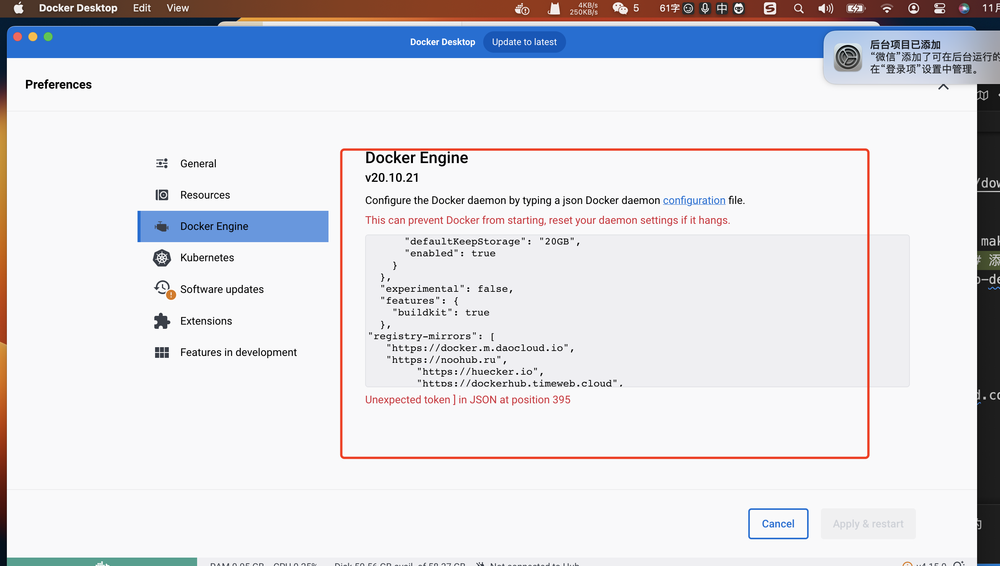
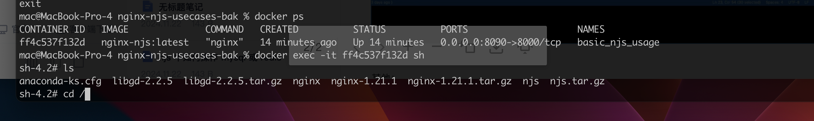
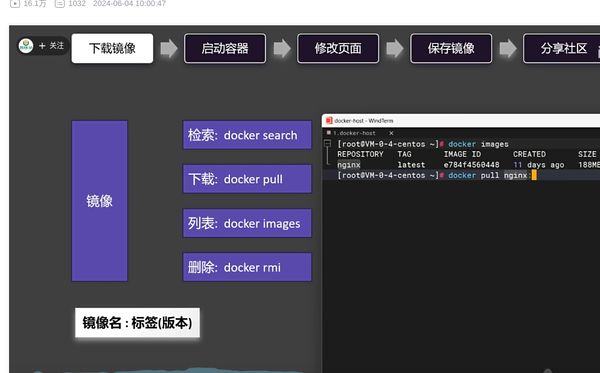
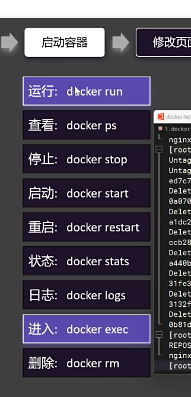
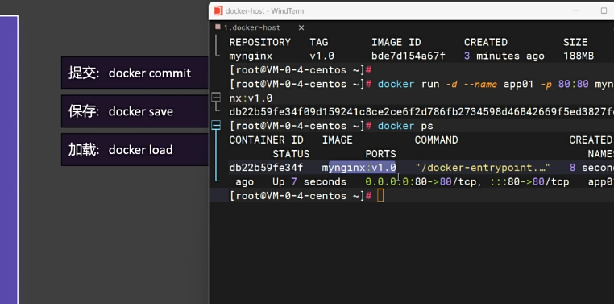
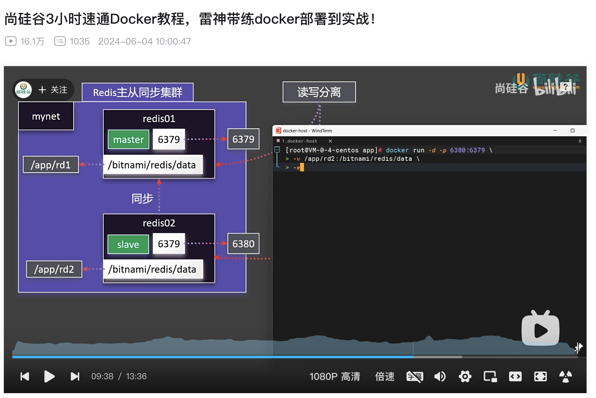
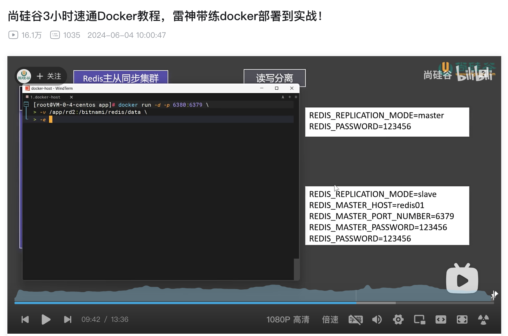

```

{
    "registry-mirrors" :
    [
        "https://docker.m.daocloud.io",
        "https://noohub.ru",
        "https://huecker.io",
        "https://dockerhub.timeweb.cloud",
        "https://docker.rainbond.cc"
    ]
}

```

mac 上修改源



```

{
  "builder": {
    "gc": {
      "defaultKeepStorage": "20GB",
      "enabled": true
    }
  },
  "experimental": false,
  "features": {
    "buildkit": true
  },
"registry-mirrors": [
   "https://docker.m.daocloud.io",
   "https://noohub.ru",
   "https://huecker.io",
   "https://dockerhub.timeweb.cloud",
   "https://docker.rainbond.cc",
   "https://docker.1panelproxy.com",

]
}

```

```
sudo mkdir -p /etc/docker
sudo tee /etc/docker/daemon.json <<EOF
{
"registry-mirrors" :
[
"https://docker.m.daocloud.io",
"https://noohub.ru",
"https://huecker.io",
"https://dockerhub.timeweb.cloud",
"https://docker.rainbond.cc"
]
}
EOF
sudo systemctl daemon-reload
sudo systemctl restart docker
执行命令拉取镜像文件
sudo docker pull dockerhub.icu/library/nginx
sudo docker image ls
sudo docker run hello-docker
sudo docker run redis
https://gist.github.com/y0ngb1n/7e8f16af3242c7815e7ca2f0833d3ea6
创建 docker-study 文件夹
创建 Dockerfile 文件 内容如下
FROM node:14-alpine
COPY index.js /index.js
CMD node /index.js
创建 index.js 文件
console.log('1111');
在目录下执行创建镜像文件命令
sudo docker build -t hello-docker .
导出镜像文件
sudo docker save -o hello_docker.tar hello-docker:latest
加载镜像文件
sudo docker load -i xxx
查看正在运行的镜像文件
sudo docker ps -a
sudo apt-get install docker.io
source /etc/bash_completion.d/docker.io
sudo docker.io version
另外一种安装方式
curl -sSL https://get.docker.com/ubuntu/|sudo.sh
sudo docker run ubuntu echo 'Hello world'
不用sudo 启动 docker
添加用户组
sudo groupadd docker
sudo gpasswd -a jkxy docker
sudo service docker restart
需要注销后重新登录才会生效
docker version
加载镜像文件
docker load -i xxx
加载后运行镜像文件
sudo docker run -d -p 6379:6379 redis
sudo docker run -d -p 5432:5432  -e POSTGRES_PASSWORD=admin -v /home/dc/postgresql/data:/var/lib/postgresql/data postgres:12.18-alpine
查看运行的进程
sudo docker ps
参考文档
https://blog.csdn.net/qq_40163617/article/details/107578706
启动本地docker
sudo systemctl start docker
启动docker中的某个镜像
docker start d7b67eb75ca2
sudo docker pull nacos-registry.cn-hangzhou.cr.aliyuncs.com/nacos/nacos-server
sudo docker pull <your-mirror>.mirror.aliyuncs.com/nacos/nacos-server
docker run -d --name nacos -p 8848:8848 -e PREFER_HOST_MODE=hostname -e MODE=standalone nacos/nacos-server
启动后，您可以通过访问http://localhost:8848/nacos来验证Nacos是否成功启动并运行正常
http://localhost:8848/nacos

```


问题排查，进入 docker 下载 的 centos7内部查看网络连接情况

```
docker pull centos:7
docker run -it centos:7 /bin/bash
ping www.baidu.com
ping 不通，修改 centos 的 dns
echo "nameserver 8.8.8.8" > /etc/resolv.conf

```

仓库：
https://github.com/wangzhiwei1888/nginx-njs-usecases


```
0.download-and-install 目录的
Dockerfile 修改为：

# build with:
#   docker build -t nginx-njs:latest . 

FROM centos:7

COPY resolv.conf /etc/resolv.conf

ENV nginx_version=1.21.1

RUN cp /etc/yum.repos.d/CentOS-Base.repo /etc/yum.repos.d/CentOS-Base.repo.backup
# 替换为阿里云的镜像源
RUN curl -o /etc/yum.repos.d/CentOS-Base.repo http://mirrors.aliyun.com/repo/Centos-7.repo
RUN yum clean all
RUN yum makecache

RUN yum install -y epel-release
RUN yum install -y curl vim wget file

WORKDIR /root
RUN wget http://nginx.org/download/nginx-${nginx_version}.tar.gz
RUN tar zxf nginx-${nginx_version}.tar.gz

RUN wget http://hg.nginx.org/njs/archive/tip.tar.gz -O njs.tar.gz
RUN tar zxf njs.tar.gz

RUN mv $(find /root -name "njs-[0-9a-f]*") njs
RUN wget https://github.com/libgd/libgd/releases/download/gd-2.2.5/libgd-2.2.5.tar.gz
RUN tar zxf libgd-2.2.5.tar.gz

RUN yum install -y gcc automake autoconf libtool make
RUN yum install -y libxml2-devel libxslt-devel  # 添加这一行
RUN yum install  -y openssl-devel pcre-devel zlib-devel libpng-devel libjpeg-devel

WORKDIR /root/libgd-2.2.5
RUN ./configure --with-png --with-jpeg
RUN make
RUN make install
RUN echo /usr/local/lib > /etc/ld.so.conf.d/libgd.conf

WORKDIR /root/nginx-${nginx_version}
RUN ./configure \
    --prefix=/root/nginx \
    --with-http_ssl_module \
    --with-stream \
    --with-http_image_filter_module \
    --with-http_realip_module \
    --with-stream_ssl_module \
    --add-dynamic-module=/root/njs/nginx
RUN make
RUN make install

WORKDIR /root
ENV PATH=$PATH:/root/nginx/sbin

RUN ldconfig

```

添加 resolv.conf
内容为

```
nameserver 8.8.8.8
nameserver 8.8.4.4

```



进入镜像内部 可以查看镜像内部情况

```
docker exec -it ff4c537f132d sh

```


4.64 复制打开抖音，看看【大神开发的作品】Docker 9分钟快速入门。# 程序员 # 教程... https://v.douyin.com/iDkATutT/ NjP:/ 05/18 h@o.dA 









redis 主从集群

```

docker network create mynet

docker pull bitnami/redis

mkdir -p /Users/mac/study/app/rd1
mkdir -p /Users/mac/study/app/rd2

主：

docker run -d -p 6379:6379 \
> -v /Users/mac/study/app/rd1:/bitnami/redis/data \
> -e REDIS_REPLICATION_MODE=master \
> -e REDIS_PASSWORD=123456 \
> --network=mynet --name=redis01 \
> bitnami/redis


从机
docker run -d -p 6380:6379 \
-v /Users/mac/study/app/rd2:/bitnami/redis/data \
-e REDIS_REPLICATION_MODE=slave \
-e REDIS_MASTER_HOST=redis01 \
-e REDIS_MASTER_PORT_NUMBER=6379 \
-e REDIS_MASTER_PASSWORD=123456 \
-e REDIS_PASSWORD=123456 \
--network=mynet --name=redis02 \
bitnami/redis


redis-cli -h 127.0.0.1 -p 6379 -a 123456
set a 1

redis-cli -h 127.0.0.1 -p 6380 -a 123456
get a


```






https://github.com/bitnami/containers/blob/main/bitnami/redis/README.md


参考：
https://www.bilibili.com/video/BV1Zn4y1X7AZ?spm_id_from=333.788.player.switch&vd_source=ffda878df0ed45bee1ade91d8f451048&p=16
https://docs.docker.com/guides/nodejs/containerize/


curl -sSL https://resource.fit2cloud.com/1panel/package/quick_start.sh -o quick_start.sh && sudo bash quick_start.sh


设置 1Panel 端口（默认为29446）：
[1Panel Log]: 您设置的端口为：29446 
[1Panel Log]: 防火墙开放 29446 端口 
success
success
[1Panel Log]: 防火墙开放 29446 端口 
防火墙规则已更新
规则已更新(v6)
未启用防火墙(跳过重新载入)
设置 1Panel 安全入口（默认为b5637a2e52）：
[1Panel Log]: 您设置的面板安全入口为：b5637a2e52 
设置 1Panel 面板用户（默认为813b87280c）：
[1Panel Log]: 您设置的面板用户为：813b87280c 
[1Panel Log]: 设置 1Panel 面板密码，设置完成后直接回车以继续（默认为122dff0e26）： 

[1Panel Log]: 配置 1Panel Service 
Created symlink /etc/systemd/system/multi-user.target.wants/1panel.service → /etc/systemd/system/1panel.service.
[1Panel Log]: 启动 1Panel 服务 
[1Panel Log]: 1Panel 服务启动成功! 
[1Panel Log]:  
[1Panel Log]: =================感谢您的耐心等待，安装已经完成================== 
[1Panel Log]:  
[1Panel Log]: 请用浏览器访问面板: 
[1Panel Log]: 外网地址: http://114.242.100.67:29446/b5637a2e52 
[1Panel Log]: 内网地址: http://192.168.40.206:29446/b5637a2e52 
[1Panel Log]: 面板用户: 813b87280c 
[1Panel Log]: 面板密码: 122dff0e26 
[1Panel Log]:  
[1Panel Log]: 项目官网: https://1panel.cn 
[1Panel Log]: 项目文档: https://1panel.cn/docs 
[1Panel Log]: 代码仓库: https://github.com/1Panel-dev/1Panel 
[1Panel Log]:  
[1Panel Log]: 如果使用的是云服务器，请至安全组开放 29446 端口 
[1Panel Log]:  
[1Panel Log]: 为了您的服务器安全，在您离开此界面后您将无法再看到您的密码，请务必牢记您的密码。 
[1Panel Log]:  
[1Panel Log]: ================================================================ 


http://192.168.40.206:29446/apps/all

mysql
root
mysql_n6Tj3M

安装 halo
数据库名
halo_rh67h4
数据库用户
halo_enWd5p
数据库用户密码
halo_rDE33a