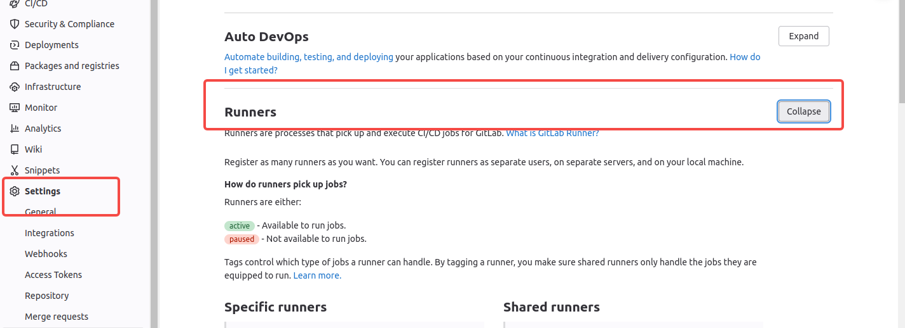

### 第一步 gitlab 新增任务（关联项目）

gitlab-runner register --tls-ca-file /etc/gitlab-runner/ca.crt

该命令会在/etc/gitlab-runner/config.toml 文件中新增一条[[runners]]记录

设置tag 用于 .gitlab-ci.yml 使用





### 第二步 编辑 config.toml

sudo vi /etc/gitlab-runner/config.toml


```

[[runners]]
  name = "项目名称"
  url = "https://gitlab地址/"
  id = 59
  token = "xxxx"
  token_obtained_at = 2025-01-17T03:28:30Z
  token_expires_at = 0001-01-01T00:00:00Z
  tls-ca-file = "/etc/gitlab-runner/ca.crt"
  executor = "docker"
  [runners.custom_build_dir]
  [runners.cache]
    MaxUploadedArchiveSize = 0
    [runners.cache.s3]
    [runners.cache.gcs]
    [runners.cache.azure]
  [runners.docker]
    tls_verify = false
    image = "centos:7"
    privileged = true
    disable_entrypoint_overwrite = false
    oom_kill_disable = false
    disable_cache = false
    volumes = ["/cache"]
    pull_policy = ["if-not-present"]
    shm_size = 0
    network_mtu = 0


```


### 第二步项目新增 文件


.gitlab-ci.yml


```

stages:
  - build_vue

build_vue:
  tags:
    - h之前注册时候用的tag
  stage: build_vue
  image: 用于打包的镜像
  script:
    - ./build/build_vue.sh
  artifacts:
    paths: # 需要打包的文件
      - ./dist/*
    expire_in: 1 week # 打包文件存储有效期
  rules:
    - if: $BUILD_OS == "kylin"
      when: always
    - if: $BUILD_OS == "centos"
      when: always
    - if: $BUILD_OS == "all" && $CI_COMMIT_REF_NAME == "分支名称"
      when: always
    - if: $CI_PIPELINE_SOURCE == "merge_request_event" # 确保job在合并请求时自动运行
      when: always
    - if: $CI_PIPELINE_SOURCE == "web" # 确保job在手动触发的时候自动调用两个job
      when: always
    - if: $CI_PIPELINE_SOURCE == "schedule" # schedule来源可以运行job 
      when: always


```

build_vue.sh
chmod +x build_vue.sh

```
#!/bin/bash
set -e
set -x
echo "开始编译"
cnpm install
cnpm run build

```