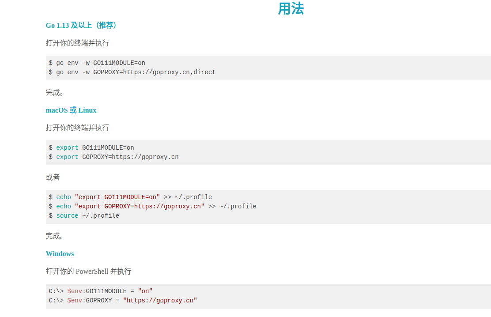
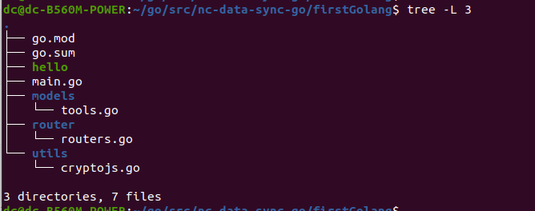
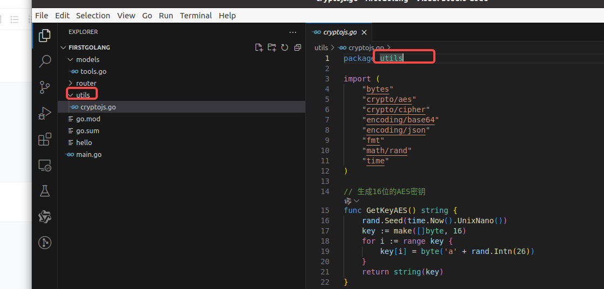

下载
https://golang.google.cn/dl/

安装
https://golang.google.cn/doc/install


rm -rf /usr/local/go && tar -C /usr/local -xzf go1.23.0.linux-amd64.tar.gz

vi .profile
export PATH=$PATH:/usr/local/go/bin

source .profile

go version

更好镜像源
go env -w GO111MODULE=on
go env -w GOPROXY=https://goproxy.io,direct


https://gin-gonic.com/zh-cn/docs/quickstart/

安装gin
go get github.com/gin-gonic/gin


安装 fresh 代替 go run xxx.go
go install github.com/pilu/fresh@latest

命令找不到，需要配置环境变量
vi .profile
export PATH=$PATH:/home/dc/go/bin
source .profile


参考视频
https://www.bilibili.com/video/BV1tU4y1u7i7/?spm_id_from=333.337.search-card.all.click&vd_source=ffda878df0ed45bee1ade91d8f451048


运行项目
go run xxx.go


参考
https://github.com/goproxyio/goproxy.io/blob/master/content/zh/docs/getting-started.md


go项目开发学习

8小时转职Golang工程师(如果你想低成本学习Go语言)
https://www.bilibili.com/video/BV1gf4y1r79E?spm_id_from=333.788.videopod.episodes&vd_source=ffda878df0ed45bee1ade91d8f451048&p=2

在线文章：https://www.yuque.com/aceld/mo95lb/dsk886
代码
https://pan.baidu.com/disk/main?from=homeSave#/index?category=all&path=%2F%E6%88%91%E7%9A%84%E8%B5%84%E6%BA%90
gin快速入门
https://gin-gonic.com/zh-cn/docs/quickstart/
GO流行的Gin框架快速搭建开发

https://www.bilibili.com/video/BV1Jy4y1F7RG/?spm_id_from=333.337.search-card.all.click&vd_source=ffda878df0ed45bee1ade91d8f451048

go 七牛云代理
https://goproxy.cn/


开发学习
环境搭建
安装

配置
cat ~/.bashrc 添加如下配置

```
export GOROOT="/usr/local/go"
export GOPATH=$HOME/go
export GOBIN=$GOROOT/bin
export PATH=$PATH:$GOBIN

```

配置镜像源





创建 go.mod

```

go mod init firstGolang

```
export GOPATH=$HOME/go

```
在$HOME/go 即  /home/dc/go/ 目录下的 src 目录创建项目

/home/dc/go/src/nc-data-sync-go/firstGolang

```



安装gin 

```
go get -u github.com/gin-gonic/gin

```
gin 的使用参考
https://gin-gonic.com/zh-cn/docs/quickstart/

tool.go

```
package models

func Add(a int, b int) int {
    return a + b
}

```

main.go


```
package main

import (
    "firstGolang/models"
    "fmt"
)

func main() {

    num := models.Add(1, 2)
    fmt.Println("1+2=", num)
}

```

注意包名为文件夹名称



