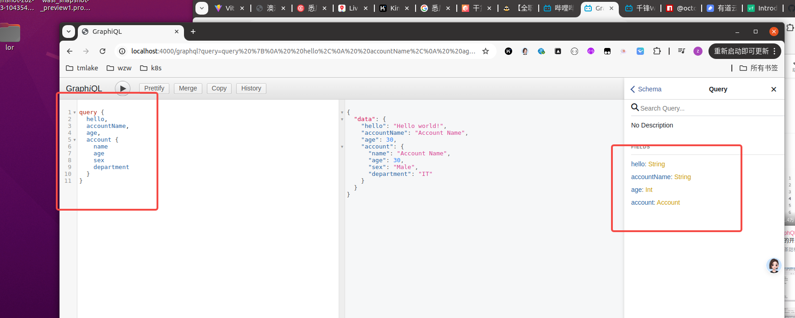
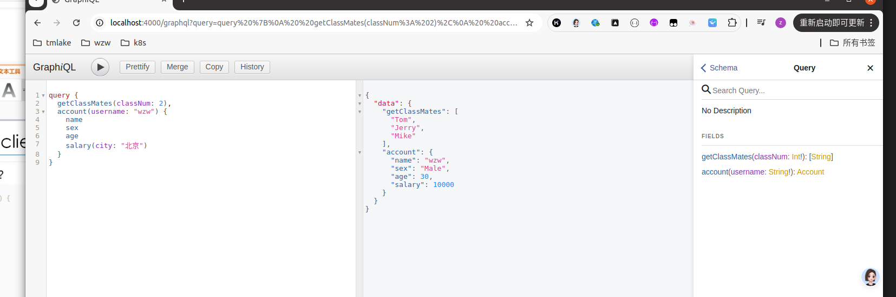
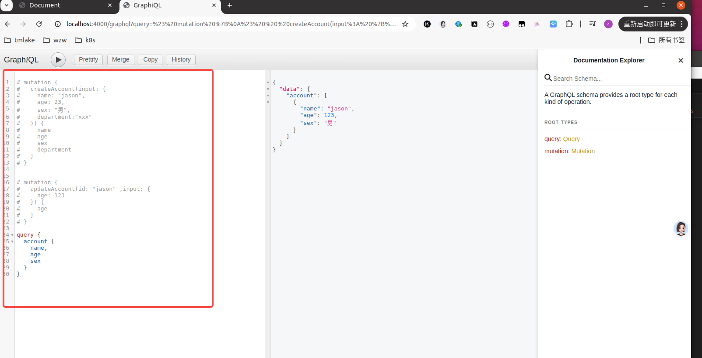
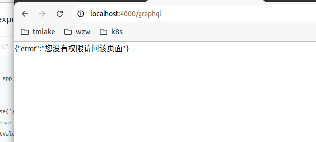
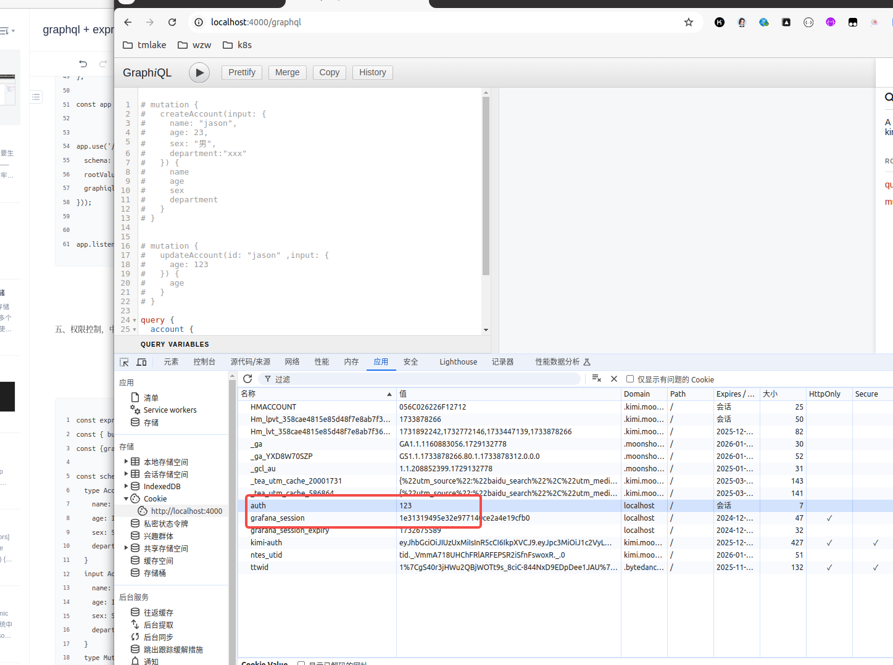
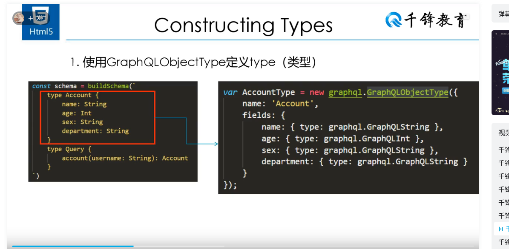
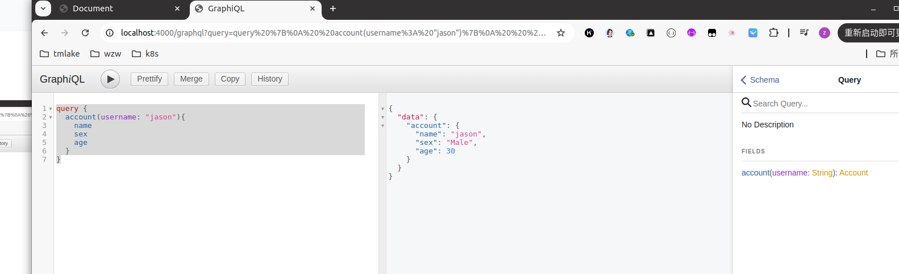
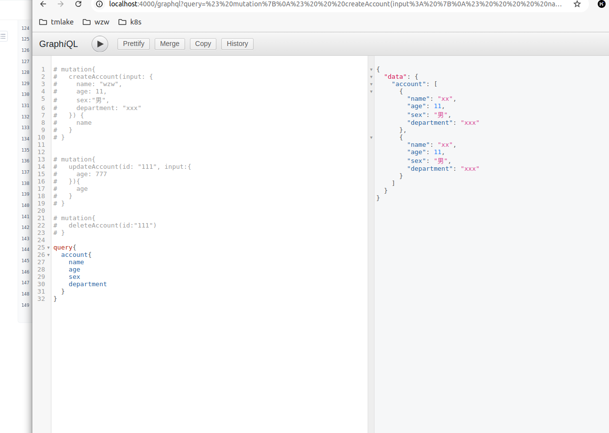

package.json


```

{
  "name": "01",
  "version": "1.0.0",
  "main": "index.js",
  "scripts": {
    "test": "echo \"Error: no test specified\" && exit 1"
  },
  "keywords": [],
  "author": "",
  "license": "ISC",
  "description": "",
  "dependencies": {
    "express": "^4.21.2",
    "express-graphql": "^0.12.0",
    "graphql": "^16.9.0",
    "nodemon": "^3.1.7"
  }
}

```

helloworld.js

```
const express = require('express');
const { buildSchema } = require('graphql');
const {graphqlHTTP} = require('express-graphql');

const schema = buildSchema(`
  type Account {
    name: String
    age: Int,
    sex: String,
    department: String
  }
  type Query {
    hello: String,
    accountName: String,
    age: Int,
    account: Account
  }
`);

const root = {
  hello: () => {
    return 'Hello world!';
  },
  accountName: () => {
    return 'Account Name';
  },
  age: () => {
    return 30;
  },
  account: () => {
    return {
      name: 'Account Name',
      age: 30,
      sex: 'Male',
      department: 'IT'
    }
  }
};

const app = express();


app.use('/graphql', graphqlHTTP({
  schema: schema,
  rootValue: root,
  graphiql: true,
}));


app.listen(4000);


```

```

nodemon helloworld.js


```

二、



baseType.js

```
const express = require('express');
const { buildSchema } = require('graphql');
const {graphqlHTTP} = require('express-graphql');

//!为必须参数
const schema = buildSchema(`
  
  type Account {
    name: String
    age: Int
    sex: String
    department: String
    salary(city: String!): Int
  }
  type Query {
    getClassMates(classNum: Int!):[String]
    account(username: String!): Account
  }
`);

const root = {
  getClassMates: ({classNum}) => {
    const obj = {
        1: ['Jack', 'Rose', 'Lucy'],
        2: ['Tom', 'Jerry', 'Mike']
    }

    return obj[classNum];
  },
  account: ({username}) => {
    const name = username;
    const sex = 'Male';
    const age = 30;
    const department = 'IT';
    const salary = ({city}) => {
      return city === '北京' ? 10000 : 4000;
    }
    return {name, sex, age, department, salary};
  }
};

const app = express();


app.use('/graphql', graphqlHTTP({
  schema: schema,
  rootValue: root,
  graphiql: true,
}));

app.listen(4000);


```

三

baseType.js

```
const express = require('express');
const { buildSchema } = require('graphql');
const {graphqlHTTP} = require('express-graphql');

//!为必须参数
const schema = buildSchema(`
  
  type Account {
    name: String
    age: Int
    sex: String
    department: String
    salary(city: String): Int
  }
  type Query {
    getClassMates(classNum: Int!):[String]
    account(username: String): Account
  }
`);

const root = {
  getClassMates: ({classNum}) => {
    const obj = {
        1: ['Jack', 'Rose', 'Lucy'],
        2: ['Tom', 'Jerry', 'Mike']
    }

    return obj[classNum];
  },
  account: ({username}) => {
    const name = username;
    const sex = 'Male';
    const age = 30;
    const department = 'IT';
    const salary = ({city}) => {
      return city === '北京' ? 10000 : 4000;
    }
    return {name, sex, age, department, salary};
  }
};

const app = express();


app.use('/graphql', graphqlHTTP({
  schema: schema,
  rootValue: root,
  graphiql: true,
}));


//静态资源目录
app.use(express.static('public'));

app.listen(4000);


```

index.html

```

<!DOCTYPE html>
<html lang="en">
<head>
    <meta charset="UTF-8">
    <meta name="viewport" content="width=device-width, initial-scale=1.0">
    <title>Document</title>
</head>
<body>
    
    <button onclick="getData()">获取数据</button>

    <script>

        function getData(){
            // 1.创建对象
            const query = `
            query Account($username: String, $city: String) {
                account(username: $username) {
                    name
                    age
                    sex
                    salary(city: $city)
                }
            }
            `
            const variables = {
                username: 'zhangsan',
                city: '北京'
            }

            fetch('/graphql', {
                method: 'POST',
                headers: {
                    'Content-Type': 'application/json',
                    'Accept': 'application/json',
                },
                    body: JSON.stringify({query, variables})
                })
                .then(res => res.json())
                .then(data => {
                    console.log(data)
                }
            )
            
        }

    </script>
</body>
</html>


```

四、添加、修改、查询



mutation.js


```

const express = require('express');
const { buildSchema } = require('graphql');
const {graphqlHTTP} = require('express-graphql');

const schema = buildSchema(`
  type Account {
    name: String
    age: Int
    sex: String
    department: String
  }
  input AccountInput {
    name: String
    age: Int
    sex: String
    department: String
  }
  type Mutation {
    createAccount(input: AccountInput): Account
    updateAccount(id: ID!, input: AccountInput): Account
  }
  type Query {
    account: [Account]
  }
`);

const fakeDb = {};

const root = {
  createAccount: ({input}) => {
    //相当与数据库的保存
    fakeDb[input.name] = input;
    //返回保存结果
    return fakeDb[input.name]
  },
  updateAccount: ({id, input}) => {
    //相当与数据库的更新
    fakeDb[id] = Object.assign({}, fakeDb[id], input);
    //返回更新结果
    return fakeDb[id]
  },
  account: () => {
    var arr = [];
    for(const key in fakeDb) {
      arr.push(fakeDb[key]);
    }
    return arr;
  }
};

const app = express();


app.use('/graphql', graphqlHTTP({
  schema: schema,
  rootValue: root,
  graphiql: true,
}));


app.listen(4000);

```

五、权限控制，中间件





```

const express = require('express');
const { buildSchema } = require('graphql');
const {graphqlHTTP} = require('express-graphql');

const schema = buildSchema(`
  type Account {
    name: String
    age: Int
    sex: String
    department: String
  }
  input AccountInput {
    name: String
    age: Int
    sex: String
    department: String
  }
  type Mutation {
    createAccount(input: AccountInput): Account
    updateAccount(id: ID!, input: AccountInput): Account
  }
  type Query {
    account: [Account]
  }
`);

const fakeDb = {};

const root = {
  createAccount: ({input}) => {
    //相当与数据库的保存
    fakeDb[input.name] = input;
    //返回保存结果
    return fakeDb[input.name]
  },
  updateAccount: ({id, input}) => {
    //相当与数据库的更新
    fakeDb[id] = Object.assign({}, fakeDb[id], input);
    //返回更新结果
    return fakeDb[id]
  },
  account: () => {
    var arr = [];
    for(const key in fakeDb) {
      arr.push(fakeDb[key]);
    }
    return arr;
  }
};

const app = express();

const middleware = (req, res, next) => {

    if(req.url.indexOf('/graphql') > -1 && req.headers.cookie.indexOf('auth') === -1) {
        res.send(JSON.stringify({
            error: "您没有权限访问该页面"
        }))
        return;
    }
    next();
}

app.use(middleware);

app.use('/graphql', graphqlHTTP({
  schema: schema,
  rootValue: root,
  graphiql: true,
}));


app.listen(4000);


```


六、




七、使用GraphQLObjectType




```

const express = require('express');
const graphql = require('graphql');
const {graphqlHTTP} = require('express-graphql');


const { GraphQLInt, GraphQLString, GraphQLObjectType, GraphQLSchema } = graphql;

var AccountType = new GraphQLObjectType({
  name: 'Account',
  fields: {
    name: { type: GraphQLString },
    age: { type: GraphQLInt },
    sex: { type: GraphQLString },
    department: { type: GraphQLString }
  }
});


var queryType = new GraphQLObjectType({
  name: 'Query',
  fields: {
    account: {
      type: AccountType,
      args: {
        username: { type: GraphQLString }
      },
      resolve: function (_, { username }) {
        return {
          name: username,
          age: 30,
          sex: 'Male',
          department: 'IT'
       }
      }
    }
  }
})


var schema = new GraphQLSchema({ query: queryType });


const app = express();

app.use('/graphql', graphqlHTTP({
    schema: schema,
    graphiql: true,
  }));
  
  
  app.listen(4000);


```

八、链接 mysql 实现增删改查





```

const express = require('express');
const { buildSchema } = require('graphql');
const {graphqlHTTP} = require('express-graphql');
const mysql = require('mysql2');


var connection = mysql.createConnection({
  host     : 'localhost',
  user     : 'admin',
  password : 'Jason@#123',
  database : 'dashen'
});
 
connection.connect((err) => {
  if (err) {
    console.error('Error connecting to MySQL:', err);
    process.exit(1);
  }
  console.log('Connected to MySQL database');
});


const schema = buildSchema(`
  type Account {
    name: String
    age: Int
    sex: String
    department: String
  }
  input AccountInput {
    name: String
    age: Int
    sex: String
    department: String
  }
  type Mutation {
    createAccount(input: AccountInput): Account
    updateAccount(id: ID!, input: AccountInput): Account
    deleteAccount(id: ID!): Boolean
  }
  type Query {
    account: [Account]
  }
`);

const fakeDb = {};

const root = {
  createAccount: ({input}) => {
    
    const data = [
      input.name,
      input.age,
      input.sex,
      input.department
    ]

    return new Promise((resolve, reject) => {
      
      connection.query('INSERT INTO `account`(`name`,`age`,`sex`,`department`) VALUES(?,?,?,?)',data,function (error, results, fields) {
        if (error) {
          console.log(error);
          return;
        };
        console.log('The solution is: ', results);
        resolve(input);
      });

    });
    


  },
  updateAccount: ({id, input}) => {
    const setClause = Object.keys(input).map(key => `${key} = ?`).join(', ');
    const values = Object.values(input).concat(id);

    return new Promise((resolve, reject) => {
      connection.query(
        `UPDATE \`account\` SET ${setClause} WHERE \`name\` = ?`,
        values,
        function (error, results, fields) {
          if (error) {
            console.log(error);
            return reject(error);
          }
          console.log('The solution is: ', results);
          resolve({ ...input, id }); // 返回更新的数据，并保留 ID
        }
      );
    });
  },
  deleteAccount: ({id}) => {

    return new Promise((resolve, reject) => {
      connection.query('DELETE FROM `account` WHERE name = ?',id,function (error, results, fields) {
        if (error) {
          console.log(error);
          return;
        };
        console.log('The solution is: ', results);
        resolve(true);
      })
    })
  },

  account: () => {
    // var arr = [];
    // for(const key in fakeDb) {
    //   arr.push(fakeDb[key]);
    // }
    // return arr;

    return new Promise((resolve, reject) => {
      connection.query('SELECT name, age, sex, department FROM `account`',function (error, results, fields) {
        if (error) {
          console.log(error);
          return;
        };
        console.log('The solution is: ', results);

        const arr = [];
        for(let i = 0; i < results.length; i++) {
          arr.push({
            name: results[i].name,
            age: results[i].age,
            sex: results[i].sex,
            department: results[i].department
          });
        }
        resolve(arr);
      });
    });


  }
};

const app = express();


app.use('/graphql', graphqlHTTP({
  schema: schema,
  rootValue: root,
  graphiql: true,
}));


app.listen(4000);

# mutation{
#   createAccount(input: {
#     name: "wzw",
#     age: 11,
#     sex:"男",
#     department: "xxx"
#   }) {
#     name
#   }
# }


# mutation{
#   updateAccount(id: "111", input:{
#     age: 777
#   }){
#     age
#   }
# }

# mutation{
#   deleteAccount(id:"111")
# }

query{
  account{
    name
    age
    sex
    department
  }
}


```


GraphQL教程，看过最详细的视频
https://www.bilibili.com/video/BV1EE411e7zB?spm_id_from=333.788.player.switch&vd_source=ffda878df0ed45bee1ade91d8f451048&p=6

https://www.npmjs.com/package/mysql