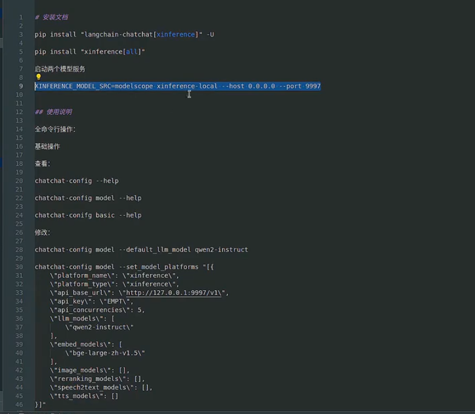
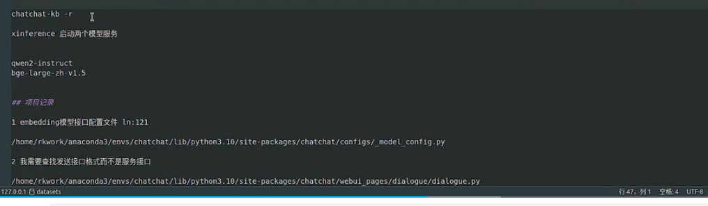

## 环境安装 conda

conda python 版本管理 工具

unbutu 下安装 conda

wget https://repo.anaconda.com/miniconda/Miniconda3-latest-Linux-x86_64.sh

chmod +x Miniconda3-latest-Linux-x86_64.sh
./Miniconda3-latest-Linux-x86_64.sh

yes

确认

yes

## 安装python
conda create -n ttt python=3.10

切换环境
conda activate ttt

## 安装 langchain-chatchat

采用清华源安装
pip install "langchain-chatchat[xinference]" -U -i https://pypi.tuna.tsinghua.edu.cn/simple

pip install "xinference[all]" -i https://pypi.tuna.tsinghua.edu.cn/simple

XINFERENCE_MODEL_SRC=modelscope xinference-local --host 0.0.0.0 --port 9997

机器配置

要有显卡

参考：
https://github.com/chatchat-space/Langchain-Chatchat 

https://www.bilibili.com/video/BV1NQUNYWEb8/?spm_id_from=333.337.search-card.all.click&vd_source=ffda878df0ed45bee1ade91d8f451048

