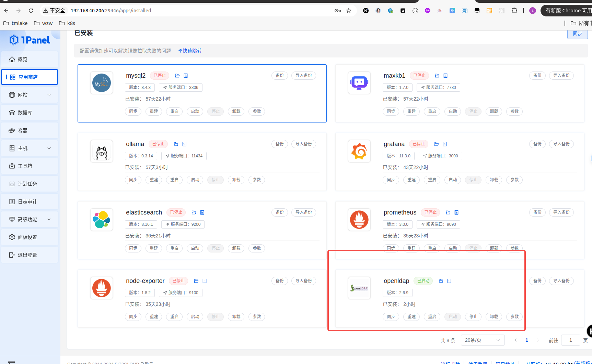
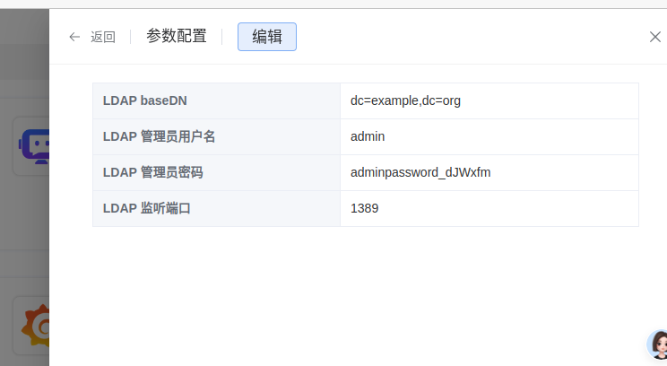

ubuntu

sudo apt-get install ldap-utils


添加
ldapadd -x -H ldap://localhost:1389 -D "cn=admin,dc=example,dc=org" -w adminpassword_dJWxfm -f user.ldif


查询 单个

假设你有一个用户 alice，你可以使用以下命令来验证：
ldapsearch -x -H ldap://localhost:1389 -D "cn=admin,dc=example,dc=org" -w adminpassword_dJWxfm -b "ou=users,dc=example,dc=org" "(uid=alice)"

ldapsearch -x -H ldap://localhost:1389 -D "cn=admin,dc=example,dc=org" -w adminpassword_dJWxfm -b "ou=users,dc=example,dc=org" "(uid=alice1)"

查询所有
ldapsearch -x -H ldap://localhost:1389 -D "cn=admin,dc=example,dc=org" -w adminpassword_dJWxfm -b "dc=example,dc=org"


user.ldif

```
dn: uid=alice1,ou=users,dc=example,dc=org
objectClass: inetOrgPerson
objectClass: top
uid: alice1
cn: Alice Smith
sn: Smith
mail: alice1@example.com
userPassword: alicepassword

```

curl -X POST http://localhost:3000/login -H "Content-Type: application/json" -d '{"username": "alice", "password": "alicepassword"}'






