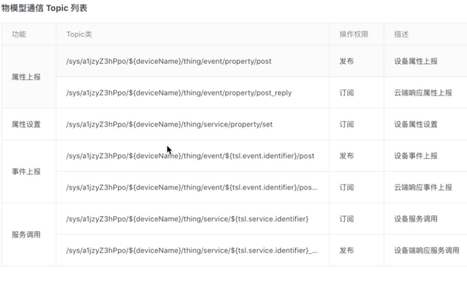
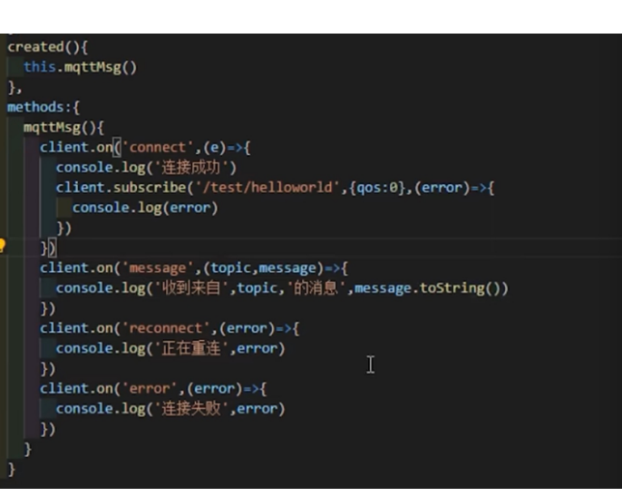
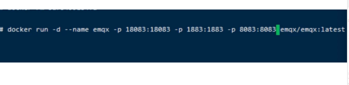
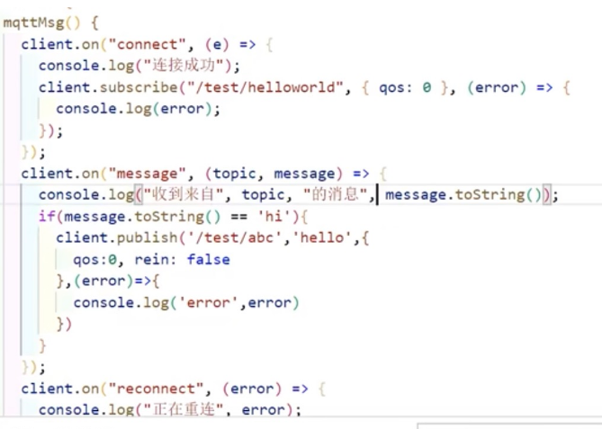

https://www.bilibili.com/video/BV1Tw4m1Q7qG/?spm_id_from=333.337.search-card.all.click&vd_source=ffda878df0ed45bee1ade91d8f451048
https://www.bilibili.com/video/BV1Zi4y1T78H?spm_id_from=333.788.player.switch&vd_source=ffda878df0ed45bee1ade91d8f451048


```

import mqtt from 'mqtt';
 
export default {
  name: 'MqttComponent',
  data() {
    return {
      client: null,
    };
  },
  created() {
    this.connectMqtt();
  },
  methods: {
    connectMqtt() {
      // 假设你的 MQTT 服务器支持 WebSocket，并且地址是 ws://your.mqtt.broker
      this.client = mqtt.connect('ws://your.mqtt.broker', {
        clientId: 'unique_client_id',
      });
 
      this.client.on('connect', () => {
        console.log('MQTT Connected');
        // 订阅主题
        this.client.subscribe('your/topic');
      });
 
      this.client.on('message', (topic, message) => {
        // 处理接收到的消息
        console.log(`Received message on ${topic}: ${message}`);
      });
 
      this.client.on('error', (error) => {
        console.log('MQTT Error:', error);
      });
    },
    publishMessage(topic, message) {
      // 发布消息
      this.client.publish(topic, message);
    }
  },
  beforeDestroy() {
    if (this.client) {
      this.client.end();
    }
  },
};


```








疑问：
mqtt 我也面没打开的时候，没有 订阅 ，java 还会一直往 mqtt发送消息吗？比如 id为1的集群状态，你那边还会一直发送吗？发送的话，我再次链接的时候会不会收到很多这个状态
mqtt只保留最新的一次消息





```

[admin@cdn116 ~]$ sudo docker run -d --name emqx -p 2883:2883 -p 8083:8083 -p 8084:8084 -p 8883:8883 -p 18083:18083 emqx/emqx

```

http://192.168.40.116:18083/#/dashboard/overview


vue mqtt demo


```

<template>
    <div>{{msg}}</div>
    <button @click="stop">stop</button>
    <button @click="start">start</button>
</template>

<script>
import mqtt from 'mqtt'
import { ref, onUnmounted } from 'vue';

const options = {
    port: 8083,
    connectTimeout: 4000,
    clientId: 'mqttjs_' + Math.random().toString(16).substr(2, 8),
    reconnectPeriod: 5000 // 自动重连时间间隔
};

let client = null;

export default {
    name: "App",
    setup() {
    
        const msg = ref('hello world');

        const start = () => {
            if (!client || client.connected === false) {
                client = mqtt.connect('ws://192.168.40.116/mqtt', options);
                setupClientEvents();
            }
        };

        const stop = () => {
            if (client && client.connected === true) {
                client.end(function() {
                    console.log('disconnected');
                });
            }
        };


        function setupClientEvents() {
            client.on('connect', function () {
                console.log('Connected to MQTT broker');
                for (var i = 1; i <= 10; i++) {
                    client.subscribe(`stock/${i}/price`, function (err) {
                        if (err) {
                            console.error('Subscription error:', err);
                        }
                    });
                }
            });

            client.on('error', function (err) {
                console.error('Connection error:', err);
            });

            client.on('message', function (topic, message) {
                console.log(topic + ':' + message.toString());
                msg.value = JSON.parse(message.toString()).msg;

            });
        }

        onUnmounted(() => {
            if (client) {
                client.end();
            }
        });

        return {
            start,
            stop,
            msg
        };
    }
};

</script>


```


yum search mosquitto

yum install mosquitto.x86_64


mosquitto_pub
mosquitto_sub 

命令就可以执行了

参考文档


https://xw1ei7mxto.feishu.cn/wiki/Wdn2wOBfvis1Hhk6rYccNrvHnYd


开启 mosquitto
mosquitto -c /etc/mosquitto/mosquitto.conf -p 1884


发布消息
mosquitto_pub -h 127.0.0.1 -p 1885 -t topic1 -m "Hello, topic1!"

mosquitto_pub -h 127.0.0.1 -p 1885 -t topic1 -m '{"key1":"value1","key2":"value2"}'


订阅消息
mosquitto_sub -h 127.0.0.1 -p 1884 -t topic1 -i client1 -F '%t : %p'


参考文档：

发布消息
mosquitto_pub -h 192.168.40.116 -p 1883 -t topic1 -m "Hello, topic1!"

mosquitto_pub -h 192.168.40.116 -p 1883 -t topic1 -m '{"key1":"value1","key2":"value2"}'


订阅消息
mosquitto_sub -h 192.168.40.116 -p 1883 -t topic1 -i client1 -F '%t : %p'


cnpm install mqtt -g

mqtt pub -h 192.168.40.116 -p 1883 -t topic1 -m '{"key1":"value1","key2":"value2"}'
mqtt sub -h 192.168.40.116 -p 1883 -t topic1 -i client1 -F '%t : %p'


mqtt pub -h 192.168.40.116 -p 8083 -t topic1 -m '{"key1":"value1","key2":"value2"}'
mqtt sub -h 192.168.40.116 -p 8083 -t topic1 -i client1 -F '%t : %p'
