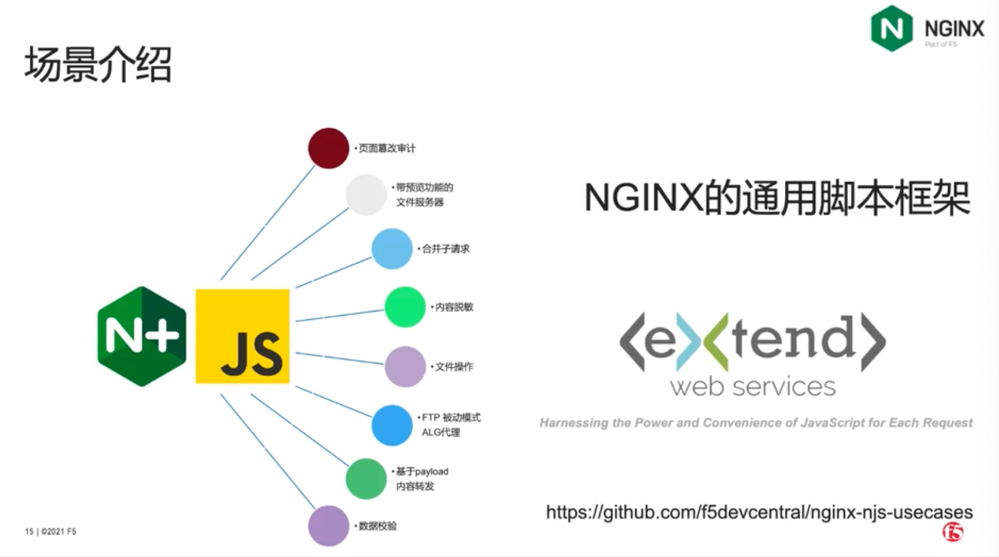
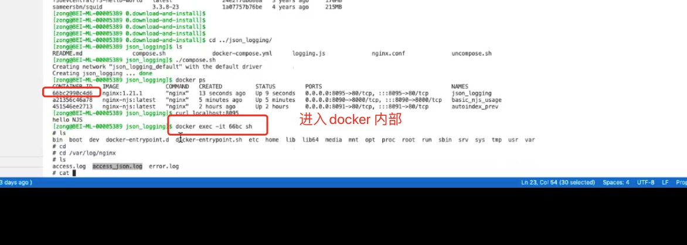

# njs


在nginx上写JavaScript


NGINX JavaScript examples
https://github.com/nginx/njs-examples?tab=readme-ov-file#https-fetch-example-http-certs-fetch-https

njs、nginx JavaScript、在nginx上写JavaScript、nginx支持js

重点
https://blog.csdn.net/weixin_37064888/article/details/142216573
https://github.com/nginx/njs-examples
https://github.com/zongzw-nginx/nginx-njs-usecases
https://nginx.org/en/docs/njs/reference.html
https://www.bilibili.com/video/BV1nq4y1p7gk/?spm_id_from=333.337.search-card.all.click&vd_source=ffda878df0ed45bee1ade91d8f451048







其他：
https://www.bilibili.com/video/BV1LB4y1p7p3/?vd_source=ffda878df0ed45bee1ade91d8f451048
https://baijiahao.baidu.com/s?id=1783143370177474114&wfr=spider&for=pc
njs 迭代版本
https://nginx.org/en/docs/njs/changes.html#njs0.8.4


https://github.com/quickjs-zh/QuickJS?tab=readme-ov-file#21-%E5%AE%89%E8%A3%85

Nginx的njs开始支持将QuickJS作为实现引擎了。他们早几年就该这么做。如果在这个之上加多一层node API兼容层可以直接跑主流node module，那在生态上还是有优势的。


官网+ 现有modules
https://nginx.org/en/docs/

QuickJS架构及源代码分析 - 丁乐华 - V8技术讨论会 - OSDT社区 - 20200607

https://www.bilibili.com/video/BV1bt4y1y79L/?spm_id_from=333.337.search-card.all.click&vd_source=ffda878df0ed45bee1ade91d8f451048


quickjs 使用 英文教程
https://www.bilibili.com/video/BV1XjhmexEFx?spm_id_from=333.788.videopod.sections&vd_source=ffda878df0ed45bee1ade91d8f451048


下载项目
git clone nginx njs openssl

```
mac@bogon study % tree -L 1
.
├── nginx
├── njs
├── openssl

```

执行编译命令

```
auto/configure --prefix=/usr/local/nginx --with-http_ssl_module --with-openssl=/Users/mac/study/openssl --add-module=../njs/nginx

sudo make
sudo make install

```


script.js

```
function hello(r) {
    r.return(200, "Hello, njs!");
}
export default { hello }

```

nginx.conf

```
load_module /usr/local/nginx/modules/ngx_http_js_module.so;

worker_processes  1;

events {
    worker_connections  1024;
}

http {
    include       mime.types;
    
    js_import main from /usr/local/nginx/conf/script.js;

    server {
        listen       80;
        server_name  localhost;

        location / {
            root   html;
            index  index.html index.htm;
        }
    
        location /hello {
            js_content main.hello;
        }

        error_page   500 502 503 504  /50x.html;
        location = /50x.html {
            root   html;
        }

    }

}

```
```

function hello(r) {
    r.return(200, "Hello, njs!");
}

function handleHeadersRequest(r) {
    var userAgent = r.headersIn['User-Agent'] || "";
    if (userAgent.includes("Chrome")) {
        r.return(200, "You are using Chrome.");
    } else {
        r.return(200, "You are not using Chrome.");
    }
}

function handleSearchRequest(r) {
    var query = r.args['query'];
    if (query) {
        r.return(200, "Search query: " + query);
    } else {
        r.return(400, "No search query provided.");
    }
}
export default { hello, handleHeadersRequest, handleSearchRequest }

```

nginx.conf

```
load_module /usr/local/nginx/modules/ngx_http_js_module.so;

worker_processes  1;

events {
    worker_connections  1024;
}

http {
    include       mime.types;
    
    js_import main from /usr/local/nginx/conf/script.js;

    server {
        listen       80;
        server_name  localhost;

        location / {
            root   html;
            index  index.html index.htm;
        }
    
        location /hello {
            js_content main.hello;
        }

        location /test {
            js_content main.handleHeadersRequest;
        }

        location /search {
            js_content main.handleSearchRequest;
        }

        error_page   500 502 503 504  /50x.html;
        location = /50x.html {
            root   html;
        }

    }

}

```

--with-http_auth_request_module

```

auto/configure --prefix=/usr/local/nginx --with-http_ssl_module --with-openssl=/Users/mac/study/openssl --with-http_auth_request_module --add-dynamic-module=../njs/nginx

```


njs 默认提供的模块，可以直接使用，npm 的模块现在看还不能直接用。

```
import fs from 'fs';
import qs from 'querystring';
import cr from 'crypto';
import xml from 'xml';
import zlib from 'zlib';

```

njs 源码分析
njs内存池代码阅读
https://blog.csdn.net/qq_41252394/article/details/126575902


- 为其它环境(如QuickJs)提供模块加载功能，以复用npm上的模块包；
https://juejin.cn/post/6844903971316842509


深度分析quickjs
https://ming1016.github.io/2021/02/21/deeply-analyse-quickjs/#QuickJS


安装nginx并配置nginxscript(njs)实现请求头验证或者分流


https://www.cnblogs.com/antake/p/16301492.html


NGINX+NJS应用场景之 带内容预览功能的文件服务器
https://community.f5chinanetworks.com/pc-post-426.html