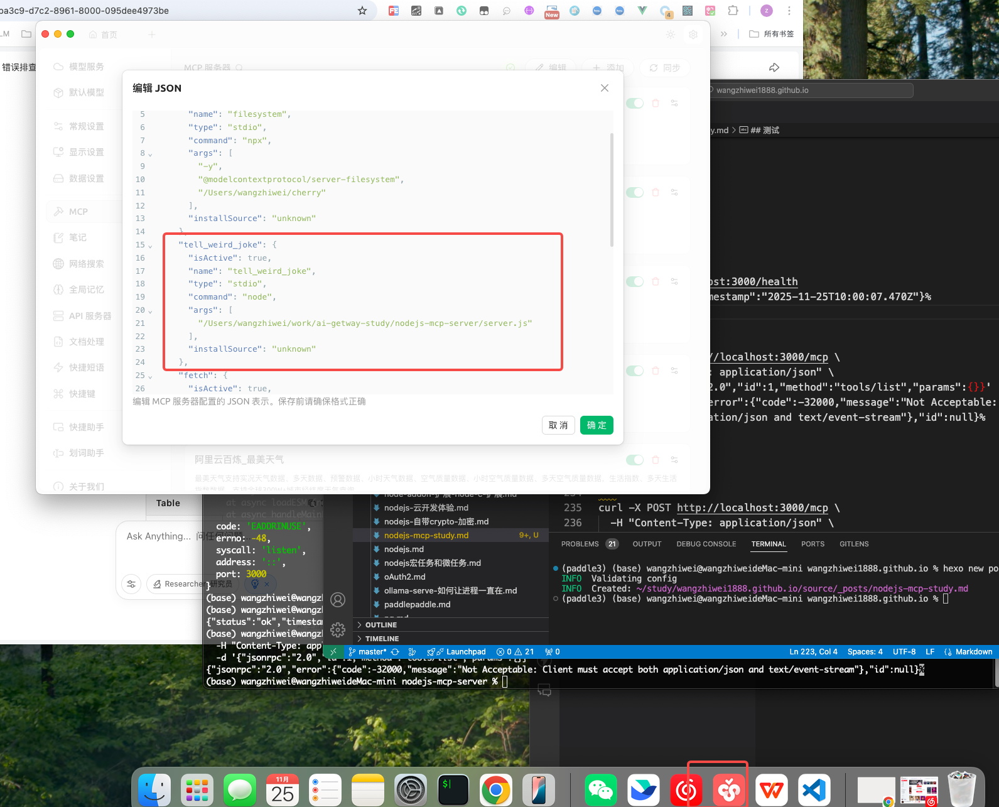

## nodejs mcp

package.json
```
{
  "name": "nodejs-mcp-server",
  "version": "1.0.0",
  "main": "server.js",
  "scripts": {
    "test": "echo \"Error: no test specified\" && exit 1",
    "start": "node server.js"
  },
  "keywords": [],
  "author": "",
  "license": "ISC",
  "description": "",
  "dependencies": {
    "@modelcontextprotocol/sdk": "^1.22.0",
    "express": "^5.1.0",
    "zod": "^3.24.1"
  },
  "type": "module"
}

```

以文件的形式提供mcp服务
server.js

```
import { McpServer, ResourceTemplate } from '@modelcontextprotocol/sdk/server/mcp.js';
import { StdioServerTransport } from '@modelcontextprotocol/sdk/server/stdio.js';
import * as z from 'zod';

const server = new McpServer({
    name: 'demo-server',
    version: '1.0.0'
});

// 工具1：笑话（修复版）
server.registerTool(
    'tell_weird_joke',
    {
        title: 'Tell Weird Joke',
        description: 'Generate a weird joke about a specified topic',
        inputSchema: z.object({  // 修复：必须使用 z.object()
            topic: z.string().describe('The topic of the joke')
        })
    },
    async ({ topic }) => {
        return {
            content: [{ type: 'text', text: `The weirdest joke about ${topic} is... hahaha!` }],
        };
    }
);

// 工具2：加法（修复版）
server.registerTool(
    'add',
    {
        title: 'Addition Tool',
        description: 'Add two numbers',
        inputSchema: z.object({  // 修复：必须使用 z.object()
            a: z.number(),
            b: z.number()
        })
    },
    async ({ a, b }) => {
        return {
            content: [{ type: 'text', text: `Result: ${a + b}` }],
        };
    }
);

// 资源：问候
server.registerResource(
    'greeting',
    new ResourceTemplate('greeting://{name}', { list: undefined }),
    { title: 'Greeting Resource', description: 'Dynamic greeting generator' },
    async (uri, { name }) => ({
        contents: [{ uri: uri.href, text: `Hello, ${name}!` }]
    })
);

// 启动
async function main() {
    const transport = new StdioServerTransport();
    await server.connect(transport);
    console.error('✅ MCP 服务器已启动');
}
main().catch(console.error);

```


## 运行
npx @modelcontextprotocol/inspector nodejs server.js





```
"tell_weird_joke": {
      "isActive": true,
      "name": "tell_weird_joke",
      "type": "stdio",
      "command": "node",
      "args": [
        "/Users/wangzhiwei/work/ai-getway-study/nodejs-mcp-server/server.js"
      ],
      "installSource": "unknown"
    },
```


以http端点的形式提供 mcp 服务
server2.js 

```
import { McpServer, ResourceTemplate } from '@modelcontextprotocol/sdk/server/mcp.js';
import { StreamableHTTPServerTransport } from '@modelcontextprotocol/sdk/server/streamableHttp.js';
import express from 'express';
import * as z from 'zod';

// 1. 创建 MCP 服务器（保持不变）
const server = new McpServer({
    name: 'demo-server',
    version: '1.0.0'
});

// 2. 注册所有工具和资源（保持不变）
server.registerTool(
    'tell_weird_joke',
    {
        title: 'Tell Weird Joke',
        description: 'Generate a weird joke about a specified topic',
        inputSchema: z.object({
            topic: z.string().describe('The topic of the joke')
        })
    },
    async ({ topic }) => {
        return {
            content: [{ type: 'text', text: `The weirdest joke about ${topic} is... hahaha!` }],
        };
    }
);

server.registerTool(
    'add',
    {
        title: 'Addition Tool',
        description: 'Add two numbers',
        inputSchema: z.object({
            a: z.number(),
            b: z.number()
        })
    },
    async ({ a, b }) => {
        return {
            content: [{ type: 'text', text: `Result: ${a + b}` }],
        };
    }
);

server.registerResource(
    'greeting',
    new ResourceTemplate('greeting://{name}', { list: undefined }),
    { title: 'Greeting Resource', description: 'Dynamic greeting generator' },
    async (uri, { name }) => ({
        contents: [{ uri: uri.href, text: `Hello, ${name}!` }]
    })
);

// 3. 创建 Express 应用
const app = express();
app.use(express.json());

// 4. 添加健康检查端点（可选）
app.get('/health', (req, res) => {
    res.json({ status: 'ok', timestamp: new Date().toISOString() });
});

// 5. 核心 MCP HTTP 端点
app.post('/mcp', async (req, res) => {
    // 每个请求创建独立 transport 实例（避免请求 ID 冲突）
    const transport = new StreamableHTTPServerTransport({
        sessionIdGenerator: undefined,
        enableJsonResponse: true // 启用 JSON 响应格式
    });

    // 请求结束时清理资源
    res.on('close', () => {
        transport.close();
    });

    try {
        // 将 transport 连接到 MCP 服务器
        await server.connect(transport);
        
        // 处理请求并返回响应
        await transport.handleRequest(req, res, req.body);
    } catch (error) {
        console.error('❌ MCP request error:', error);
        if (!res.headersSent) {
            res.status(500).json({ error: 'Internal server error' });
        }
    }
});

// 6. 启动 HTTP 服务器
const port = parseInt(process.env.PORT || '3000');
app.listen(port, () => {
    console.log(`🚀 MCP HTTP Server running at http://localhost:${port}`);
    console.log(`📡 MCP endpoint: http://localhost:${port}/mcp`);
    console.log(`🏥 Health check: http://localhost:${port}/health`);
}).on('error', error => {
    console.error('❌ Server error:', error);
    process.exit(1);
});

```

## 运行

node server2.js

## 测试

```
curl http://localhost:3000/health
{"status":"ok","timestamp":"2025-11-25T10:00:07.470Z"}%
```

```
curl -X POST http://localhost:3000/mcp \
  -H "Content-Type: application/json" \
  -d '{"jsonrpc":"2.0","id":1,"method":"tools/list","params":{}}'
{"jsonrpc":"2.0","error":{"code":-32000,"message":"Not Acceptable: Client must accept both application/json and text/event-stream"},"id":null}%

```


```
curl -X POST http://localhost:3000/mcp \
  -H "Content-Type: application/json" \
  -H "Accept: application/json, text/event-stream" \
  -d '{"jsonrpc":"2.0","id":1,"method":"tools/list","params":{}}'


  {"result":{"tools":[{"name":"tell_weird_joke","title":"Tell Weird Joke","description":"Generate a weird joke about a specified topic","inputSchema":{"type":"object","properties":{"topic":{"type":"string","description":"The topic of the joke"}},"required":["topic"],"additionalProperties":false,"$schema":"http://json-schema.org/draft-07/schema#"}},{"name":"add","title":"Addition Tool","description":"Add two numbers","inputSchema":{"type":"object","properties":{"a":{"type":"number"},"b":{"type":"number"}},"required":["a","b"],"additionalProperties":false,"$schema":"http://json-schema.org/draft-07/schema#"}}]},"jsonrpc":"2.0","id":1}%

```


```
curl -X POST http://localhost:3000/mcp \
  -H "Content-Type: application/json" \
  -H "Accept: application/json, text/event-stream" \
  -d '{"jsonrpc":"2.0","id":2,"method":"tools/call","params":{"name":"add","arguments":{"a":5,"b":3}}}'

  {"result":{"content":[{"type":"text","text":"Result: 8"}]},"jsonrpc":"2.0","id":2}%
```

```

curl -X POST http://localhost:3000/mcp \
  -H "Content-Type: application/json" \
  -H "Accept: application/json, text/event-stream" \
  -d '{"jsonrpc":"2.0","id":3,"method":"tools/call","params":{"name":"tell_weird_joke","arguments":{"topic":"programming"}}}'

{"result":{"content":[{"type":"text","text":"The weirdest joke about programming is... hahaha!"}]},"jsonrpc":"2.0","id":3}%
```


## 参考文档

https://github.com/modelcontextprotocol/typescript-sdk