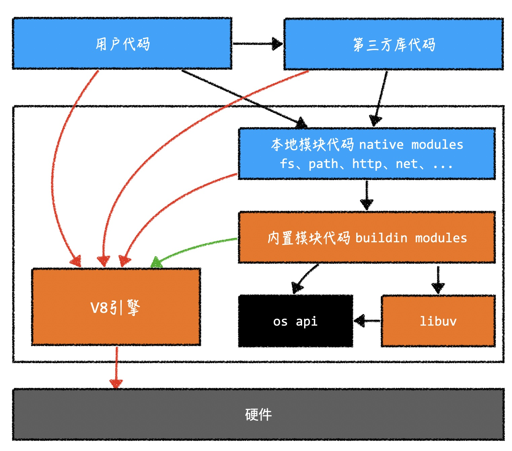

#  nodejs

nodejs 是 javascript 的运行环境, 不是一门语言



用户代码：js代码

三方库：大部分都是js代码

本地模块代码：js代码


内置模块代码： c/c++代码

V8 引擎：c/c++代码，作用：把js代码转换成机器码

可以通过V8引擎的某种机制，扩展其功能

V8 引擎的扩展和对扩展的编译，是通过一个工具： node-gyp 工具 完成 的

某些第三方库需要使用node-gyp工具进行构建，因此需要先安装node-gyp


koa 洋葱模型


```
app.use(async (ctx, next) => {

    consol.log('111, start')
    await next()
    consol.log('111, end')

})

app.use(async (ctx, next) => {

    consol.log('222, start')
    await next()
    consol.log('222, end')

})

app.use(async (ctx, next) => {

    consol.log('333, start')
    await next()
    consol.log('333, end')

})

打印顺序

111, start
222, start
333, start
333, end
222, end
111, end

```


```
app.use(async (ctx, next) => {

    consol.log('111, start')
    // await next()
    consol.log('111, end')

})

app.use(async (ctx, next) => {

    consol.log('222, start')
    await next()
    consol.log('222, end')

})

app.use(async (ctx, next) => {

    consol.log('333, start')
    await next()
    consol.log('333, end')

})

打印顺序

111, start
111, end

```


```
app.use(async (ctx, next) => {

    consol.log('111, start')
    await next()
    consol.log('111, end')

})

app.use(async (ctx, next) => {

    consol.log('222, start')
    // await next()
    consol.log('222, end')

})

app.use(async (ctx, next) => {

    consol.log('333, start')
    await next()
    consol.log('333, end')

})

打印顺序

111, start
222, start
222, end
111, end

```


```
app.use(async (ctx, next) => {

    consol.log('111, start')
    await next()
    consol.log('111, end')

})

app.use(async (ctx, next) => {

    consol.log('222, start')
    await next()
    consol.log('222, end')

})

app.use(async (ctx, next) => {

    consol.log('333, start')
    // await next()
    consol.log('333, end')

})

打印顺序

111, start
222, start
333, start
333, end
222, end
111, end
```


参考：
libuv book
https://luohaha.github.io/Chinese-uvbook/source/introduction.html

https://www.bilibili.com/video/BV1GfywY7Ebs?spm_id_from=333.788.videopod.episodes&vd_source=ffda878df0ed45bee1ade91d8f451048&p=43