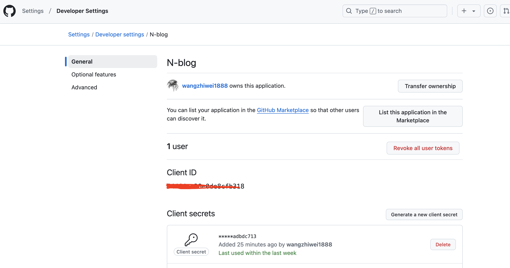
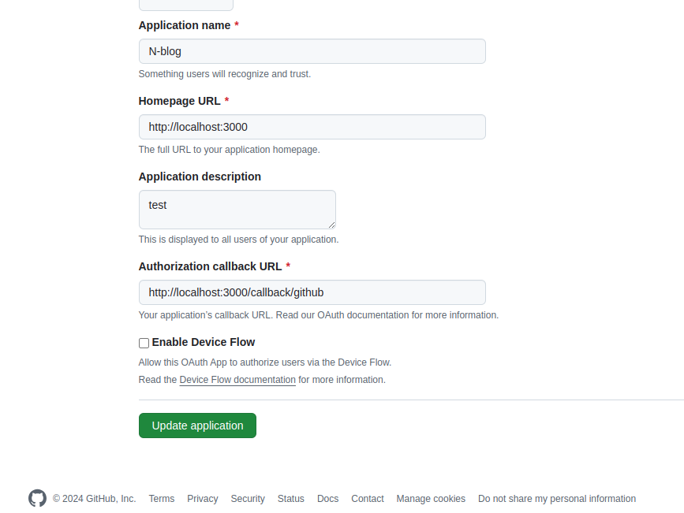

# 认识 OAuth2.0

## 什么是 OAuth？

> [OAuth](http://en.wikipedia.org/wiki/OAuth)是一个关于授权（authorization）的开放网络标准协议，简单理解就是一种授权机制。

> 它是在客户端和资源所有者之间的授权层，用来分离两种不同的角色。在资源所有者同意并向客户端颁发令牌后，客户端携带令牌可以访问资源所有者的资源。
>
> OAuth2.0 是 OAuth 协议的一个版本，**2.0 版本不兼容 1.0 版本，相当于 1.0 版本已经废弃**

#### 令牌的特点

（1）短期的，到期会自动失效，用户自己无法修改。

（2）可以被数据所有者撤销，会立即失效。

（3）有权限范围（scope），对于网络服务来说，只读令牌就比读写令牌更安全。

> 令牌既可以让第三方应用获得权限，同时又随时可控，不会危及系统安全。这也是 OAuth 2.0 的优点。
>
> **注意**，只要知道了令牌，就能进入系统。系统一般不会再次确认身份，所以**令牌必须保密，泄漏令牌与泄漏密码的后果是一样的。** 这也是为什么令牌的有效期，一般都设置得很短的原因。

## 获取令牌四种实现方式

- 授权码（authorization-code）
- 隐藏式（implicit）
- 密码式（password）：
- 客户端凭证（client credentials）

> 不管哪一种授权方式，第三方应用申请令牌之前，**都必须先到系统备案**，说明自己的身份，然后会拿到两个身份识别码：**客户端 ID（client ID）和客户端密钥（client secret）**。这是为了防止令牌被滥用，没有备案过的第三方应用，是不会拿到令牌的；

## 授权码

**授权码（authorization code）方式，指的是第三方应用先申请一个授权码，然后再用该码获取令牌（适合前后端分离，最常用的方式）。**

> 这种方式是最常用的流程，安全性也最高，它适用于有后端的 Web 应用。授权码通过前端传送，令牌则是储存在后端，而且所有与资源服务器的通信都在后端完成。这样的前后端分离，可以避免令牌泄漏。

### 实现流程

1. **A 网站提供一个链接，用户点击后就会跳转到 B 网站，授权用户数据给 A 网站使用。**

   ```javascript
   https://b.com/oauth/authorize?
     response_type=code&
     client_id=CLIENT_ID&
     redirect_uri=CALLBACK_URL&
     scope=read
   ```

   - response*type=code \_code 参数表示要求返回授权码*
   - client*id=CLIENT_ID *参数让 B 知道是谁在请求数据\_
   - redirect*uri = CALLBACK_URL *当 B 网站处理完成链接请求后的跳转地址\_
   - scope=read _表示要授权的范围，read 代表对授权资源进行只读操作_

2. **跳转成功，B 网站会要求用户登录，然后询问是否同意给予 A 网站授权。用户表示同意，这时 B 网站就会跳回`redirect_uri`参数指定的网址。跳转时，会传回一个授权码**

   ```js
   https://a.com/callback?code=AUTHORIZATION_CODE     // code 代表授权码
   ```

3. **A 网站拿到授权码以后，就可以在后端，向 B 网站请求令牌。**

```html
https://b.com/oauth/token? client_id=CLIENT_ID& client_secret=CLIENT_SECRET&
grant_type=authorization_code& code=AUTHORIZATION_CODE&
redirect_uri=CALLBACK_URL
```

​ client*id *确认 A 的身份\_

​ client*secret *确认 A 的身份\_

​ grant*type *表示使用授权的方式获取授权码\_

​ code _第二步中获取到的 code 值_

​ redirect*uri *令牌颁发后的回调地址\_

4.  **B 网站收到请求以后，就会颁发令牌。具体做法是向`redirect_uri`指定的网址，发送一段 JSON 数据。**

```javascript
{
  "access_token":"ACCESS_TOKEN",
  "token_type":"bearer",
  "expires_in":2592000,
  "refresh_token":"REFRESH_TOKEN",
  "scope":"read",
  "uid":100101,
  "info":{...}
}
```

---

## 隐藏式

> 适用于纯前端的 WEB 应用，必须将令牌储存在前端。允许直接向前端颁发令牌。这种方式没有授权码这个中间步骤，所以称为（授权码）"隐藏式"（implicit）。**由于前端直接获取 token，安全性较低，一般适用于比较信任的网站，并且令牌的有效期，也相对较短，一般是界面关闭及失效**

### 实现流程

1. **A 网站提供一个链接，要求用户跳转到 B 网站，授权用户数据给 A 网站使用**

   ```html
   https://b.com/oauth/authorize? response_type=token& client_id=CLIENT_ID&
   redirect_uri=CALLBACK_URL& scope=read
   ```

   > response_type=token 表示直接返回令牌

2. **用户跳转到 B 网站，登录后同意给予 A 网站授权。B 网站就会跳回`redirect_uri`参数指定的跳转网址，并且把令牌作为 URL 参数，传给 A 网站。**

   ```js
   https://a.com/callback#token=ACCESS_TOKEN
   ```

   > token 参数为令牌，**令牌的位置是 URL 锚点（fragment），而不是查询字符串（querystring），这是因为 OAuth 2.0 允许跳转网址是 HTTP 协议，因此存在"中间人攻击"的风险，而浏览器跳转时，锚点不会发到服务器，就减少了泄漏令牌的风险。**

---

## 密码式

> 如果你高度信任某个应用，RFC 6749 也允许用户把用户名和密码，直接告诉该应用。该应用就使用你的密码，申请令牌，这种方式称为"密码式"（password）。

### 实现流程

1. 第一步，A 网站要求用户提供 B 网站的用户名和密码。拿到以后，A 就直接向 B 请求令牌。

   ```js
   https://oauth.b.com/token?
     grant_type=password&
     username=USERNAME&
     password=PASSWORD&
     client_id=CLIENT_ID
   ```

   - grant*type = password *授权方式为密码的形式进行授权\_
   - username && userpassword _B 网站的登录用户名及密码_
   - client*id *用户申请令牌的身份标识\_

2. B 网站验证身份通过后，直接给出令牌。注意，这时不需要跳转，而是把令牌放在 JSON 数据里面，作为 HTTP 回应，A 因此拿到令牌。

   > 这种方式需要用户给出自己的用户名/密码，显然风险很大，因此只适用于其他授权方式都无法采用的情况，而且必须是用户高度信任的应

---

## 凭证式

> 凭证式和密码式很相似，主要适用于那些没有前端的命令行应用，可以用最简单的方式获取令牌，在请求响应的 `JSON` 结果中返回 `token`。

### 实现流程

1. **第一步，A 应用在命令行向 B 发出请求。**

```html
https://oauth.b.com/token? grant_type=client_credentials& client_id=CLIENT_ID&
client_secret=CLIENT_SECRET
```

​ `grant_type` 为 `client_credentials` 表示凭证式授权，`client_id` 和 `client_secret` 用来识别身份。

2. B 网站验证通过以后，直接返回令牌。

## 令牌的使用/更新

### 使用

> A 网站拿到令牌以后，就可以向 B 网站的 API 请求数据了。使用方法为在请求头中将 `token` 放在 `http` 请求头部的一个`Authorization`字段里。

### 更新

> `token`是有时效性的，一旦过期就需要重新获取，令牌的有效期到了，如果让用户重新走一遍上面的流程，再申请一个新的令牌，很可能体验不好，而且也没有必要。OAuth 2.0 允许用户自动更新令牌

### 实现方法

> 具体方法是，B 网站颁发令牌的时候，一次性颁发两个令牌，一个用于获取数据，另一个用于获取新的令牌（refresh token 字段）。令牌到期前，用户使用 refresh token 发一个请求，去更新令牌。

```js
https://b.com/oauth/token?
  grant_type=refresh_token&
  client_id=CLIENT_ID&
  client_secret=CLIENT_SECRET&
  refresh_token=REFRESH_TOKEN
```

`grant_type`参数为`refresh_token`表示要求更新令牌；

`client_id`参数和`client_secret`参数用于确认身份；

`refresh_token`参数就是用于更新令牌的令牌。

B 网站验证通过以后，就会颁发新的令牌

## 授权码实现 github 授权







```
const Koa = require("koa");
const router = require("koa-router")();
const staticFiles = require('koa-static')
const path = require('path')
const views = require('koa-views')
const axios = require('axios')
const qs = require('qs')
const app = new Koa();

let userInfo = {}

app.use(staticFiles(path.resolve(__dirname, "./public")))
app.use(views('views', { map: { html: 'ejs' } }))

/* 模板路由处理 */
router.get('/login', async ctx => {
  await ctx.render('login')
})
router.get('/home', async ctx => {
  await ctx.render('home', { userInfo })
})

/* 拦截前端的a链接跳转 */
router.get('/loginByGithub', async ctx => {
  /* 跳转到git获取授权码的地址  携带了client_id参数*/
  const path = 'https://github.com/login/oauth/authorize?client_id=xxx'
  ctx.redirect(path)
})

/* 创建一个授权码的地址路由 */
router.get('/callback/github', async ctx => {
  const { code } = ctx.query
  /* 请求令牌 post  params参数 */
  const accessToken = await axios.post('https://github.com/login/oauth/access_token', {
    client_id: 'xxx',
    client_secret: 'xxx',
    code
  })
  const { access_token } = qs.parse(accessToken.data)
  /* 获取用户的信息 */
  userInfo = await axios.get('https://api.github.com/user', {
    /* Bearer 后面记得跟一个空格 */
    headers: {
      Authorization: 'Bearer ' + access_token
    }
  })
  userInfo = userInfo.data
  ctx.redirect('/home')
})

app.use(router.routes())
app.listen(3000, () => {
  console.log('server is running on port 3000')
})


```
