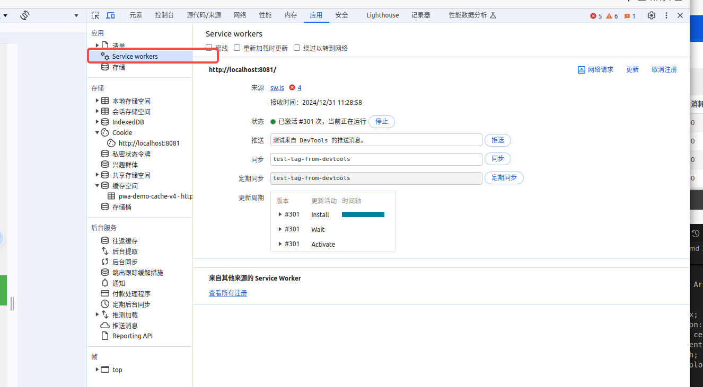
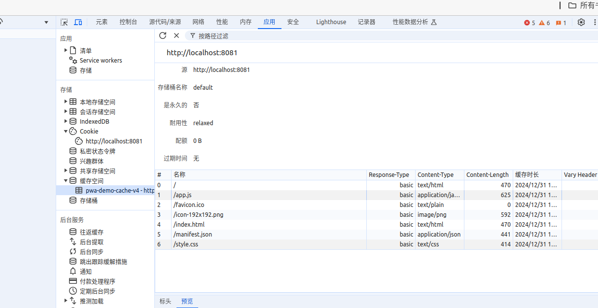
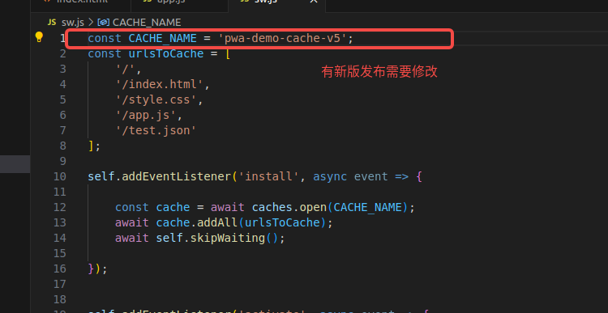
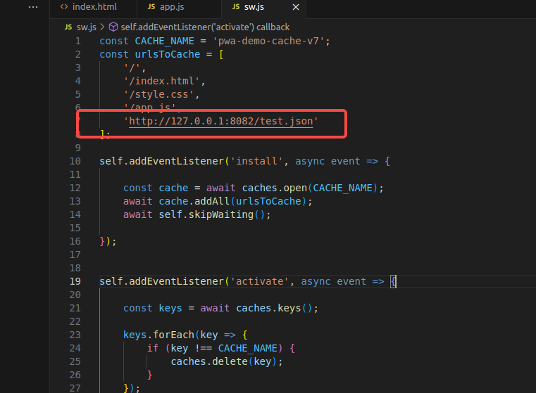
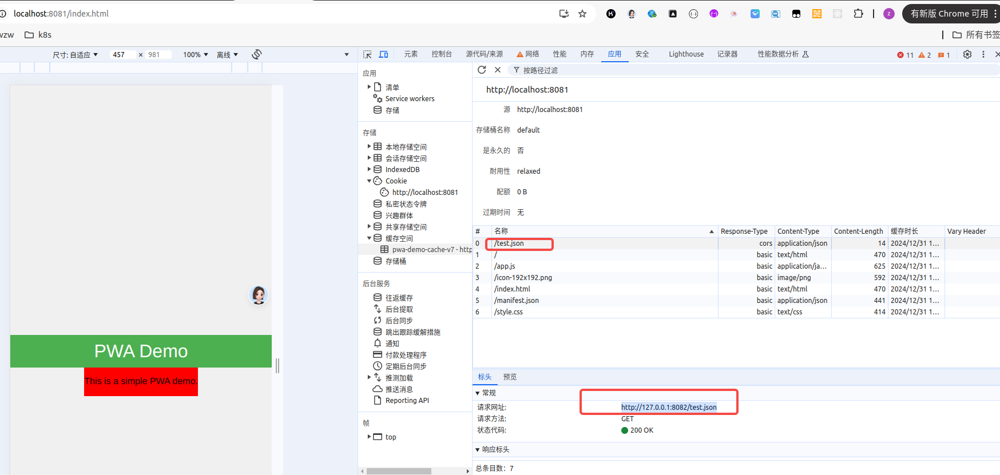
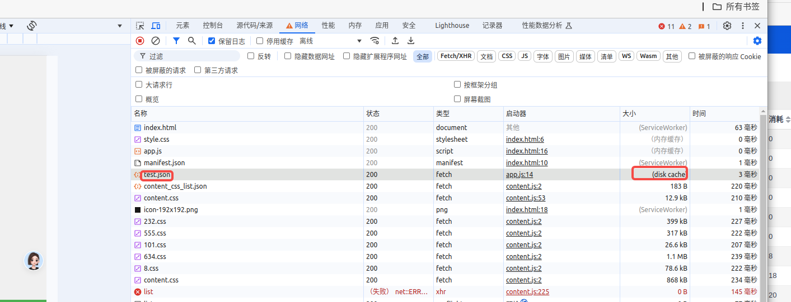
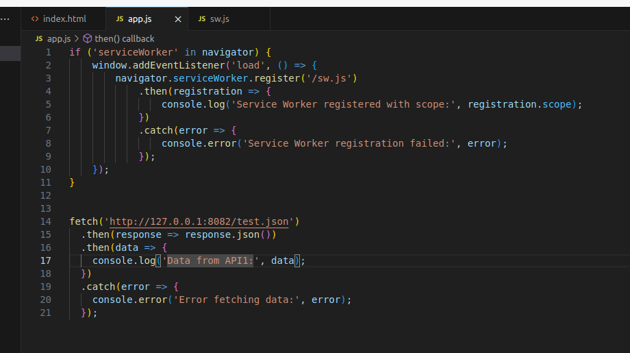

### pwa 核心技术


PWA（Progressive Web App，渐进式Web应用）的核心技术主要包括以下几点：

- **Service Worker**：这是一个可编程的网络代理，允许你拦截和处理应用程序的网络请求，从而实现离线访问、背景同步等功能。
- **Manifest 文件**：这是一个JSON文件，提供了关于Web应用的基本信息，如名称、图标、主题颜色等，用于将Web应用添加到主屏幕并提供类似原生应用的体验。
- **promise/async/await**：确保通信的安全性，PWA要求必须通过HTTPS协议来部署，以保障数据传输的安全。
- **fetch api**：确保通信的安全性，PWA要求必须通过HTTPS协议来部署，以保障数据传输的安全。
- **cache storage**：确保通信的安全性，PWA要求必须通过HTTPS协议来部署，以保障数据传输的安全。
- **常见的缓存策略**：确保通信的安全性，PWA要求必须通过HTTPS协议来部署，以保障数据传输的安全。
- **notification**：确保通信的安全性，PWA要求必须通过HTTPS协议来部署，以保障数据传输的安全。


这些技术共同作用，使得PWA能够提供接近原生应用的用户体验，同时具备跨平台的优势。


### demo

```
app.js

if ('serviceWorker' in navigator) {
    window.addEventListener('load', () => {
        navigator.serviceWorker.register('/sw.js')
            .then(registration => {
                console.log('Service Worker registered with scope:', registration.scope);
            })
            .catch(error => {
                console.error('Service Worker registration failed:', error);
            });
    });
}


index.html


<!DOCTYPE html>
<html lang="en">
<head>
    <meta charset="UTF-8">
    <meta name="viewport" content="width=device-width, initial-scale=1.0">
    <title>PWA Demo</title>
    <link rel="stylesheet" href="style.css">
    <link rel="manifest" href="manifest.json">
</head>
<body>
    <header>
        <h1>PWA Demo</h1>
    </header>
    <main style="background: red;">
        <p>This is a simple PWA demo.</p>
    </main>
    <script src="app.js"></script>
</body>
</html>


manifest.json

{
    "name": "PWA Demo",
    "short_name": "PWA Demo",
    "start_url": "/",
    "display": "standalone",
    "background_color": "#f0f0f0",
    "theme_color": "#4CAF50",
    "icons": [
        {
            "src": "icon-192x192.png",
            "sizes": "192x192",
            "type": "image/png"
        },
        {
            "src": "icon-512x512.png",
            "sizes": "512x512",
            "type": "image/png"
        }
    ]
}


style.css


body {
    font-family: Arial, sans-serif;
    margin: 0;
    padding: 0;
    display: flex;
    flex-direction: column;
    align-items: center;
    justify-content: center;
    height: 100vh;
    background-color: #f0f0f0;
}

header {
    background-color: #4CAF50;
    color: white;
    width: 100%;
    text-align: center;
    padding: 10px 0;
}

main {
    text-align: center;
}

img {
    margin-top: 20px;
}


sw.js


const CACHE_NAME = 'pwa-demo-cache-v1';
const urlsToCache = [
    '/',
    '/index.html',
    '/style.css',
    '/app.js'
];

self.addEventListener('install', async event => {

    const cache = await caches.open(CACHE_NAME);
    await cache.addAll(urlsToCache);
    await self.skipWaiting();

});


self.addEventListener('activate', async event => {

    const keys = await caches.keys();

    keys.forEach(key => {
        if (key !== CACHE_NAME) {
            caches.delete(key);
        }
    });

    await self.clients.claim();

});

self.addEventListener('fetch', event => {

    // 1. 只缓存同源的内容
    const req = event.request;
    const url = new URL(req.url);
    if (url.origin !== location.origin) {
        return;
    }

    // 2. 接口走网络优先策略 静态资源走缓存优先策略
    if (req.url.includes('/api/')) {
        event.respondWith(
            networkFirst(event.request)
        );
    } else {
        event.respondWith(
            cacheFirst(event.request)
        );
    }
    
});

// networkFirst 一般适用于动态资源
async function networkFirst(request) {

    const cache = await caches.open(CACHE_NAME);

    try {
        const response = await fetch(request);
        //保证缓存最新的数据
        cache.put(request, response.clone());
        return response;
    } catch (error) {    
        const cachedResponse = await cache.match(request);
        return cachedResponse;
    }
}

// catchFirst 一般适用于静态资源
async function cacheFirst(request) {
    const cache = await caches.open(CACHE_NAME);
    const cachedResponse = await cache.match(request);
    if (cachedResponse) {
        return cachedResponse;
    }
    const response = await fetch(request);
    cache.put(request, response.clone());
    return response;
}


```

### 注意事项

```
1、https 子签名证书可能会导致 pwa register 失败
2、接口跨域名

```
















vite项目改造

```

import { VitePWA } from 'vite-plugin-pwa'


vitePlugins.push(
    VitePWA({
        registerType: 'autoUpdate',
        includeAssets: ['favicon.ico'],
        manifest: {
            name: 'xxx',
            short_name:'xxx',
            description: 'xxx',
            theme_color: '#ffffff',
            start_url: '/demo/',
            display: 'standalone',
            form_factor: 'wide',
            
            icons: [
                {
                    "src": "./images/icon-192x192.png",
                    "sizes": "192x192",
                    "type": "image/png"
                },
                {
                    "src": "/images/icon-512x512.png",
                    "sizes": "512x512",
                    "type": "image/png"
                }
            ]
        },
        workbox: {
            maximumFileSizeToCacheInBytes: 10 * 1024 * 1024, // 10M
        }
    })
)


```


参考地址：
MDN地址：
[https://developer.mozilla.org/en-US/docs/Web/Progressive_web_apps](https://developer.mozilla.org/en-US/docs/Web/Progressive_web_apps)