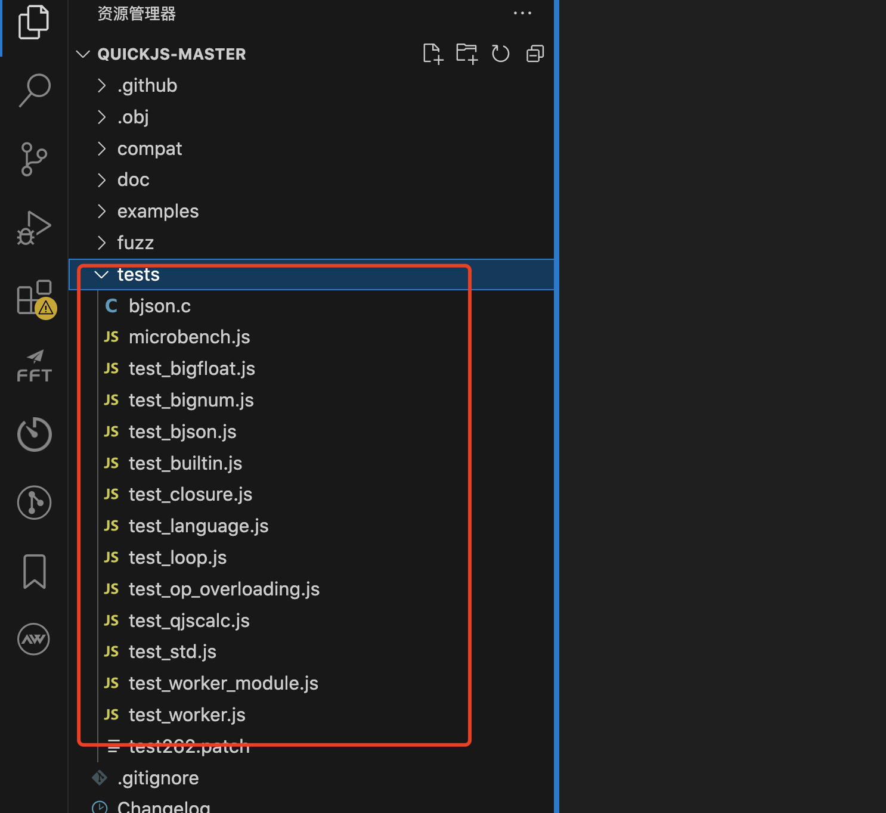
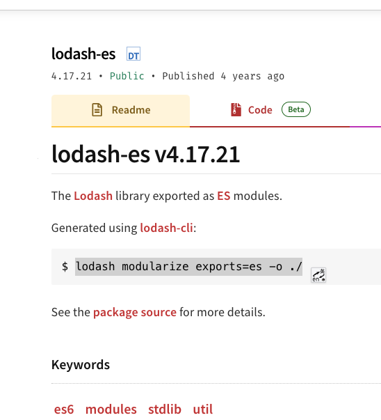

# 快速开始


环境处理
clone 项目 
执行 make 命令
生成 qjs qjsc 命令行工具 


可以执行 系统命令

```
import { popen } from 'std';

import * as os from "os";
import * as std from "std";

var errorObj = {};
// var pipe = popen("./examples/hello", "r", errorObj);
var pipe = popen("ls -la", "r", errorObj);
if (!pipe) {
    throw new Error(`Failed to open pipe: ${errorObj.errno}`);
}

console.log(pipe.readAsString())
// var output = readAll(pipe);
// console.log(output.toString());
// pipe.close();

var ret = os.exec(["/bin/sh", "-c", "exit 1"], { usePath: false });

console.log(ret)

var f = std.tmpfile();
var str = "hello world\n";
f.puts(str);

f.seek(0, std.SEEK_SET);
var str1 = f.readAsString();
// assert(str1 === str);

console.log(str1)

```

自己通过 curl 命令封装 fetch 方法

quick 可以使用 redaxios - 调用远程请求
https://github.com/wangzhiwei1888/redaxios/tree/master


可以通过 quickjs 中 的 test 文件夹进行学习更多能力




fetch.js


```

import { popen } from 'std';
export default function fetch(resource, init) {

    init = init || {
        method: 'GET',
        headers: null,
        body: null,
    };

    let spErr = {}
    let curlCmd = `curl -s -X${init.method} ${resource}`

    if (init.headers != null) {
        curlCmd = `${curlCmd} ${Object.entries(init.headers).map(n=> `-H '${n[0]}: ${n[1]}'`).join(' ')}`
    }
  
    if (init.method != 'GET')
    {
      curlCmd = `${curlCmd} -d '${init.body}'`
    }

    console.log(curlCmd);
    let sp = popen(curlCmd, 'r', spErr);
    let curlOutput = sp.readAsString();
    let responseUrl = resource;
    let responseHeaders = {};
    let responseOk = true;
    let responseStatus = 200;
    
    console.log(curlOutput)
    
    let p = new Promise(function(resolve, reject) {

        let response = {
            headers: responseHeaders,
            ok: responseOk,
            url: responseUrl,
            json: () => JSON.parse(curlOutput),
            text: () => curlOutput,
        }
        

        resolve(response);
    });

    return p;
}

```

fetch.js 使用

```
import fetch from './fetch.js';

const url = 'https://jsonplaceholder.typicode.com/todos/1';

fetch(url)
  .then(data => {
      console.log(JSON.stringify(data));
      return data.json();
  })
  .then(res => {
    console.log(JSON.stringify(res));
  })
  .catch(err => {
    console.log('err:' + JSON.stringify(err));
  })

fetch('https://jsonplaceholder.typicode.com/posts', { method: 'POST', headers: {'Content-Type': 'application/json; charset=UTF-8'}, body: JSON.stringify({'title': 'foo', 'body': 'bar', 'userId': 1})})
  .then(data => {
      console.log(JSON.stringify(data));
      return data.json();
  })
  .then(res => {
    console.log(JSON.stringify(res));
  })
  .catch(err => {
    console.log('err:' + JSON.stringify(err));
  })

```

fetch.js  + redaxios.js 使用

```

import redaxios from './redaxios.js';
import fetch from './fetch.js';

const axios = redaxios.create({fetch, responseType: 'json' });

// 定义请求的 URL 和配置
const url = 'https://jsonplaceholder.typicode.com/todos/1';

axios.get(url)
  .then(res => res.data)
  .then(data => {
    console.log(JSON.stringify(data))
  })


axios.post('https://jsonplaceholder.typicode.com/posts', { 'title': 'foo', 'body': 'bar', 'userId': 1 })
  .then(res => res.data)
  .then(data => {
    console.log(JSON.stringify(data))
  })
  .catch(err => {
    console.log(err.stack);
  })

```

redaxios.js 修改版

```
/**
 * Copyright 2018 Google Inc. All Rights Reserved.
 * Licensed under the Apache License, Version 2.0 (the "License");
 * you may not use this file except in compliance with the License.
 * You may obtain a copy of the License at
 *     http://www.apache.org/licenses/LICENSE-2.0
 * Unless required by applicable law or agreed to in writing, software
 * distributed under the License is distributed on an "AS IS" BASIS,
 * WITHOUT WARRANTIES OR CONDITIONS OF ANY KIND, either express or implied.
 * See the License for the specific language governing permissions and
 * limitations under the License.
 */

/**
 * @public
 * @typedef Options
 * @property {string} [url] the URL to request
 * @property {'get'|'post'|'put'|'patch'|'delete'|'options'|'head'|'GET'|'POST'|'PUT'|'PATCH'|'DELETE'|'OPTIONS'|'HEAD'} [method="get"] HTTP method, case-insensitive
 * @property {RequestHeaders} [headers] Request headers
 * @property {FormData|string|object} [body] a body, optionally encoded, to send
 * @property {'text'|'json'|'stream'|'blob'|'arrayBuffer'|'formData'|'stream'} [responseType="json"] An encoding to use for the response
 * @property {Record<string,any>|URLSearchParams} [params] querystring parameters
 * @property {(params: Options['params']) => string} [paramsSerializer] custom function to stringify querystring parameters
 * @property {boolean} [withCredentials] Send the request with credentials like cookies
 * @property {string} [auth] Authorization header value to send with the request
 * @property {string} [xsrfCookieName] Pass an Cross-site Request Forgery prevention cookie value as a header defined by `xsrfHeaderName`
 * @property {string} [xsrfHeaderName] The name of a header to use for passing XSRF cookies
 * @property {(status: number) => boolean} [validateStatus] Override status code handling (default: 200-399 is a success)
 * @property {Array<(body: any, headers?: RequestHeaders) => any?>} [transformRequest] An array of transformations to apply to the outgoing request
 * @property {string} [baseURL] a base URL from which to resolve all URLs
 * @property {typeof window.fetch} [fetch] Custom window.fetch implementation
 * @property {any} [data]
 */

/**
 * @public
 * @typedef RequestHeaders
 * @type {{[name: string]: string} | Headers}
 */

/**
 * @public
 * @template T
 * @typedef Response
 * @property {number} status
 * @property {string} statusText
 * @property {Options} config the request configuration
 * @property {T} data the decoded response body
 * @property {Headers} headers
 * @property {boolean} redirect
 * @property {string} url
 * @property {ResponseType} type
 * @property {ReadableStream<Uint8Array> | null} body
 * @property {boolean} bodyUsed
 */

/**
 * @typedef BodylessMethod
 * @type {<T=any>(url: string, config?: Options) => Promise<Response<T>>}
 */

/**
 * @typedef BodyMethod
 * @type {<T=any>(url: string, body?: any, config?: Options) => Promise<Response<T>>}
 */

/**
 * @public
 * @param {Options} [defaults = {}]
 * @returns {redaxios}
 */
function create(defaults) {
  defaults = defaults || {};

  /**
   * @public
   * @template T
   * @type {(<T = any>(config?: Options) => Promise<Response<T>>) | (<T = any>(url: string, config?: Options) => Promise<Response<T>>)}
   */
  redaxios.request = redaxios;

  /** @public @type {BodylessMethod} */
  redaxios.get = (url, config) => redaxios(url, config, 'get');

  /** @public @type {BodylessMethod} */
  redaxios.delete = (url, config) => redaxios(url, config, 'delete');

  /** @public @type {BodylessMethod} */
  redaxios.head = (url, config) => redaxios(url, config, 'head');

  /** @public @type {BodylessMethod} */
  redaxios.options = (url, config) => redaxios(url, config, 'options');

  /** @public @type {BodyMethod} */
  redaxios.post = (url, data, config) => redaxios(url, config, 'post', data);

  /** @public @type {BodyMethod} */
  redaxios.put = (url, data, config) => redaxios(url, config, 'put', data);

  /** @public @type {BodyMethod} */
  redaxios.patch = (url, data, config) => redaxios(url, config, 'patch', data);

  /** @public */
  redaxios.all = Promise.all.bind(Promise);

  /**
   * @public
   * @template Args, R
   * @param {(...args: Args[]) => R} fn
   * @returns {(array: Args[]) => R}
   */
  redaxios.spread = (fn) => /** @type {any} */ (fn.apply.bind(fn, fn));

  /**
   * @private
   * @template T, U
   * @param {T} opts
   * @param {U} [overrides]
   * @param {boolean} [lowerCase]
   * @returns {{} & (T | U)}
   */
  function deepMerge(opts, overrides, lowerCase) {
    let out = /** @type {any} */ ({}),
      i;
    if (Array.isArray(opts)) {
      // @ts-ignore
      return opts.concat(overrides);
    }
    for (i in opts) {
      const key = lowerCase ? i.toLowerCase() : i;
      out[key] = opts[i];
    }
    for (i in overrides) {
      const key = lowerCase ? i.toLowerCase() : i;
      const value = /** @type {any} */ (overrides)[i];
      out[key] = key in out && typeof value == 'object' ? deepMerge(out[key], value, key == 'headers') : value;
    }
    return out;
  }

  /**
   * Issues a request.
   * @public
   * @template T
   * @param {string | Options} urlOrConfig
   * @param {Options} [config = {}]
   * @param {any} [_method] (internal)
   * @param {any} [data] (internal)
   * @param {never} [_undefined] (internal)
   * @returns {Promise<Response<T>>}
   */
  function redaxios(urlOrConfig, config, _method, data, _undefined) {
    let url = /** @type {string} */ (typeof urlOrConfig != 'string' ? (config = urlOrConfig).url : urlOrConfig);

    const response = /** @type {Response<any>} */ ({ config });

    /** @type {Options} */
    const options = deepMerge(defaults, config);

    /** @type {RequestHeaders} */
    const customHeaders = {};

    data = data || options.data;

    (options.transformRequest || []).map((f) => {
      data = f(data, options.headers) || data;
    });

    if (options.auth) {
      customHeaders.authorization = options.auth;
    }

    if (data && typeof data === 'object' && typeof data.append !== 'function' && typeof data.text !== 'function') {
      data = JSON.stringify(data);
      customHeaders['content-type'] = 'application/json';
    }

    try {
      // @ts-ignore providing the cookie name without header name is nonsensical anyway
      customHeaders[options.xsrfHeaderName] = decodeURIComponent(
        // @ts-ignore accessing match()[2] throws for no match, which is intentional
        document.cookie.match(RegExp('(^|; )' + options.xsrfCookieName + '=([^;]*)'))[2]
      );
    } catch (e) {}

    if (options.baseURL) {
      url = url.replace(/^(?!.*\/\/)\/?/, options.baseURL + '/');
    }

    if (options.params) {
      url +=
        (~url.indexOf('?') ? '&' : '?') +
        (options.paramsSerializer ? options.paramsSerializer(options.params) : new URLSearchParams(options.params));
    }

    const fetchFunc = options.fetch || fetch;

    return fetchFunc(url, {
      method: (_method || options.method || 'get').toUpperCase(),
      body: data,
      headers: deepMerge(options.headers, customHeaders, true),
      credentials: options.withCredentials ? 'include' : _undefined
    }).then((res) => {
      for (const i in res) {
        if (typeof res[i] != 'function') response[i] = res[i];
      }

      if (options.responseType == 'stream') {
        response.data = res.body;
        return response;
      }

      /*

      return res[options.responseType || 'text']()
        .then((data) => {
          response.data = data;
          // its okay if this fails: response.data will be the unparsed value:
          response.data = JSON.parse(data);
        })
        .catch(Object)
        .then(() => {
          const ok = options.validateStatus ? options.validateStatus(res.status) : res.ok;
          return ok ? response : Promise.reject(response);
        });
        */
      
      const fn = res[options.responseType || 'text'];
      const data = fn();
      response.data = data;
      return response;
      
    });
  }

  /**
   * @public
   * @type {AbortController}
   */
  redaxios.CancelToken = /** @type {any} */ (typeof AbortController == 'function' ? AbortController : Object);

  /**
   * @public
   * @type {Options}
   */
  redaxios.defaults = defaults;

  /**
   * @public
   */
  redaxios.create = create;

  return redaxios;
}

export default create();

```




quickjs 中使用 lodash
安装 lodash 命令行工具

```
cnpm i -g lodash-cli

```

clone lodash 仓库 
执行以下命令输出 es6 modules 文件列表到 out 目录下

```
lodash modularize exports=es -o ./out
```

演示代码（备注：其中 debounce 仓库用到了 setTimeout 方法，quickjs 中  ）

需要在打包好的debounce.js 中引入 setTimeout 方法才可以正常使用

```
import {setTimeout} from "os";

```

```
import throttle from './lodash/throttle.js';
import debounce from './lodash/debounce.js';

// 使用导入的函数
const myDebounceFunction = debounce(() => {
  console.log('This function has been debounced!');
}, 1000);

myDebounceFunction();

const myThrottleFunction = throttle(() => {
  console.log('This function has been throttled!');
}, 1000);

myThrottleFunction();


```


继续学习官方的demo

https://www.cnblogs.com/wunaozai/p/17850789.html
https://github.com/OpenQuickJS/quickjs-android
https://www.youtube.com/watch?v=uzLy9DfujfM
https://github.com/bojie-liu/react-native-quickjs

https://medium.com/@bojieliu711/easily-use-quickjs-in-react-native-c7e650705ebf
https://github.com/taoweiji/miniprogram-double-thread-demo


https://www.w3.org/2023/09/TPAC/ac-lt-wasm-perf


# quickjs 如何操作 mysql 


安装依赖

```

sudo apt-get install libmysqlclient-dev

```

mysql_module.c

```
#include "../quickjs.h"
#include <mysql/mysql.h>

#define countof(x) (sizeof(x) / sizeof((x)[0]))

typedef struct
{
  MYSQL *conn;
  int is_closed;  // 新增字段，用于标记连接是否已关闭
} MySQLClient;

static JSClassID js_mysql_client_class_id;

static void js_mysql_client_finalizer(JSRuntime *rt, JSValue val)
{
  MySQLClient *client = JS_GetOpaque(val, js_mysql_client_class_id);
  if (client && client->conn && !client->is_closed)
  {
    mysql_close(client->conn);
    js_free_rt(rt, client);
  }
}

static JSValue js_mysql_client_ctor(JSContext *ctx,
                                    JSValueConst new_target,
                                    int argc, JSValueConst *argv)
{
  MySQLClient *client;
  JSValue obj = JS_UNDEFINED;
  JSValue proto;
  const char *host = "127.0.0.1";
  const char *user = "root";
  const char *password = "";
  const char *database = "";
  unsigned int port = 3306;

  client = js_mallocz(ctx, sizeof(*client));
  if (!client)
    return JS_EXCEPTION;

  if (argc > 0 && JS_IsString(argv[0]))
  {
    host = JS_ToCString(ctx, argv[0]);
  }
  if (argc > 1 && JS_IsString(argv[1]))
  {
    user = JS_ToCString(ctx, argv[1]);
  }
  if (argc > 2 && JS_IsString(argv[2]))
  {
    password = JS_ToCString(ctx, argv[2]);
  }
  if (argc > 3 && JS_IsString(argv[3]))
  {
    database = JS_ToCString(ctx, argv[3]);
  }
  if (argc > 4 && JS_IsNumber(argv[4]))
  {
    JS_ToUint32(ctx, &port, argv[4]);
  }

  client->conn = mysql_init(NULL);
  if (mysql_real_connect(client->conn, host, user, password, database, port, NULL, 0) == NULL)
  {
    fprintf(stderr, "MySQL connection error: %s\n", mysql_error(client->conn));
    mysql_close(client->conn);
    js_free(ctx, client);
    return JS_EXCEPTION;
  }

  proto = JS_GetPropertyStr(ctx, new_target, "prototype");
  if (JS_IsException(proto))
    goto fail;
  obj = JS_NewObjectProtoClass(ctx, proto, js_mysql_client_class_id);
  JS_FreeValue(ctx, proto);
  if (JS_IsException(obj))
    goto fail;
  JS_SetOpaque(obj, client);
  return obj;

fail:
  js_free(ctx, client);
  JS_FreeValue(ctx, obj);
  return JS_EXCEPTION;
}

static JSValue js_mysql_query(JSContext *ctx, JSValueConst this_val,
                              int argc, JSValueConst *argv)
{
  MySQLClient *client = JS_GetOpaque2(ctx, this_val, js_mysql_client_class_id);
  if (!client || !client->conn || client->is_closed)
    return JS_EXCEPTION;

  const char *query;
  if (argc < 1 || !JS_IsString(argv[0]))
    return JS_EXCEPTION;

  query = JS_ToCString(ctx, argv[0]);

  if (mysql_query(client->conn, query))
  {
    fprintf(stderr, "MySQL query error: %s\n", mysql_error(client->conn));
    return JS_EXCEPTION;
  }

  MYSQL_RES *result = mysql_store_result(client->conn);
  if (result)
  {
    MYSQL_ROW row;
    JSValue result_array = JS_NewArray(ctx);

    int row_index = 0;
    while ((row = mysql_fetch_row(result)))
    {
      JSValue row_obj = JS_NewObject(ctx);
      for (int i = 0; i < mysql_num_fields(result); i++)
      {
        const char *field_name = mysql_fetch_field_direct(result, i)->name;
        JS_SetPropertyStr(ctx, row_obj, field_name, JS_NewString(ctx, row[i]));
      }
      JS_SetPropertyUint32(ctx, result_array, row_index++, row_obj);
    }

    mysql_free_result(result);
    return result_array;
  }

  return JS_UNDEFINED;
}

static JSValue js_mysql_insert(JSContext *ctx, JSValueConst this_val,
                               int argc, JSValueConst *argv)
{
  MySQLClient *client = JS_GetOpaque2(ctx, this_val, js_mysql_client_class_id);
  if (!client || !client->conn || client->is_closed)
    return JS_EXCEPTION;

  const char *query;
  if (argc < 1 || !JS_IsString(argv[0]))
    return JS_EXCEPTION;

  query = JS_ToCString(ctx, argv[0]);

  if (mysql_query(client->conn, query))
  {
    fprintf(stderr, "MySQL insert error: %s\n", mysql_error(client->conn));
    return JS_EXCEPTION;
  }

  return JS_NewInt32(ctx, mysql_insert_id(client->conn));
}

static JSValue js_mysql_update(JSContext *ctx, JSValueConst this_val,
                               int argc, JSValueConst *argv)
{
  MySQLClient *client = JS_GetOpaque2(ctx, this_val, js_mysql_client_class_id);
  if (!client || !client->conn || client->is_closed)
    return JS_EXCEPTION;

  const char *query;
  if (argc < 1 || !JS_IsString(argv[0]))
    return JS_EXCEPTION;

  query = JS_ToCString(ctx, argv[0]);

  if (mysql_query(client->conn, query))
  {
    fprintf(stderr, "MySQL update error: %s\n", mysql_error(client->conn));
    return JS_EXCEPTION;
  }

  return JS_NewInt32(ctx, mysql_affected_rows(client->conn));
}
static JSValue js_mysql_delete(JSContext *ctx, JSValueConst this_val,
                               int argc, JSValueConst *argv)
{
  MySQLClient *client = JS_GetOpaque2(ctx, this_val, js_mysql_client_class_id);
  if (!client || !client->conn || client->is_closed)
    return JS_EXCEPTION;

  const char *query;
  if (argc < 1 || !JS_IsString(argv[0]))
    return JS_EXCEPTION;

  query = JS_ToCString(ctx, argv[0]);

  if (mysql_query(client->conn, query))
  {
    fprintf(stderr, "MySQL delete error: %s\n", mysql_error(client->conn));
    return JS_EXCEPTION;
  }

  return JS_NewInt32(ctx, mysql_affected_rows(client->conn));
}
static JSValue js_mysql_close(JSContext *ctx, JSValueConst this_val,
                              int argc, JSValueConst *argv)
{
  MySQLClient *client = JS_GetOpaque2(ctx, this_val, js_mysql_client_class_id);
  if (!client || !client->conn || client->is_closed)
    return JS_UNDEFINED;

  mysql_close(client->conn);
  client->conn = NULL;
  client->is_closed = 1;

  return JS_UNDEFINED;
}

static JSClassDef js_mysql_client_class = {
    "MySQLClient",
    .finalizer = js_mysql_client_finalizer,
};

static const JSCFunctionListEntry js_mysql_client_proto_funcs[] = {
    JS_CFUNC_DEF("query", 1, js_mysql_query),
    JS_CFUNC_DEF("insert", 1, js_mysql_insert),
    JS_CFUNC_DEF("update", 1, js_mysql_update),
    JS_CFUNC_DEF("delete", 1, js_mysql_delete),  // 新增这一行
    JS_CFUNC_DEF("close", 0, js_mysql_close),
};

static int js_mysql_client_init(JSContext *ctx, JSModuleDef *m)
{
  JSValue mysql_proto, mysql_class;

  JS_NewClassID(&js_mysql_client_class_id);
  JS_NewClass(JS_GetRuntime(ctx), js_mysql_client_class_id, &js_mysql_client_class);

  mysql_proto = JS_NewObject(ctx);
  JS_SetPropertyFunctionList(ctx, mysql_proto, js_mysql_client_proto_funcs, countof(js_mysql_client_proto_funcs));

  mysql_class = JS_NewCFunction2(ctx, js_mysql_client_ctor, "MySQLClient", 5, JS_CFUNC_constructor, 0);
  JS_SetConstructor(ctx, mysql_class, mysql_proto);
  JS_SetClassProto(ctx, js_mysql_client_class_id, mysql_proto);

  JS_SetModuleExport(ctx, m, "MySQLClient", mysql_class);
  return 0;
}

JSModuleDef *js_init_module(JSContext *ctx, const char *module_name)
{
  JSModuleDef *m;
  m = JS_NewCModule(ctx, module_name, js_mysql_client_init);
  if (!m)
    return NULL;
  JS_AddModuleExport(ctx, m, "MySQLClient");
  return m;
}

```


```

gcc -shared -o libmysql_module.so -fPIC examples/mysql_module.c -L/home/dc/wzw/study/quickjs_yoga/quickjs -lmysqlclient -lquickjs
mv libmysql_module.so ./examples/
./qjs examples/test_mysql.js


```

test_mysql.js


```
import * as mysql from './libmysql_module.so';

const client = new mysql.MySQLClient('127.0.0.1', 'admin', 'Jason@#123', 'big_event');

// // 查询数据
// const result = client.query('SELECT * FROM user');
// console.log(JSON.stringify(result));

// // 插入数据
// const insertId = client.insert('INSERT INTO user (username, password, create_time, update_time) VALUES ("aAlice111", "aaaa", "2024-08-22 09:31:58", "2024-08-22 09:31:58")');
// console.log(insertId);

// // 更新数据
// const affectedRows = client.update('UPDATE user SET username = "Bo1b" WHERE id = 1');
// console.log(affectedRows);


//删除数据
const daffectedRows = client.delete("DELETE FROM user WHERE id = 1")
console.log(daffectedRows);

// 关闭连接
client.close();


```

ldd examples/libmysql_module.so

```


ldd examples/libmysql_module.so
        linux-vdso.so.1 (0x00007fff1318a000)
        libmysqlclient.so.21 => /lib/x86_64-linux-gnu/libmysqlclient.so.21 (0x00007f0203bf7000)
        libc.so.6 => /lib/x86_64-linux-gnu/libc.so.6 (0x00007f0203a05000)
        libdl.so.2 => /lib/x86_64-linux-gnu/libdl.so.2 (0x00007f02039ff000)
        libssl.so.1.1 => /lib/x86_64-linux-gnu/libssl.so.1.1 (0x00007f020396c000)
        libcrypto.so.1.1 => /lib/x86_64-linux-gnu/libcrypto.so.1.1 (0x00007f0203695000)
        libresolv.so.2 => /lib/x86_64-linux-gnu/libresolv.so.2 (0x00007f0203677000)
        libpthread.so.0 => /lib/x86_64-linux-gnu/libpthread.so.0 (0x00007f0203654000)
        libstdc++.so.6 => /lib/x86_64-linux-gnu/libstdc++.so.6 (0x00007f0203472000)
        libgcc_s.so.1 => /lib/x86_64-linux-gnu/libgcc_s.so.1 (0x00007f0203457000)
        /lib64/ld-linux-x86-64.so.2 (0x00007f020441a000)
        libm.so.6 => /lib/x86_64-linux-gnu/libm.so.6 (0x00007f0203308000)

```

```

ldd 命令用于显示动态链接库的依赖关系。它可以帮助你了解某个可执行文件或共享库依赖于哪些其他共享库，并显示这些库的具体路径。以下是 ldd 命令的主要功能和用法：
显示依赖库：
列出目标文件（可执行文件或共享库）所依赖的所有共享库及其路径。
检查库文件完整性：
确认所有依赖的库文件是否存在，并且路径正确。
调试链接问题：
帮助诊断由于缺少依赖库或路径错误导致的程序启动失败或运行时错误。
用法
ldd [选项] 文件
常用选项
-v 或 --verbose：显示详细信息，包括版本信息和符号解析。
-u 或 --unused：显示未使用的直接依赖库。
-d 或 --data-relocs：处理数据重定位。
-r 或 --function-relocs：处理数据和函数重定位。

```


# quickjs 如何操作 redis 


```
sudo apt-get install libmysqlclient-dev

```


redis_module.c

```
#include "../quickjs.h"
#include <hiredis/hiredis.h>

#define countof(x) (sizeof(x) / sizeof((x)[0]))

typedef struct
{
  redisContext *context;
  int is_closed;  // 新增字段，用于标记连接是否已关闭
} RedisClient;

static JSClassID js_redis_client_class_id;

static void js_redis_client_finalizer(JSRuntime *rt, JSValue val)
{
  RedisClient *client = JS_GetOpaque(val, js_redis_client_class_id);
  if (client && client->context && !client->is_closed)
  {
    redisFree(client->context);
    js_free_rt(rt, client);
  }
}

static JSValue js_redis_client_ctor(JSContext *ctx,
                                    JSValueConst new_target,
                                    int argc, JSValueConst *argv)
{
  RedisClient *client;
  JSValue obj = JS_UNDEFINED;
  JSValue proto;
  const char *host = "127.0.0.1";
  int port = 6379;

  client = js_mallocz(ctx, sizeof(*client));
  if (!client)
    return JS_EXCEPTION;

  if (argc > 0 && JS_IsString(argv[0]))
  {
    host = JS_ToCString(ctx, argv[0]);
  }
  if (argc > 1 && JS_IsNumber(argv[1]))
  {
    JS_ToInt32(ctx, &port, argv[1]);
  }

  client->context = redisConnect(host, port);
  if (client->context == NULL || client->context->err)
  {
    if (client->context)
    {
      fprintf(stderr, "Connection error: %s\n", client->context->errstr);
      redisFree(client->context);
    }
    else
    {
      fprintf(stderr, "Connection error: can't allocate redis context\n");
    }
    js_free(ctx, client);
    return JS_EXCEPTION;
  }

  proto = JS_GetPropertyStr(ctx, new_target, "prototype");
  if (JS_IsException(proto))
    goto fail;
  obj = JS_NewObjectProtoClass(ctx, proto, js_redis_client_class_id);
  JS_FreeValue(ctx, proto);
  if (JS_IsException(obj))
    goto fail;
  JS_SetOpaque(obj, client);
  return obj;

fail:
  js_free(ctx, client);
  JS_FreeValue(ctx, obj);
  return JS_EXCEPTION;
}

static JSValue js_redis_set(JSContext *ctx, JSValueConst this_val,
                            int argc, JSValueConst *argv)
{
  RedisClient *client = JS_GetOpaque2(ctx, this_val, js_redis_client_class_id);
  if (!client || !client->context || client->is_closed)
    return JS_EXCEPTION;

  const char *key, *value;
  int expire = 0;  // 默认不过期

  if (argc < 2 || !JS_IsString(argv[0]) || !JS_IsString(argv[1]))
    return JS_EXCEPTION;

  if (argc > 2 && JS_IsNumber(argv[2]))
  {
    JS_ToInt32(ctx, &expire, argv[2]);
  }

  key = JS_ToCString(ctx, argv[0]);
  value = JS_ToCString(ctx, argv[1]);

  redisReply *reply;
  if (expire > 0)
  {
    reply = (redisReply *)redisCommand(client->context, "SET %s %s EX %d", key, value, expire);
  }
  else
  {
    reply = (redisReply *)redisCommand(client->context, "SET %s %s", key, value);
  }

  if (reply == NULL)
  {
    fprintf(stderr, "Error setting key: %s\n", client->context->errstr);
    return JS_EXCEPTION;
  }

  freeReplyObject(reply);
  return JS_UNDEFINED;
}

static JSValue js_redis_get(JSContext *ctx, JSValueConst this_val,
                            int argc, JSValueConst *argv)
{
  RedisClient *client = JS_GetOpaque2(ctx, this_val, js_redis_client_class_id);
  if (!client || !client->context || client->is_closed)
    return JS_EXCEPTION;

  const char *key;
  if (argc < 1 || !JS_IsString(argv[0]))
    return JS_EXCEPTION;

  key = JS_ToCString(ctx, argv[0]);

  redisReply *reply = (redisReply *)redisCommand(client->context, "GET %s", key);
  if (reply == NULL)
  {
    fprintf(stderr, "Error getting key: %s\n", client->context->errstr);
    return JS_EXCEPTION;
  }

  JSValue result = JS_UNDEFINED;
  if (reply->type == REDIS_REPLY_STRING)
  {
    result = JS_NewString(ctx, reply->str);
  }

  freeReplyObject(reply);
  return result;
}

static JSValue js_redis_del(JSContext *ctx, JSValueConst this_val,
                            int argc, JSValueConst *argv)
{
  RedisClient *client = JS_GetOpaque2(ctx, this_val, js_redis_client_class_id);
  if (!client || !client->context || client->is_closed)
    return JS_EXCEPTION;

  const char *key;
  if (argc < 1 || !JS_IsString(argv[0]))
    return JS_EXCEPTION;

  key = JS_ToCString(ctx, argv[0]);

  redisReply *reply = (redisReply *)redisCommand(client->context, "DEL %s", key);
  if (reply == NULL)
  {
    fprintf(stderr, "Error deleting key: %s\n", client->context->errstr);
    return JS_EXCEPTION;
  }

  freeReplyObject(reply);
  return JS_UNDEFINED;
}

static JSValue js_redis_close(JSContext *ctx, JSValueConst this_val,
                              int argc, JSValueConst *argv)
{
  RedisClient *client = JS_GetOpaque2(ctx, this_val, js_redis_client_class_id);
  if (!client || !client->context || client->is_closed)
    return JS_UNDEFINED;

  redisFree(client->context);
  client->context = NULL;
  client->is_closed = 1;

  return JS_UNDEFINED;
}

static JSClassDef js_redis_client_class = {
    "RedisClient",
    .finalizer = js_redis_client_finalizer,
};

static const JSCFunctionListEntry js_redis_client_proto_funcs[] = {
    JS_CFUNC_DEF("set", 3, js_redis_set),
    JS_CFUNC_DEF("get", 1, js_redis_get),
    JS_CFUNC_DEF("del", 1, js_redis_del),
    JS_CFUNC_DEF("close", 0, js_redis_close),
};

static int js_redis_client_init(JSContext *ctx, JSModuleDef *m)
{
  JSValue redis_proto, redis_class;

  JS_NewClassID(&js_redis_client_class_id);
  JS_NewClass(JS_GetRuntime(ctx), js_redis_client_class_id, &js_redis_client_class);

  redis_proto = JS_NewObject(ctx);
  JS_SetPropertyFunctionList(ctx, redis_proto, js_redis_client_proto_funcs, countof(js_redis_client_proto_funcs));

  redis_class = JS_NewCFunction2(ctx, js_redis_client_ctor, "RedisClient", 2, JS_CFUNC_constructor, 0);
  JS_SetConstructor(ctx, redis_class, redis_proto);
  JS_SetClassProto(ctx, js_redis_client_class_id, redis_proto);

  JS_SetModuleExport(ctx, m, "RedisClient", redis_class);
  return 0;
}

JSModuleDef *js_init_module(JSContext *ctx, const char *module_name)
{
  JSModuleDef *m;
  m = JS_NewCModule(ctx, module_name, js_redis_client_init);
  if (!m)
    return NULL;
  JS_AddModuleExport(ctx, m, "RedisClient");
  return m;
}

```

编译

```
gcc -shared -o libredis_module.so -fPIC examples/redis_module.c -L/home/dc/wzw/study/quickjs_yoga/quickjs -lhiredis -lquickjs
mv libredis_module.so ./examples/
qjs examples/test_redis.js

```

调用编译好的 so 文件，进行 redis 操作

```
import{RedisClient} from './libredis_module.so';

// 创建 Redis 客户端
const redis = new RedisClient('127.0.0.1', 6379);

// 设置键值对
redis.set('key2', 'value22')

// 获取键值对
console.log(redis.get('key2'))


// import * as redis from './libredis_module.so';

// const client = new redis.RedisClient();

// client.set('key', 'value', 30);  // 设置键值对并指定过期时间为10秒
// const value = client.get('key');
// console.log(value); // 输出: value

// client.del('key');  // 删除键

// const deletedValue = client.get('key');
// console.log(deletedValue); // 输出: undefined

// client.close();  // 关闭连接

```


# quickjs+yoga结合使用


```

QuickJS + Yoga 结合使用
QuickJS 是一个轻量级的 JavaScript 引擎，由 Mozilla 开发，适用于嵌入式系统和高性能应用。Yoga 是 Facebook 开发的一个跨平台布局引擎，基于 Flexbox 布局算法。结合 QuickJS 和 Yoga，可以在 JavaScript 中实现高效的布局管理，特别适合用于构建跨平台的应用程序。

以下是一个简单的示例，展示如何在 QuickJS 中使用 Yoga 进行布局计算。

1. 安装依赖
首先，确保你已经安装了 QuickJS 和 Yoga。你可以从各自的 GitHub 仓库获取源代码并编译安装。

QuickJS: https://github.com/bellard/quickjs
Yoga: https://github.com/facebook/yoga
2. 编写 C 代码
创建一个 C 文件（例如 main.c），用于初始化 QuickJS 和 Yoga，并提供 JavaScript 接口。

c
#include "quickjs.h"
#include "yoga/YGNode.h"

// 初始化 Yoga 节点
YGNodeRef createYogaNode() {
    YGNodeRef node = YGNodeNew();
    return node;
}

// 设置 Yoga 节点的宽度
void setWidth(YGNodeRef node, float width) {
    YGNodeStyleSetWidth(node, width);
}

// 设置 Yoga 节点的高度
void setHeight(YGNodeRef node, float height) {
    YGNodeStyleSetHeight(node, height);
}

// 设置 Yoga 节点的 Flex 方向
void setFlexDirection(YGNodeRef node, const char* direction) {
    YGFlexDirection dir = YGFlexDirectionColumn;
    if (strcmp(direction, "row") == 0) {
        dir = YGFlexDirectionRow;
    } else if (strcmp(direction, "column-reverse") == 0) {
        dir = YGFlexDirectionColumnReverse;
    } else if (strcmp(direction, "row-reverse") == 0) {
        dir = YGFlexDirectionRowReverse;
    }
    YGNodeStyleSetFlexDirection(node, dir);
}

// 计算 Yoga 布局
void calculateLayout(YGNodeRef node, float width, float height) {
    YGNodeCalculateLayout(node, width, height, YGDirectionLTR);
}

// 获取 Yoga 节点的布局属性
float getLayoutLeft(YGNodeRef node) {
    return YGNodeLayoutGetLeft(node);
}

float getLayoutTop(YGNodeRef node) {
    return YGNodeLayoutGetTop(node);
}

float getLayoutWidth(YGNodeRef node) {
    return YGNodeLayoutGetWidth(node);
}

float getLayoutHeight(YGNodeRef node) {
    return YGNodeLayoutGetHeight(node);
}

// 注册 JavaScript 函数
void registerJSFunctions(JSContext* ctx) {
    JS_NewGlobalObject(ctx);
    JSValue global_obj = JS_GetGlobalObject(ctx);

    JS_SetPropertyStr(ctx, global_obj, "createYogaNode", JS_NewCFunction(ctx, createYogaNode, "createYogaNode", 0));
    JS_SetPropertyStr(ctx, global_obj, "setWidth", JS_NewCFunction(ctx, setWidth, "setWidth", 2));
    JS_SetPropertyStr(ctx, global_obj, "setHeight", JS_NewCFunction(ctx, setHeight, "setHeight", 2));
    JS_SetPropertyStr(ctx, global_obj, "setFlexDirection", JS_NewCFunction(ctx, setFlexDirection, "setFlexDirection", 2));
    JS_SetPropertyStr(ctx, global_obj, "calculateLayout", JS_NewCFunction(ctx, calculateLayout, "calculateLayout", 3));
    JS_SetPropertyStr(ctx, global_obj, "getLayoutLeft", JS_NewCFunction(ctx, getLayoutLeft, "getLayoutLeft", 1));
    JS_SetPropertyStr(ctx, global_obj, "getLayoutTop", JS_NewCFunction(ctx, getLayoutTop, "getLayoutTop", 1));
    JS_SetPropertyStr(ctx, global_obj, "getLayoutWidth", JS_NewCFunction(ctx, getLayoutWidth, "getLayoutWidth", 1));
    JS_SetPropertyStr(ctx, global_obj, "getLayoutHeight", JS_NewCFunction(ctx, getLayoutHeight, "getLayoutHeight", 1));

    JS_FreeValue(ctx, global_obj);
}

int main(int argc, char** argv) {
    JSRuntime* rt = JS_NewRuntime();
    JSContext* ctx = JS_NewContext(rt);

    registerJSFunctions(ctx);

    // 读取并执行 JavaScript 代码
    const char* js_code = R"(
        let root = createYogaNode();
        setWidth(root, 300);
        setHeight(root, 300);
        setFlexDirection(root, 'column');

        let child1 = createYogaNode();
        setWidth(child1, 100);
        setHeight(child1, 100);

        let child2 = createYogaNode();
        setWidth(child2, 100);
        setHeight(child2, 100);

        root.appendChild(child1);
        root.appendChild(child2);

        calculateLayout(root, 300, 300);

        console.log(`Left: ${getLayoutLeft(root)}, Top: ${getLayoutTop(root)}, Width: ${getLayoutWidth(root)}, Height: ${getLayoutHeight(root)}`);
        console.log(`Child1 Left: ${getLayoutLeft(child1)}, Top: ${getLayoutTop(child1)}, Width: ${getLayoutWidth(child1)}, Height: ${getLayoutHeight(child1)}`);
        console.log(`Child2 Left: ${getLayoutLeft(child2)}, Top: ${getLayoutTop(child2)}, Width: ${getLayoutWidth(child2)}, Height: ${getLayoutHeight(child2)}`);
    )";

    JS_Eval(ctx, js_code, strlen(js_code), "<input>", JS_EVAL_TYPE_GLOBAL);

    JS_FreeContext(ctx);
    JS_FreeRuntime(rt);

    return 0;
}

3. 编译和运行
编译上述 C 代码，并链接 QuickJS 和 Yoga 库。假设你已经编译并安装了 QuickJS 和 Yoga，可以使用以下命令进行编译：

gcc -o quickjs_yoga main.c -I/path/to/quickjs -I/path/to/yoga -L/path/to/quickjs -L/path/to/yoga -lquickjs -lyoga -lm

运行编译后的程序：
./quickjs_yoga


解释
初始化 Yoga 节点:

createYogaNode 函数创建一个新的 Yoga 节点。
setWidth 和 setHeight 函数设置节点的宽度和高度。
setFlexDirection 函数设置节点的 Flex 方向。
计算布局:

calculateLayout 函数计算节点的布局。
获取布局属性:

getLayoutLeft、getLayoutTop、getLayoutWidth 和 getLayoutHeight 函数获取节点的布局属性。
注册 JavaScript 函数:

registerJSFunctions 函数将 C 函数注册为 JavaScript 函数，使它们可以在 JavaScript 中调用。
执行 JavaScript 代码:

在 main 函数中，读取并执行 JavaScript 代码，创建和配置 Yoga 节点，并计算布局。
运行结果
当你运行上述程序时，JavaScript 代码将创建一个根节点和两个子节点，设置它们的布局属性，并计算布局。最终，程序将输出每个节点的布局属性。

总结
通过结合 QuickJS 和 Yoga，你可以在 JavaScript 中实现高效的布局管理，特别适合用于构建跨平台的应用程序。这种方式不仅提供了灵活的布局能力，还保持了高性能和低资源消耗。


yoga 编译安装
oga 编译安装指南
Yoga 是 Facebook 开发的一个跨平台的布局引擎，基于 Flexbox 布局算法。它支持多种平台，包括 iOS、Android、Web 和桌面应用。以下是如何在不同平台上编译和安装 Yoga 的详细步骤。
1. 获取 Yoga 源代码
首先，从 GitHub 上克隆 Yoga 仓库：
sudo apt-get update
sudo apt-get install cmake ninja-build

mkdir build
cd build
cmake -G Ninja ..
ninja
编译完成后，你会在 build 目录下找到生成的库文件，例如 libyoga.a 或 libyoga.so。
Windows
使用 Visual Studio 命令行工具（例如 Developer Command Prompt for VS 2019）：
shmkdir build
cd build
cmake -G "Visual Studio 16 2019" -A x64 ..
cmake --build . --config Release
编译完成后，你会在 build\Release 目录下找到生成的库文件，例如 yoga.lib。
4. 安装 Yoga
Linux 和 macOS
将生成的库文件和头文件复制到适当的位置。例如，复制到 /usr/local/lib 和 /usr/local/include：
shsudo cp build/libyoga.a /usr/local/lib/
sudo cp -r ../yoga /usr/local/include/
Windows
将生成的库文件和头文件复制到你的项目目录中。例如，复制到 C:\your_project\lib 和 C:\your_project\include：
shcopy build\Release\yoga.lib C:\your_project\lib\
xcopy ..\yoga C:\your_project\include\yoga /E /I


5. 验证安装
创建一个简单的 C++ 程序来验证 Yoga 是否安装成功。
示例代码
创建一个 test_yoga.cpp 文件：
cpp#include <iostream>
#include <yoga/YGNode.h>

int main() {
    // 创建一个 Yoga 节点
    YGNodeRef root = YGNodeNew();
    YGNodeStyleSetWidth(root, 300);
    YGNodeStyleSetHeight(root, 300);

    // 计算布局
    YGNodeCalculateLayout(root, YGUndefined, YGUndefined, YGDirectionLTR);

    // 输出布局信息
    std::cout << "Root node layout: "
              << "Left: " << YGNodeLayoutGetLeft(root) << ", "
              << "Top: " << YGNodeLayoutGetTop(root) << ", "
              << "Width: " << YGNodeLayoutGetWidth(root) << ", "
              << "Height: " << YGNodeLayoutGetHeight(root) << std::endl;

    // 释放节点
    YGNodeFreeRecursive(root);

    return 0;
}


编译和运行
Linux 和 macOS
shg++ test_yoga.cpp -lyoga -o test_yoga
./test_yoga
Windows
使用 Visual Studio 命令行工具：
shcl /EHsc /I C:\your_project\include test_yoga.cpp /link /LIBPATH:C:\your_project\lib yoga.lib
test_yoga.exe
总结
通过以上步骤，你可以在不同的平台上编译和安装 Yoga，并验证其是否安装成功。Yoga 提供了强大的布局能力，适用于多种应用场景，特别是需要跨平台布局的项目。

javascript 应该如何调用
在你的代码中，已经将 C/C++ 函数注册到了 QuickJS 的全局对象中，这样你就可以在 JavaScript 中直接调用这些函数。以下是如何在 JavaScript 中调用这些函数的详细步骤和示例：
1. 创建和配置 Yoga 节点
你已经在 main 函数中定义了一段 JavaScript 代码，用于创建和配置 Yoga 节点。以下是这段代码的详细解释：
javascriptlet root = createYogaNode();
setWidth(root, 300);
setHeight(root, 300);
setFlexDirection(root, 'column');
createYogaNode()：创建一个新的 Yoga 节点。
setWidth(root, 300)：设置根节点的宽度为 300。
setHeight(root, 300)：设置根节点的高度为 300。
setFlexDirection(root, 'column')：设置根节点的 Flex 方向为列方向。
2. 创建子节点并添加到根节点
javascriptlet child1 = createYogaNode();
setWidth(child1, 100);
setHeight(child1, 100);

let child2 = createYogaNode();
setWidth(child2, 100);
setHeight(child2, 100);

root.appendChild(child1);
root.appendChild(child2);
createYogaNode()：创建两个子节点 child1 和 child2。
setWidth(child1, 100) 和 setHeight(child1, 100)：设置 child1 的宽度和高度。
setWidth(child2, 100) 和 setHeight(child2, 100)：设置 child2 的宽度和高度。
root.appendChild(child1) 和 root.appendChild(child2)：将子节点添加到根节点中。
3. 计算布局
javascriptcalculateLayout(root, 300, 300);
calculateLayout(root, 300, 300)：计算根节点及其子节点的布局，给定的宽度和高度分别为 300。
4. 获取并输出布局属性
javascriptconsole.log(`Left: ${getLayoutLeft(root)}, Top: ${getLayoutTop(root)}, Width: ${getLayoutWidth(root)}, Height: ${getLayoutHeight(root)}`);
console.log(`Child1 Left: ${getLayoutLeft(child1)}, Top: ${getLayoutTop(child1)}, Width: ${getLayoutWidth(child1)}, Height: ${getLayoutHeight(child1)}`);
console.log(`Child2 Left: ${getLayoutLeft(child2)}, Top: ${getLayoutTop(child2)}, Width: ${getLayoutWidth(child2)}, Height: ${getLayoutHeight(child2)}`);
getLayoutLeft(node)：获取节点的左偏移。
getLayoutTop(node)：获取节点的上偏移。
getLayoutWidth(node)：获取节点的宽度。
getLayoutHeight(node)：获取节点的高度。
console.log()：输出节点的布局属性。
完整的 JavaScript 代码
javascriptlet root = createYogaNode();
setWidth(root, 300);
setHeight(root, 300);
setFlexDirection(root, 'column');

let child1 = createYogaNode();
setWidth(child1, 100);
setHeight(child1, 100);

let child2 = createYogaNode();
setWidth(child2, 100);
setHeight(child2, 100);

root.appendChild(child1);
root.appendChild(child2);

calculateLayout(root, 300, 300);

console.log(`Left: ${getLayoutLeft(root)}, Top: ${getLayoutTop(root)}, Width: ${getLayoutWidth(root)}, Height: ${getLayoutHeight(root)}`);
console.log(`Child1 Left: ${getLayoutLeft(child1)}, Top: ${getLayoutTop(child1)}, Width: ${getLayoutWidth(child1)}, Height: ${getLayoutHeight(child1)}`);
console.log(`Child2 Left: ${getLayoutLeft(child2)}, Top: ${getLayoutTop(child2)}, Width: ${getLayoutWidth(child2)}, Height: ${getLayoutHeight(child2)}`);
运行结果
运行上述 JavaScript 代码后，你应该会看到类似以下的输出：
Left: 0, Top: 0, Width: 300, Height: 300
Child1 Left: 0, Top: 0, Width: 100, Height: 100
Child2 Left: 0, Top: 100, Width: 100, Height: 100
这表明 Yoga 节点的布局已经正确计算并输出。你可以根据需要修改 JavaScript 代码，以实现不同的布局效果。


```

