### Telegraf 介绍

每隔一个频次，将数据写入到时序数据库中

看文档一定要和版本匹配

1. 概述
Telegraf 是由 InfluxData 开发的开源插件化代理工具，主要用于收集、处理和写入监控数据。它能够从各种系统、服务和应用程序中提取指标，并将这些数据发送到不同的后端存储或处理系统。

2. 主要特点
- **插件化架构**：支持多种输入（如 CPU、内存、网络接口等）和输出（如 InfluxDB、Prometheus、Kafka 等）插件。
- **轻量级**：资源消耗低，适合部署在服务器、容器或边缘设备上。
- **灵活性**：可以通过配置文件轻松启用或禁用插件，调整采集频率和数据处理逻辑。
- **社区支持**：拥有活跃的开发者社区，提供了丰富的插件和文档支持。

3. 应用场景
- **系统监控**：收集主机的性能指标，如 CPU 使用率、内存占用、磁盘 I/O 和网络流量等。
- **应用监控**：监控应用程序的日志、响应时间、错误率等关键性能指标。
- **日志聚合**：读取应用程序日志并将其转发到集中式日志管理系统。
- **与 InfluxDB 集成**：作为 InfluxDB 的官方数据采集器，Telegraf 可以无缝地将数据写入 InfluxDB，用于时间序列数据分析。

4. 安装与配置
- **安装**：支持多种操作系统平台，可通过包管理器（如 apt、yum）或二进制文件进行安装。
- **配置**：通过 YAML 或 TOML 格式的配置文件进行配置，用户可以定义需要采集的数据源和目标存储位置。

如果您有更具体的需求或问题，请提供更多信息，以便我为您提供更详细的帮助。


./telegraf config > tmp.conf

直接生成配置文件
./telegraf --input-filter cpu:mem --processor-filter converter --aggregator-filter : --output-filter file config

./telegraf --input-filter cpu:disk:mem --test


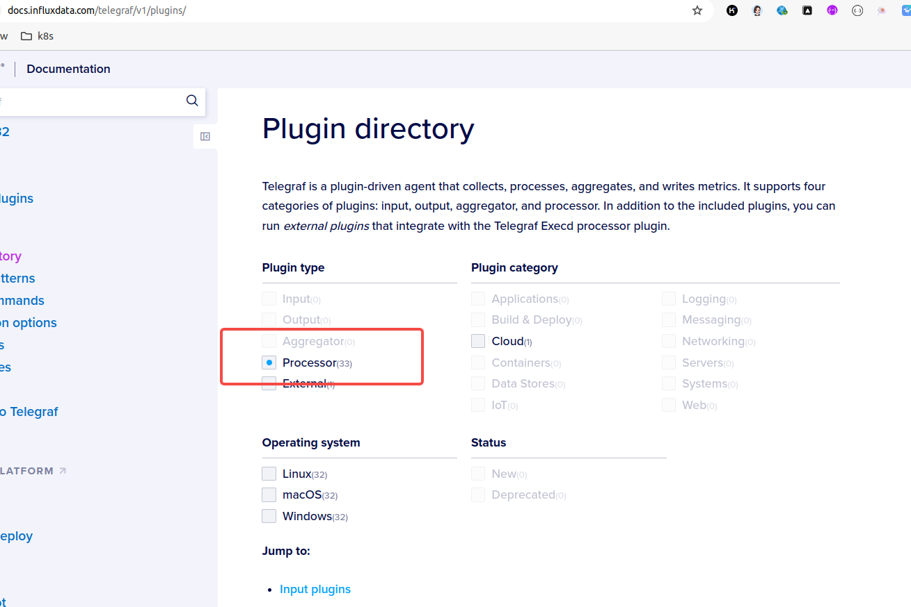

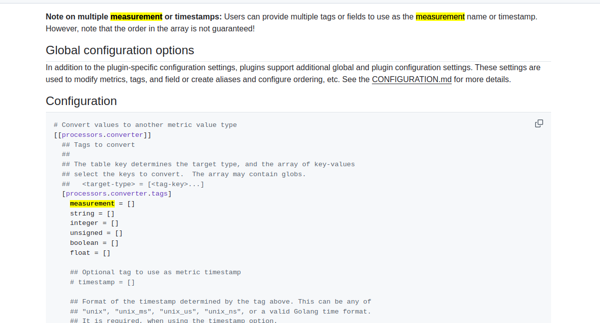

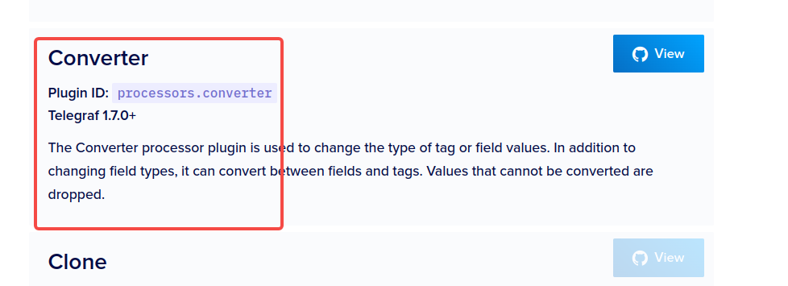

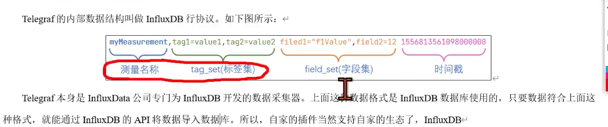

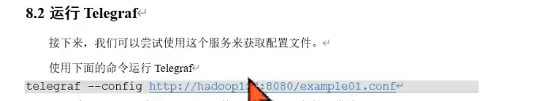

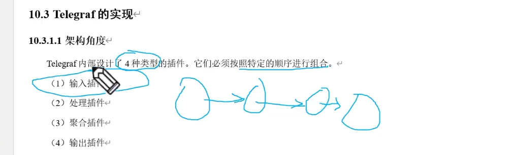

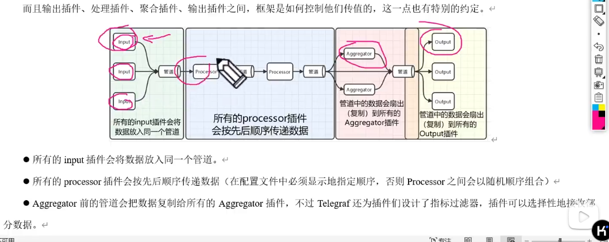

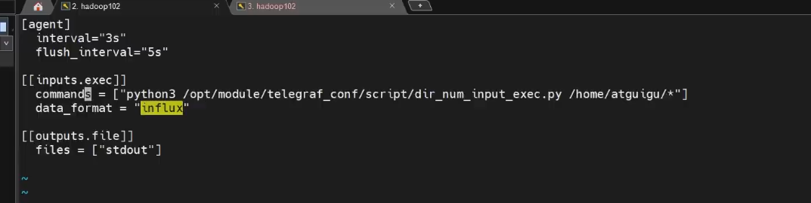

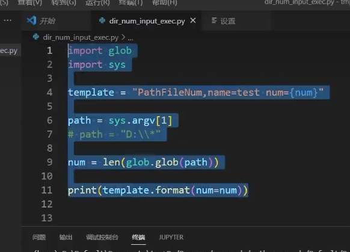

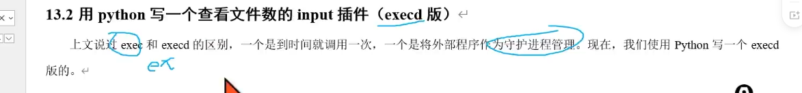

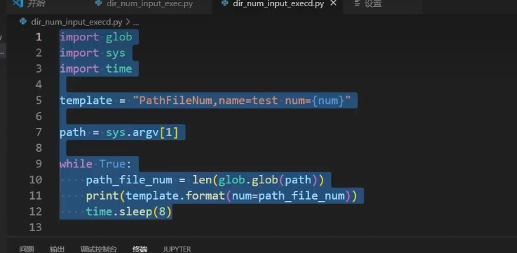

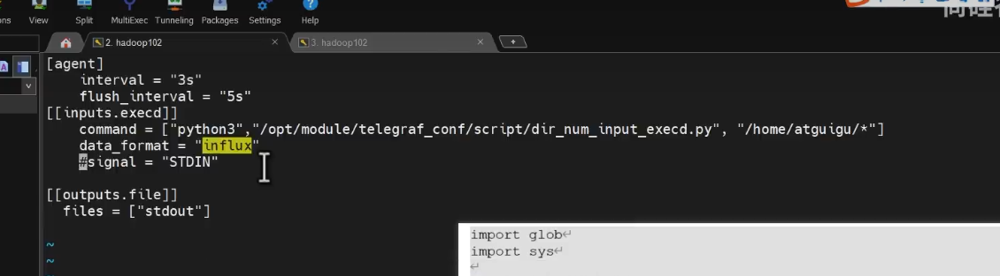

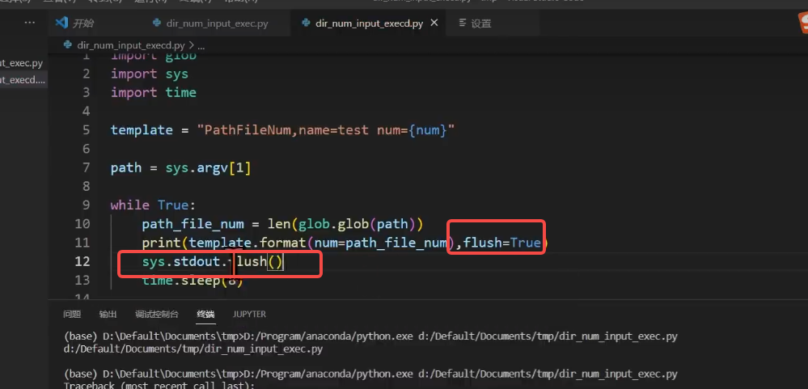


### Telegraf 配置文件解析

您提供的 Telegraf 配置文件包含了多个部分，每个部分定义了不同的功能和行为。以下是详细的解析：

1. `[agent]` 部分
```toml
[agent]
  interval = "15s"
  flush_interval = "15s"
  skip_processors_after_aggregators = true
```
- **interval**: 指定 Telegraf 采集数据的间隔时间，这里是 15 秒。
- **flush_interval**: 指定 Telegraf 将数据写入输出插件的间隔时间，这里是 15 秒。
- **skip_processors_after_aggregators**: 如果设置为 `true`，Telegraf 将在聚合器（aggregators）之后跳过处理器（processors）。

2. `[[inputs.http_listener_v2]]` 部分
```toml
[[inputs.http_listener_v2]]
  service_address = ":1234"
  paths = ["/receive"]
  data_format = "prometheusremotewrite"
```
- **service_address**: 指定 HTTP 服务监听的地址和端口，这里是 `:1234`。
- **paths**: 指定接收数据的路径，这里是 `/receive`。
- **data_format**: 指定数据格式，这里是 `prometheusremotewrite`，表示接收 Prometheus 远程写入的数据格式。

3. `[[inputs.redis]]` 部分
```toml
[[inputs.redis]]
  servers = ["tcp://127.0.0.1:6379"]
  password = "xxxxx"
  fieldpass = ["clients", "used_memory", "keyspace_hitrate"]
```
- **servers**: 指定 Redis 服务器的地址和端口，这里是 `tcp://127.0.0.1:6379`。
- **password**: 指定连接 Redis 服务器的密码，这里是 `WUzPxGn8`。
- **fieldpass**: 指定要收集的字段，这里是 `clients`, `used_memory`, `keyspace_hitrate`。

4. `[[inputs.net_response]]` 部分
```toml
[[inputs.net_response]]
  protocol = "tcp"
  address = "127.0.0.1:6379"  
  timeout = "5s"
  read_timeout = "2s"
  [inputs.net_response.tags]
    job = "redis"
    instanceId = "127.0.0.1:6379"
```
- **protocol**: 指定网络协议，这里是 `tcp`。
- **address**: 指定要测试的地址和端口，这里是 `127.0.0.1:6379`。
- **timeout**: 指定连接超时时间，这里是 5 秒。
- **read_timeout**: 指定读取超时时间，这里是 2 秒。
- **tags**: 指定默认标签，`job` 设置为 `redis`，`instanceId` 设置为 `127.0.0.1:6379`。

5. `[[processors.starlark]]` 部分
```toml
[[processors.starlark]]
  source = '''
def apply(metric):
    if metric.name == "redis":
        metric.tags["job"] = "redis"
        server = metric.tags.get('server', '')
        port = metric.tags.get('port', '')
        if server and port:
            instanceId = "%s:%s" % (server, port)
            metric.tags["instanceId"] = instanceId
            metric.fields["role"] = metric.tags["replication_role"]
        else:
           return None

    if metric.name == "net_response":
        up_value = 1 if metric.fields.get("result_type") == "success" else 0
        for field in list(metric.fields.keys()):
            metric.fields.pop(field)
        metric.fields["up"] = up_value

    # Add instanceId tag if it doesn't exist
    if "instanceId" not in metric.tags:
        metric.tags["instanceId"] = metric.tags.get("instance", "")

    return metric
  '''
```
- **source**: 定义一个 Starlark 脚本，用于处理和修改指标数据。
  - **处理 `redis` 指标**：
    - 设置 `job` 标签为 `redis`。
    - 从 `server` 和 `port` 标签构建 `instanceId` 标签。
    - 将 `replication_role` 标签的值添加到 `role` 字段。
  - **处理 `net_response` 指标**：
    - 根据 `result_type` 字段设置 `up` 字段的值（1 表示成功，0 表示失败）。
    - 移除所有其他字段，只保留 `up` 字段。
  - **添加 `instanceId` 标签**：
    - 如果 `instanceId` 标签不存在，则从 `instance` 标签获取值。

6. `[[outputs.mqtt]]` 部分
```toml
[[outputs.mqtt]]
  servers = ["mqtt://127.0.0.1:1883"]
  protocol = "5"
  topic = '/metrics/{{.Tag "job"}}/{{.Tag "instanceId"}}'
  retain = true
  layout = "field"
```
- **servers**: 指定 MQTT 服务器的地址和端口，这里是 `mqtt://127.0.0.1:1883`。
- **protocol**: 指定 MQTT 协议版本，这里是 `5`。
- **topic**: 指定发布消息的主题，使用模板语法 `{{.Tag "job"}}` 和 `{{.Tag "instanceId"}}` 动态生成主题。
- **retain**: 如果设置为 `true`，MQTT 服务器将保留最后一条消息。
- **layout**: 指定消息的布局，这里是 `field`，表示将字段作为消息内容。

总结
该 Telegraf 配置文件定义了以下功能：
- 从 HTTP 端点接收 Prometheus 远程写入的数据。
- 从 Redis 服务器收集特定的性能指标。
- 测试 Redis 服务器的网络响应时间。
- 使用 Starlark 脚本处理和修改收集到的指标数据。
- 将处理后的指标数据通过 MQTT 发布到指定的主题。

如果您有更具体的问题或需要进一步的配置调整，请提供更多细节。


参考：
https://www.bilibili.com/video/BV1Na411G7M6?spm_id_from=333.788.player.switch&vd_source=ffda878df0ed45bee1ade91d8f451048&p=4

https://docs.influxdata.com/telegraf/v1/get-started/