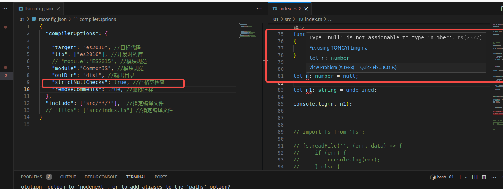
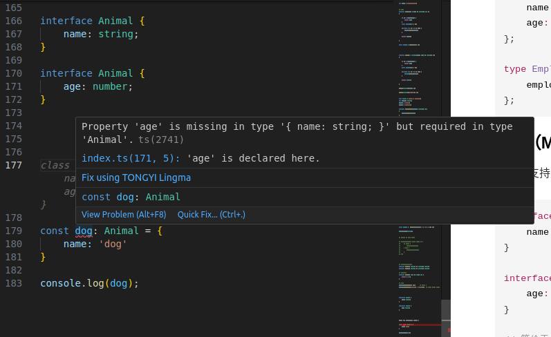
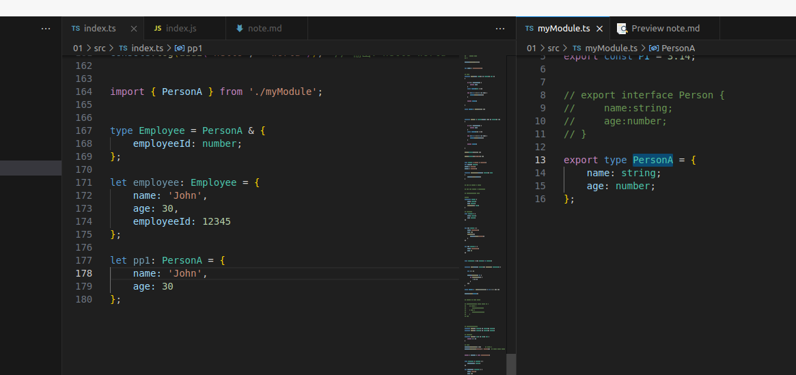
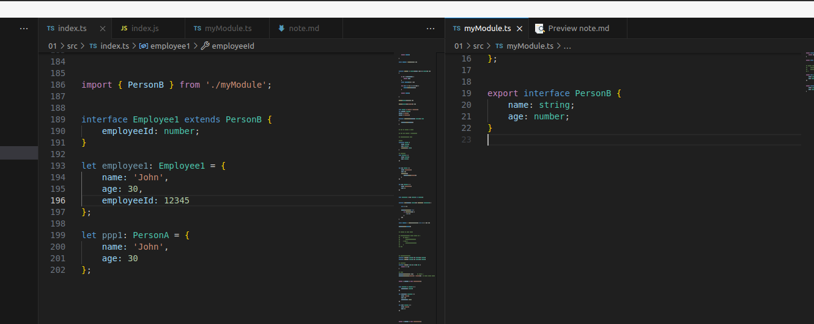
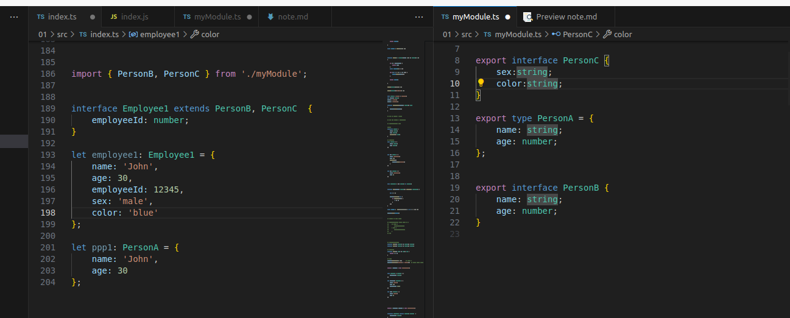
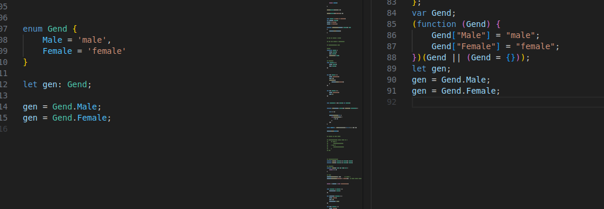

## 安装


```
cnpm i typescript
cnpm i @types/node

npx tsc --init

生成  tsconfig.json


npx tsc 
npx tsc --watch 
```

```
nodejs 环境的tsconfig.json 配置
{
  "compilerOptions": {
    
    "target": "es2016", //目标代码
    "lib": ["es2016", "dom"], //开发时的库
    "module": "commonjs", //模块规范
    "outDir": "dist", //输出目录
    "strictNullChecks": true, //严格空检查
    "removeComments": true, //删除注释
  },
  "include": ["src/**/*"],  //指定编译文件
  // "files": ["src/index.ts"] //指定编译文件
}


```

## 泛型

```
// 泛型 在函数中使用

function take2<T = number>(arr: T[], n: number): T[]
{

    if (n > arr.length) {
        return arr;
    }
    const newArr:T[] = [];

    for (let i = 0; i < n; i++) {
        newArr.push(arr[i]);
    }

    return newArr;

}

take2<number>([1,2], 3);

take2<string>(['1','2'], 3);

```


## 枚举

```

enum Gend {
    Male = 'male',
    Female = 'female'
}

let gen: Gend;

gen = Gend.Male;
gen = Gend.Female;

会参与编译 枚举属性的值是字符串或数字，为数字时会自增，可以赋值（不建议）


```


## 接口和别名


```
type Gender = 'male' | 'female';
let gender: Gender;
gender = 'male';
gender = 'female';

function showGender(gender: Gender): void
{
    console.log(gender);
}

```

``` 


//接口
interface Person {
    name: string;
    age: number;
    sayHello(): void;
}

// 类型别名
type Person2 = {
    name: string;
    age: number;
};


let p1: Person = {
    name: 'zhangsan',
    age: 18,
    sayHello(){
        console.log('hello');
    }
};


let p2: Person2 = {
    name: 'zhangsan',
    age: 18
};


type Condition = (n: number) => boolean;

function sum(number: number[], callback: Condition) {

    let s = 0;

    number.forEach(n => {
        if (callback(n)) {
            s += n;
        }
    });
}

const result =  sum([1,2,3,4,5], n => n % 2 === 0);

console.log(result);


```














## 接口（Interface）和类型别名（Type Alias）的区别

在 TypeScript 中，接口和类型别名都可以用来定义对象的形状，但它们有一些关键的区别。以下是它们的主要差异：

### 1. 扩展性（Extensibility）

- **接口**：可以使用 `extends` 关键字来扩展其他接口。
  ```typescript
  interface Person {
      name: string;
      age: number;
  }

  interface Employee extends Person {
      employeeId: number;
  }
  ```

- **类型别名**：不能直接扩展其他类型别名，但可以通过交叉类型（intersection types）实现类似的效果。
  ```typescript
  type Person = {
      name: string;
      age: number;
  };

  type Employee = Person & {
      employeeId: number;
  };
  ```

### 2. 合并（Merging）

- **接口**：支持声明合并（declaration merging），即多个同名接口会自动合并为一个接口。
  ```typescript
  interface Person {
      name: string;
  }

  interface Person {
      age: number;
  }

  // 等价于
  interface Person {
      name: string;
      age: number;
  }
  ```

- **类型别名**：不支持声明合并，多个同名类型别名会导致编译错误。

### 3. 使用场景

- **接口**：主要用于定义对象的形状，通常用于描述类、函数参数或返回值等。
  ```typescript
  interface User {
      id: number;
      name: string;
  }

  class Admin implements User {
      id: number;
      name: string;
      role: string;
  }
  ```

- **类型别名**：更加灵活，可以用于定义原始类型、联合类型、元组等复杂类型。
  ```typescript
  type ID = number | string;

  type Point = [number, number];

  type PartialPerson = {
      name?: string;
      age?: number;
  };
  ```

### 4. 可重载（Overloading）

- **接口**：可以用于函数重载。
  ```typescript
  interface Func {
      (a: number): number;
      (a: string): string;
  }
  ```

- **类型别名**：不能直接用于函数重载，但可以通过函数类型定义实现类似效果。
  ```typescript
  type Func = {
      (a: number): number;
      (a: string): string;
  };
  ```

### 5. 性能

- **接口**：编译后会被优化掉，不会生成额外的 JavaScript 代码。
- **类型别名**：同样不会生成额外的 JavaScript 代码，但在某些情况下可能会有细微的性能差异。

### 总结

- 如果你需要定义对象的形状并且希望支持扩展和合并，建议使用接口。
- 如果你需要定义更复杂的类型（如联合类型、元组等），或者需要更高的灵活性，建议使用类型别名。

在你的代码中，`Person` 和 `Person2` 分别使用了接口和类型别名来定义相同的内容。你可以根据上述区别选择更适合你需求的方式。


## 可重载


在 TypeScript 中，函数重载（Function Overloading） 是指定义多个具有相同名称但参数列表不同的函数签名。编译器会根据调用时传递的参数类型和数量来选择最匹配的函数签名。函数重载允许你为同一个函数提供多种调用方式，从而提高代码的灵活性和可读性。


示例：

typescript

```
// 定义两个重载签名
function add(a: number, b: number): number;
function add(a: string, b: string): string;

// 实现函数
function add(a: any, b: any): any {
    return a + b;
}

// 调用
console.log(add(1, 2));      // 输出: 3
console.log(add("hello", " world"));  // 输出: hello world

```

## 访问修饰符

```

class User {
    
    readonly id:number
    name:string
    age:number
    pid?:string

    // ts语法 访问修饰符
    private publishNumber:number = 3
    private curNumber:number = 0

    constructor(name:string,age:number){
        this.id = Math.random();
        this.name = name;
        this.age = age;
    }

    publish(){
        if (this.curNumber >= this.publishNumber) {
            console.log(`${this.name} 已经发布文章上限`);
            return;
        }
        this.curNumber++;
        console.log(`${this.name} 发布了第${this.curNumber}篇文章`);
    }
}

const u = new User('张三',18);
u.pid = '1111';
// u.id = 2;
console.log(u.id);
console.log(u.pid);


u.publish();
u.publish();
u.publish();
u.publish();


编译后代码
==>>

class User {
    constructor(name, age) {
        this.publishNumber = 3;
        this.curNumber = 0;
        this.id = Math.random();
        this.name = name;
        this.age = age;
    }
    publish() {
        if (this.curNumber >= this.publishNumber) {
            console.log(`${this.name} 已经发布文章上限`);
            return;
        }
        this.curNumber++;
        console.log(`${this.name} 发布了第${this.curNumber}篇文章`);
    }
}
const u = new User('张三', 18);
u.pid = '1111';
console.log(u.id);
console.log(u.pid);
u.publish();
u.publish();
u.publish();
u.publish();


```