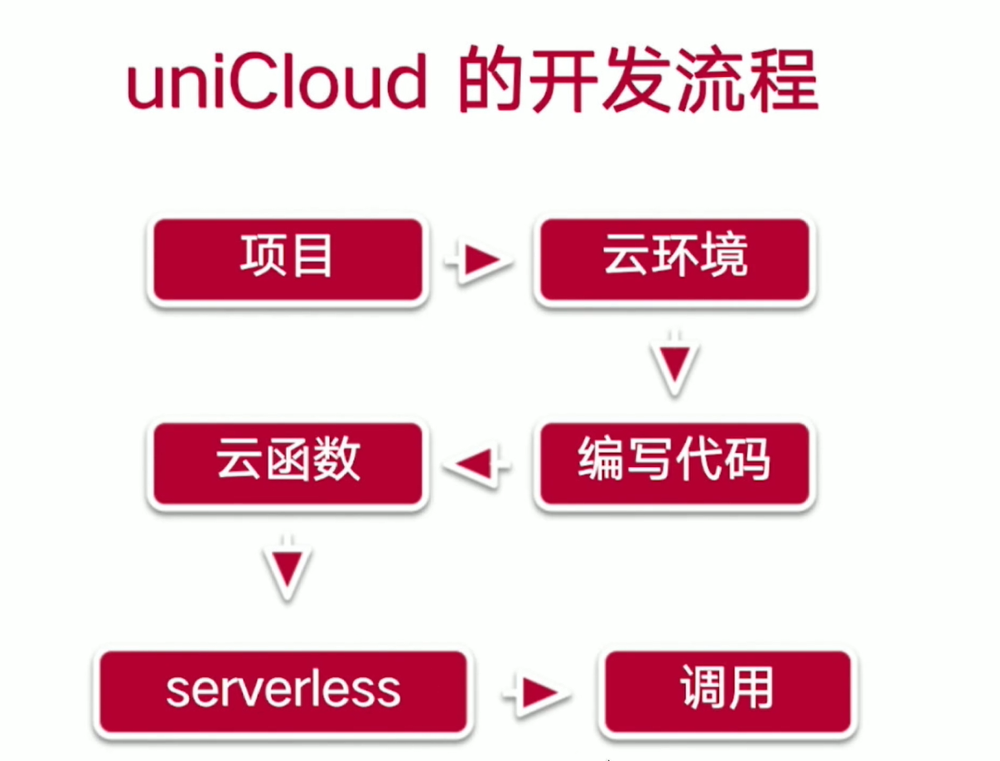
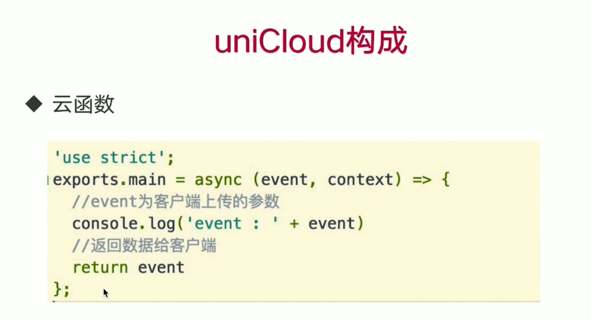
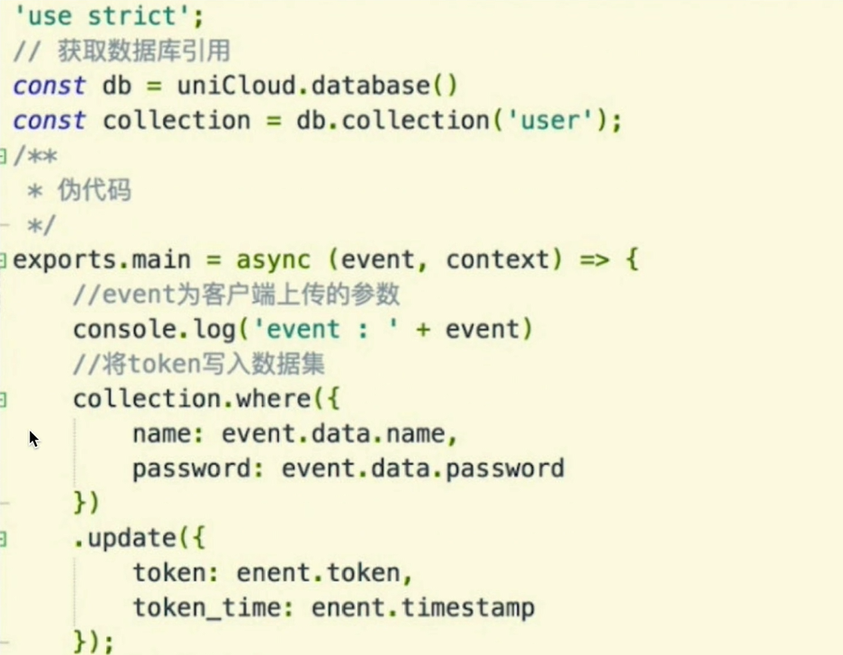
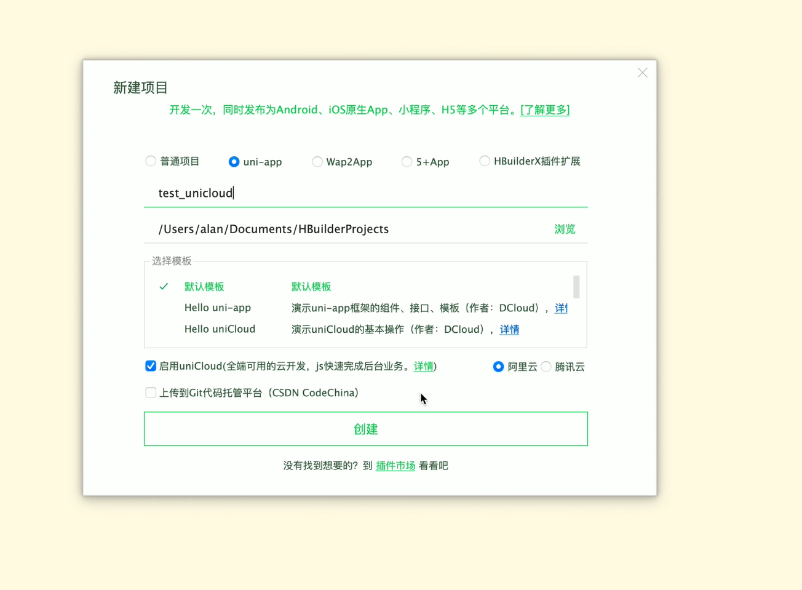
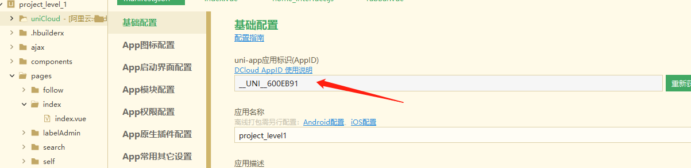
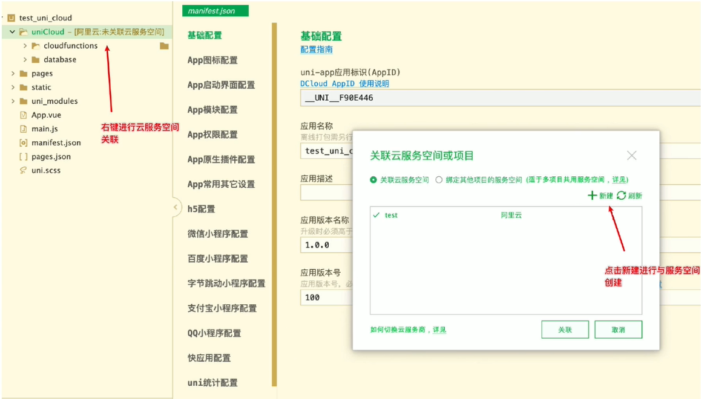
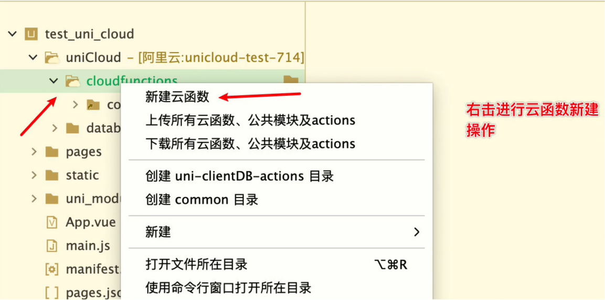
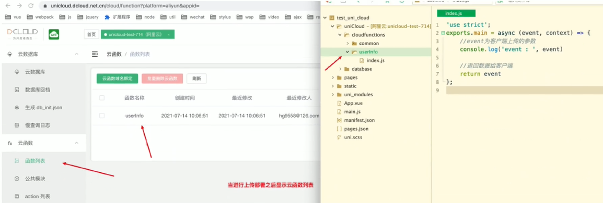

# uniapp 

一套代码编到十几个平台

Android、iOS(uni-app x),鸿蒙版,微信小程序版,Web版,Android版(uni-app),iOS版(uni-app),支付宝小程序版,百度小程序版,抖音小程序版,QQ小程序版,360小程序,快手小程序版,飞书小程序版,钉钉小程序版,京东小程序版,小红书小程序版,快应用


## hbuilderX中使用unicloud云开发平台

### 文档

- 参考文档：https://uniapp.dcloud.io/uniCloud/README
- web控制台文档：https://dev.dcloud.net.cn/pages/common/login


### 传统业务开发流程

> ​	前端 => 后端 => 运维 => 发布上线


**使用unicloud云开发平台**

> 前端 => 运维 => 发布上线


### 什么是unicloud

> `uniCloud` 是 DCloud 联合阿里云、腾讯云，为开发者提供的基于 serverless 模式和 js 编程的实现后端服务的云开发平台。不需要服务器的购买配置即可快速创建一个完整的后端服务。


### unicloud优点

- 用JavaScript开发前后台整体业务
- 非h5项目免域名使用服务器
- 敏捷性业务处理，不需要前后端分离开发


## 开发流程





### uncloud构成





#### 云数据库




#### 云存储及CDN

> 可进行文件的相关存储操作

参考文档：https://uniapp.dcloud.io/uniCloud/storage

---


#### 创建云函数工程


1. **指定unicloud工程创建**




2. **保证uni-app应用标识appID填写**（保证用户为登录状态）



3. **进行云服务空间创建**


   

   > 如果未进行实名认证，会跳转至实名认证页面进行实名认证，等待实名认证审核之后可以开通服务空间。若腾讯云实名认证提示身份证下已创建过多账户，则需要在腾讯云官网注销不用的账户

4. 进行云函数创建


   

   ```js
   'use strict';
   // 一个通过nodeJS运行的函数在服务器端使用
   exports.main = async (event, context) => {
   	//event为客户端上传的参数
   	//context 包含了调用信息及运行状态,获取每次调用的上下文
   	console.log('event : ', event)
   	
   	//返回数据给客户端
   	return {
   		"code":0,
   		"msg":"云函数调用成功"
   	}
   };
   ```

   

5. **云WEB控制台查看**


   

6. **云数据库操作**

   > 在云数据库中进行数据操作，全部使用双引号进行值的定义

7. 云存储

   > 在云存储中进行文件的上传
   >
   > api使用：
   >
   > ```js
   > uniCloud.uploadFile({})
   > ```

8. 跨域处理

   参考文档https://uniapp.dcloud.io/uniCloud/quickstart?id=useinh5


## unicloud api操作

### 云函数调用

**参考文档**：https://uniapp.dcloud.net.cn/uniCloud/cf-functions?id=clientcallfunction

```js
// promise方式
uniCloud.callFunction({
    name: 'test', // 云函数名称
    data: { a: 1 }   // 请求参数
  })
  .then(res => {});

// callback方式
uniCloud.callFunction({
    name: 'test',
    data: { a: 1 },
    success(){},  // 成功
    fail(){},   // 失败
    complete(){}   // 完成（不管成功与失败）
});
```

### 云函数实现云数据库基本增删改查

#### 1. 获取数据库引用

```js
const db = uniCloud.database()
```

2. 获取数据库集合引用

   ```
   const collection = db.collection('unicloud-test-714') // uncloud-test-714 为数据表名称
   ```

3. 新增记录

   ```js
   const res = collection.add({user:'alan'})
   ```

   ```js
   'use strict';
   const db = uniCloud.database() // 获取数据库引用
   
   exports.main = async (event, context) => {
   	// 获取集合引用
   	const collection = db.collection('unicloud-test-714')
   	// 新增数据
   	const res = await collection.add({user:'alan'})
   	console.log(res)
   	return {
   		"code":0,
   		"msg":"云函数调用成功"
   	}
   };
   ```

4. 删除记录

   ```js
   	const res = await collection.doc('60ee51103b7d3500014124c1').remove()
   ```

5. 数据更新

   ```js
   const res = await collection.doc('60ee52a1827eca0001e56bc4').update({
   		name:"joob"
   	})
   
   const res = await collection.doc('60ee52a1827eca0001e56bc4').set({   // 如果说获取不到内容，从新进行插入记录的操作
   		name:"joob",
     	type:"javascript"
   	})
   ```

   > update与set的区别：
   >
   > 当没有找到指定记录时，使用update无法进行更新操作，set在没有查找到指定记录的时候，可以进行新增内容的操作（不存在进行创建添加操作）

5. 数据查找

   ```js
   // 查询全部
   	const res = await collection.get()
   // 指定条件进行查询-id查询
     const res = await collection.doc('id').get()  // id为需要查询的指定id
   // 指定条件查询-其他条件进行查询
     const res = await collection.where({name:"alan"}).get()
   ```

   

   #### 云存储操作

   1. 使用uni.chooseImage方法进行图片选择获取

      参考地址：https://uniapp.dcloud.io/api/media/image?id=chooseimage

      ```js
      	uni.chooseImage({
      					count: 1,
      					success(res) {
      						console.log(JSON.stringify(res.tempFilePaths))
      					}
      				})
      ```

   2. 使用uniCloud.uploadFile进行文件上传

      参考文档：https://uniapp.dcloud.io/uniCloud/storage?id=clouduploadfile

      ```js
      uni.chooseImage({
      					count: 1,
      					async success(res) {
      						let result = await uniCloud.uploadFile({
      							filePath:res.tempFilePaths[0],
      							cloudPath:'a.jpg',
      							success(res) {
      								console.log(res)
      							},
      							fail(err) {
      								console.log(err)
      							}
      						});
      					}
      				})
      ```

   3. 使用uniCloud.deleteFile进行图片删除

      参考文档：https://uniapp.dcloud.io/uniCloud/storage?id=clouddeletefile

      **阿里云函数删除不能在客户端进行删除操作，下列代码在云函数中进行使用**

      ```js
      let result = await uniCloud.deleteFile({
      	   fileList:['https://vkceyugu.cdn.bspapp.com/VKCEYUGU-6ce25980-c28e-4e78-bdef-a96eb40ad98b/06a1cb3a-84b7-47a0-b554-8aff299cb255.jpg'],
      	});
      	console.log(result)
      ```

## UniApp 云函数使用场景

```

1. **数据存储与查询**
   - 使用云函数连接数据库，实现数据的增删改查操作。
   - 示例：用户注册、登录、个人信息保存等。

2. **文件上传与下载**
   - 通过云函数处理文件的上传和下载，确保文件的安全性和高效传输。
   - 示例：用户头像上传、文档下载等。

3. **支付功能**
   - 调用第三方支付接口，完成支付流程。
   - 示例：微信支付、支付宝支付等。

4. **消息推送**
   - 使用云函数发送通知或消息，提高用户体验。
   - 示例：订单状态更新通知、活动提醒等。

5. **权限验证**
   - 在云函数中进行权限校验，确保敏感操作的安全性。
   - 示例：管理员权限校验、用户角色验证等。

6. **定时任务**
   - 设置定时任务，定期执行某些操作。
   - 示例：数据备份、日志清理等。

7. **第三方服务调用**
   - 通过云函数调用第三方 API，扩展应用功能。
   - 示例：天气查询、地图定位等。

8. **数据同步**
   - 实现多端数据同步，确保数据一致性。
   - 示例：跨平台数据同步、多设备数据同步等。

9. **日志记录**
   - 记录应用运行日志，便于问题排查和性能优化。
   - 示例：用户行为日志、错误日志等。

10. **自定义业务逻辑**
    - 根据具体业务需求，编写自定义的云函数逻辑。
    - 示例：复杂的计算任务、数据处理等。

通过这些场景，UniApp 云函数可以帮助开发者更高效地实现后端逻辑，提升应用的整体性能和用户体验。


```


## 发布 wap

## 发布小程序
通过uniapp官方开发工具开发，发布上线，通过小程序开发工具发布上线

## 发布安卓


## UniApp 与 React Native 的主要区别


UniApp:
如果你已经熟悉 Vue.js，学习 UniApp 会比较容易。
文档和示例相对简单，上手较快。

React Native:
如果你已经熟悉 React.js，学习 React Native 会比较容易。
需要了解一些原生开发的概念，学习曲线稍陡。


UniApp 适合快速开发轻量级的跨平台应用，特别是需要同时支持多个平台的项目。

React Native 适合开发高性能、复杂交互的移动应用，特别是对性能有较高要求的项目。