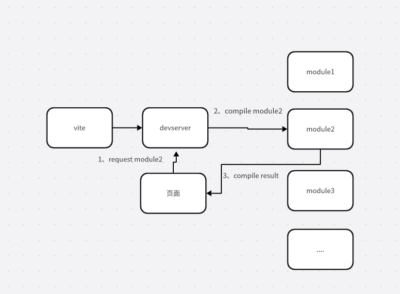
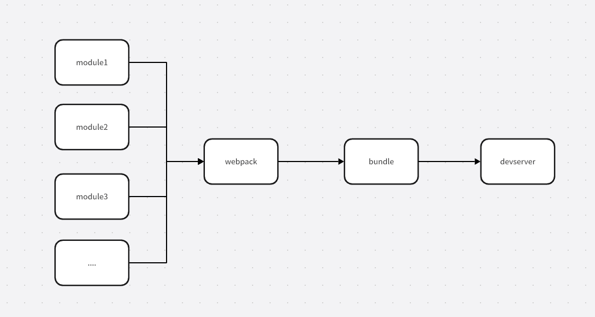

一个开发服务器，它基于 原生 ES 模块 提供了 丰富的内建功能，如速度快到惊人的 模块热更新（HMR）。

一套构建指令，它使用 Rollup 打包你的代码，并且它是预配置的，可输出用于生产环境的高度优化过的静态资源。




vs




```

<!doctype html>
<html lang="en">
  <head>
    <meta charset="UTF-8" />
    <link rel="icon" type="image/svg+xml" href="/vite.svg" />
    <meta name="viewport" content="width=device-width, initial-scale=1.0" />
    <title>Vite + Vue</title>
  </head>
  <body>
    <div id="app"></div>
    <script type="module" src="/src/main.js"></script>
  </body>
</html>

```


参考：
https://vitejs.cn/vite3-cn/guide/

https://developer.mozilla.org/en-US/docs/Web/JavaScript/Guide/Modules