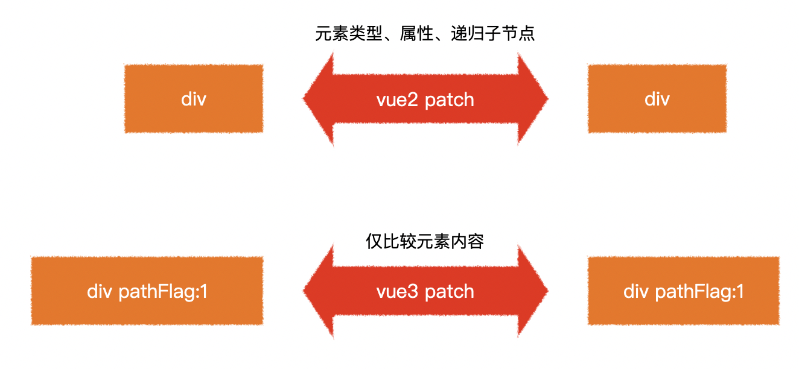

> 客户端渲染效率比vue2提升了1.3~2倍
>
> SSR渲染效率比vue2提升了2~3倍

> 面试题：vue3的效率提升主要表现在哪些方面？


# 效率的提升

## 静态提升

下面的静态节点会被提升

- 元素节点
- 没有绑定动态内容

```js
// vue2 的静态节点
render(){
  createVNode("h1", null, "Hello World")
  // ...
}

// vue3 的静态节点
const hoisted = createVNode("h1", null, "Hello World")
function render(){
  // 直接使用 hoisted 即可
}
```

静态属性会被提升

```html
<div class="user">
  {{user.name}}
</div>
```

```js
const hoisted = { class: "user" }

function render(){
  createVNode("div", hoisted, user.name)
  // ...
}
```


## 预字符串化

```html
<div class="menu-bar-container">
  <div class="logo">
    <h1>logo</h1>
  </div>
  <ul class="nav">
    <li><a href="">menu</a></li>
    <li><a href="">menu</a></li>
    <li><a href="">menu</a></li>
    <li><a href="">menu</a></li>
    <li><a href="">menu</a></li>
  </ul>
  <div class="user">
    <span>{{ user.name }}</span>
  </div>
</div>
```

当编译器遇到大量连续的静态内容，会直接将其编译为一个普通字符串节点

```js
const _hoisted_2 = _createStaticVNode("<div class=\"logo\"><h1>logo</h1></div><ul class=\"nav\"><li><a href=\"\">menu</a></li><li><a href=\"\">menu</a></li><li><a href=\"\">menu</a></li><li><a href=\"\">menu</a></li><li><a href=\"\">menu</a></li></ul>")
```


## 缓存事件处理函数

```html
<button @click="count++">plus</button>
```

```js
// vue2
render(ctx){
  return createVNode("button", {
    onClick: function($event){
      ctx.count++;
    }
  })
}

// vue3
render(ctx, _cache){
  return createVNode("button", {
    onClick: cache[0] || (cache[0] = ($event) => (ctx.count++))
  })
}
```

## Block Tree

vue2在对比新旧树的时候，并不知道哪些节点是静态的，哪些是动态的，因此只能一层一层比较，这就浪费了大部分时间在比对静态节点上

```html
<form>
  <div>
    <label>账号：</label>
    <input v-model="user.loginId" />
  </div>
  <div>
    <label>密码：</label>
    <input v-model="user.loginPwd" />
  </div>
</form>
```


## PatchFlag

vue2在对比每一个节点时，并不知道这个节点哪些相关信息会发生变化，因此只能将所有信息依次比对

```html
<div class="user" data-id="1" title="user name">
  {{user.name}}
</div>
```




> 面试题1：为什么vue3中去掉了vue构造函数？
>
> 面试题2：谈谈你对vue3数据响应式的理解

> 

# 数据响应式和API的变化

## 去掉了Vue构造函数


> 在过去，如果遇到一个页面有多个`vue`应用时，往往会遇到一些问题

```html
<!-- vue2 -->
<div id="app1"></div>
<div id="app2"></div>
<script>
  Vue.use(...); // 此代码会影响所有的vue应用
  Vue.mixin(...); // 此代码会影响所有的vue应用
  Vue.component(...); // 此代码会影响所有的vue应用
                
	new Vue({
    // 配置
  }).$mount("#app1")
  
  new Vue({
    // 配置
  }).$mount("#app2")
</script>
```

在`vue3`中，去掉了`Vue`构造函数，转而使用`createApp`创建`vue`应用

```html
<!-- vue3 -->
<div id="app1"></div>
<div id="app2"></div>
<script>  
	createApp(根组件).use(...).mixin(...).component(...).mount("#app1")
  createApp(根组件).mount("#app2")
</script>
```

> 更多vue应用的api：https://v3.vuejs.org/api/application-api.html

## 组件实例中的API

在`vue3`中，组件实例是一个`Proxy`，它仅提供了下列成员，功能和`vue2`一样

属性：https://v3.vuejs.org/api/instance-properties.html

方法：https://v3.vuejs.org/api/instance-methods.html

## 对比数据响应式

vue2和vue3均在相同的生命周期完成数据响应式，但做法不一样


## 面试题参考答案

面试题1：为什么vue3中去掉了vue构造函数？

```
vue2的全局构造函数带来了诸多问题：
1. 调用构造函数的静态方法会对所有vue应用生效，不利于隔离不同应用
2. vue2的构造函数集成了太多功能，不利于tree shaking，vue3把这些功能使用普通函数导出，能够充分利用tree shaking优化打包体积
3. vue2没有把组件实例和vue应用两个概念区分开，在vue2中，通过new Vue创建的对象，既是一个vue应用，同时又是一个特殊的vue组件。vue3中，把两个概念区别开来，通过createApp创建的对象，是一个vue应用，它内部提供的方法是针对整个应用的，而不再是一个特殊的组件。

```

面试题2：谈谈你对vue3数据响应式的理解

```

vue3不再使用Object.defineProperty的方式定义完成数据响应式，而是使用Proxy。
除了Proxy本身效率比Object.defineProperty更高之外，由于不必递归遍历所有属性，而是直接得到一个Proxy。所以在vue3中，对数据的访问是动态的，当访问某个属性的时候，再动态的获取和设置，这就极大的提升了在组件初始阶段的效率。
同时，由于Proxy可以监控到成员的新增和删除，因此，在vue3中新增成员、删除成员、索引访问等均可以触发重新渲染，而这些在vue2中是难以做到的。

```

# 模板中的变化

## v-model

`vue2`比较让人诟病的一点就是提供了两种双向绑定：`v-model`和`.sync`，在`vue3`中，去掉了`.sync`修饰符，只需要使用`v-model`进行双向绑定即可。

为了让`v-model`更好的针对多个属性进行双向绑定，`vue3`作出了以下修改

- 当对自定义组件使用`v-model`指令时，绑定的属性名由原来的`value`变为`modelValue`，事件名由原来的`input`变为`update:modelValue`

  ```html
  <!-- vue2 -->
  <ChildComponent :value="pageTitle" @input="pageTitle = $event" />
  <!-- 简写为 -->
  <ChildComponent v-model="pageTitle" />

  <!-- vue3 -->
  <ChildComponent
    :modelValue="pageTitle"
    @update:modelValue="pageTitle = $event"
  />
  <!-- 简写为 -->
  <ChildComponent v-model="pageTitle" />
  ```

- 去掉了`.sync`修饰符，它原本的功能由`v-model`的参数替代

  ```html
  <!-- vue2 -->
  <ChildComponent :title="pageTitle" @update:title="pageTitle = $event" />
  <!-- 简写为 -->
  <ChildComponent :title.sync="pageTitle" />

  <!-- vue3 -->
  <ChildComponent :title="pageTitle" @update:title="pageTitle = $event" />
  <!-- 简写为 -->
  <ChildComponent v-model:title="pageTitle" />
  ```

- `model`配置被移除

- 允许自定义`v-model`修饰符

  vue2 无此功能

  

## v-if v-for

`v-if` 的优先级 现在高于 `v-for`

## key

- 当使用`<template>`进行`v-for`循环时，需要把`key`值放到`<template>`中，而不是它的子元素中

- 当使用`v-if v-else-if v-else`分支的时候，不再需要指定`key`值，因为`vue3`会自动给予每个分支一个唯一的`key`

  即便要手工给予`key`值，也必须给予每个分支唯一的`key`，**不能因为要重用分支而给予相同的 key**

## Fragment

`vue3`现在允许组件出现多个根节点


# 组件的变化

## Teleport

```

import Modal from "../components/Modal.vue";


<Teleport to="body">
  <Modal v-if="modalVisible">
    <button @click="modalVisible = false">关闭朦层</button>
  </Modal>
</Teleport>


<template>
  <div class="modal">
    <slot></slot>
  </div>
</template>

<style scoped>
.modal {
  display: flex;
  justify-content: center;
  align-items: center;
  position: fixed;
  width: 100%;
  height: 100%;
  background: rgba(0, 0, 0, 0.3);
  left: 0;
  top: 0;
}
</style>

```

## asyncComponent

```

utils.js
定义 getAsyncComponent 方法加载异步组件  定义 delay 通过 await delay(); 延迟加载


import { defineAsyncComponent, h } from "vue";
import Loading from "../components/Loading.vue";
import Error from "../components/Error.vue";
import NProgress from "nprogress";
import "nprogress/nprogress.css";
NProgress.configure({
  trickleSpeed: 50,
  showSpinner: false,
});
export function delay(duration) {
  if (!duration) {
    duration = random(1000, 5000);
  }
  return new Promise((resolve) => {
    setTimeout(() => {
      resolve();
    }, duration);
  });
}

export function random(min, max) {
  return Math.floor(Math.random() * (max - min) + min);
}

export function getAsyncPage(path) {
  return defineAsyncComponent({
    loader: async () => {
      NProgress.start();
      await delay();
      const comp = await import(path);
      NProgress.done();
      return comp;
    },
    loadingComponent: Loading,
  });
}

export function getAsyncComponent(path) {
  return defineAsyncComponent({
    loader: async () => {
      await delay();
      if (Math.random() < 0.5) {
        return import(path);
      }
      throw new Error();
    },
    loadingComponent: Loading,
    errorComponent: {
      render() {
        return h(Error, "组件加载出错");
      },
    },
  });
}


import { getAsyncPage } from "../util";

export default [
  {
    path: "/",
    name: "Home",
    component: getAsyncPage("../views/Home.vue"),
  },
  {
    path: "/about",
    name: "About",
    component: getAsyncPage("../views/About.vue"),
  },
];


```

# ReactivityApi


> reactivity api: https://v3.vuejs.org/api/reactivity-api

## 获取响应式数据

| API        | 传入                      | 返回             | 备注                                                         |
| :--------- | ------------------------- | ---------------- | ------------------------------------------------------------ |
| `reactive` | `plain-object`            | `对象代理`       | 深度代理对象中的所有成员                                     |
| `readonly` | `plain-object` or `proxy` | `对象代理`       | 只能读取代理对象中的成员，不可修改                           |
| `ref`      | `any`                     | `{ value: ... }` | 对value的访问是响应式的<br />如果给value的值是一个对象，<br />则会通过`reactive`函数进行代理<br />如果已经是代理，则直接使用代理 |
| `computed` | `function`                | `{ value: ... }` | 当读取value值时，<br />会**根据情况**决定是否要运行函数      |

应用：

- 如果想要让一个对象变为响应式数据，可以使用`reactive`或`ref`
- 如果想要让一个对象的所有属性只读，使用`readonly`
- 如果想要让一个非对象数据变为响应式数据，使用`ref`
- 如果想要根据已知的响应式数据得到一个新的响应式数据，使用`computed`

笔试题1：下面的代码输出结果是什么？

```js
import { reactive, readonly, ref, computed } from "vue";

const state = reactive({
  firstName: "Xu Ming",
  lastName: "Deng",
});
const fullName = computed(() => {
  console.log("changed");
  return `${state.lastName}, ${state.firstName}`;
});
console.log("state ready");
console.log("fullname is", fullName.value);
console.log("fullname is", fullName.value);
const imState = readonly(state);
console.log(imState === state);

const stateRef = ref(state);
console.log(stateRef.value === state);

state.firstName = "Cheng";
state.lastName = "Ji";

console.log(imState.firstName, imState.lastName);
console.log("fullname is", fullName.value);
console.log("fullname is", fullName.value);

const imState2 = readonly(stateRef);
console.log(imState2.value === stateRef.value);

```

笔试题2：按照下面的要求完成函数

```js

import { readonly, reactive } from "vue";
function useUser(){
  // 在这里补全函数
  // const userOrigin = reactive({})
  // const user = readonly(userOrigin)
  // const setUserName = (name) => {
  //   userOrigin.name = name
  // }

  // const setUserAge = (age) => {
  //   userOrigin.age = age
  // }
  
  return {
    user, // 这是一个只读的用户对象，响应式数据，默认为一个空对象
    setUserName, // 这是一个函数，传入用户姓名，用于修改用户的名称
    setUserAge, // 这是一个函数，传入用户年龄，用户修改用户的年龄
  }
}
```

笔试题3：按照下面的要求完成函数

```js

import { readonly, reactive } from "vue";

function useDebounce(obj, duration){
  // 在这里补全函数
  const valueOrigin = reactive(obj);
  const value = readonly(valueOrigin);
  
  let timer = null;
  const setValue = (newValue) => {

    clearTimeout(timer);
    timer = setTimeout(() => {
      Object.entries(newValue).forEach(([key, value]) => {
        valueOrigin[key] = value;
      })
    },duration)
    
  }

  return {
    value, // 这里是一个只读对象，响应式数据，默认值为参数值
    setValue // 这里是一个函数，传入一个新的对象，需要把新对象中的属性混合到原始对象中，混合操作需要在duration的时间中防抖
  }
}

const {value, setValue} = useDebounceValue({a:1,b:2},5000)

window.value = value;
window.setValue = setValue;

```


## 监听数据变化

**watchEffect**

```js

const stats = reactive({a:1, b:2})
const count =ref(0)

// watchEffect 会自动收集用到的依赖，依赖的数据改变后，会重新执行回调函数
const stop = watchEffect(() => {

  console.log('count', count.value);
  console.log('stats', stats.a);
  // 该函数会立即执行，然后追中函数中用到的响应式数据，响应式数据变化后会再次执行
})

// 修改数据，后会自动执行watchEffect函数
state.a++;
state.a++;
state.a++;
state.a++;
state.a++;
state.a++;
count.value++;
count.value++;
count.value++;
count.value++;
count.value++;

//因为会进入微队列，所以会执行一次 watchEffect 


// 通过调用stop函数，会停止监听
stop(); // 停止监听
```

**watch**

```js
// 等效于vue2的$watch

// 监听单个数据的变化
const state = reactive({ count: 0 })
const options = { immediate: true } //会立即执行一次回调函数 

// watch 默认不执行回调函数，只有值发生变化才会执行回调函数
// 不可以直接传state.count 需要 () => state.count
watch(() => state.count, (newValue, oldValue) => {
  // ...
}, options)

const countRef = ref(0);
watch(countRef, (newValue, oldValue) => {
  // ...
}, options)

// 监听多个数据的变化
watch([() => state.count, countRef], ([new1, new2], [old1, old2]) => {
  // ...
});

// watch 也是延迟执行的

```


**注意：无论是`watchEffect`还是`watch`，当依赖项变化时，回调函数的运行都是异步的（微队列）**

应用：除非遇到下面的场景，否则均建议选择`watchEffect`

- 不希望回调函数一开始就执行
- 数据改变时，需要参考旧值
- 需要监控一些回调函数中不会用到的数据

笔试题: 下面的代码输出结果是什么？

```js
import { reactive, watchEffect, watch } from "vue";
const state = reactive({
  count: 0,
});
watchEffect(() => {
  console.log("watchEffect", state.count);
});
watch(
  () => state.count,
  (count, oldCount) => {
    console.log("watch", count, oldCount);
  }
);
console.log("start");

//宏队列
setTimeout(() => {
  console.log("time out");
  state.count++; //微队列
  state.count++;
});
state.count++;//微队列
state.count++;

console.log("end");

// 输出结果
// watchEffect 0
// start
// end
// watchEffect 2
// watch 2 0
// time out
// watchEffect 4
// watch 4 2

```


## 判断

| API          | 含义                                                         |
| ------------ | ------------------------------------------------------------ |
| `isProxy`    | 判断某个数据是否是由`reactive`或`readonly`                   |
| `isReactive` | 判断某个数据是否是通过`reactive`创建的<br />详细:https://v3.vuejs.org/api/basic-reactivity.html#isreactive |
| `isReadonly` | 判断某个数据是否是通过`readonly`创建的                       |
| `isRef`      | 判断某个数据是否是一个`ref`对象                              |


## 转换

**unref**

等同于：`isRef(val) ? val.value : val`

应用：

```js
function useNewTodo(todos){
  todos = unref(todos);
  // ...
}
```


**toRef**

得到一个响应式对象某个属性的ref格式

```js
const state = reactive({
  foo: 1,
  bar: 2
})

const fooRef = toRef(state, 'foo'); // fooRef: {value: ...}

fooRef.value++
console.log(state.foo) // 2

state.foo++
console.log(fooRef.value) // 3
```

**toRefs**

把一个响应式对象的所有属性转换为ref格式，然后包装到一个`plain-object`中返回

```js
const state = reactive({
  foo: 1,
  bar: 2
})

const stateAsRefs = toRefs(state)
/*
stateAsRefs: not a proxy
{
  foo: { value: ... },
  bar: { value: ... }
}
*/
```

应用：

```js
setup(){
  const state1 = reactive({a:1, b:2});
  const state2 = reactive({c:3, d:4});
  return {
    ...state1, // lost reactivity
    ...state2 // lost reactivity
  }
}

setup(){
  const state1 = reactive({a:1, b:2});
  const state2 = reactive({c:3, d:4});
  return {
    ...toRefs(state1), // reactivity
    ...toRefs(state2) // reactivity
  }
}
// composition function
function usePos(){
  const pos = reactive({x:0, y:0});
  return pos;
}

setup(){
  const {x, y} = usePos(); // lost reactivity
  const {x, y} = toRefs(usePos()); // reactivity
}
```

## 降低心智负担

所有的`composition function`均以`ref`的结果返回，以保证`setup`函数的返回结果中不包含`reactive`或`readonly`直接产生的数据

```js
function usePos(){
  const pos = reactive({ x:0, y:0 });
  return toRefs(pos); //  {x: refObj, y: refObj}
}
function useBooks(){
  const books = ref([]);
  return {
    books // books is refObj
  }
}
function useLoginUser(){
  const user = readonly({
    isLogin: false,
    loginId: null
  });
  return toRefs(user); // { isLogin: refObj, loginId: refObj }  all ref is readonly
}

setup(){
  // 在setup函数中，尽量保证解构、展开出来的所有响应式数据均是ref
  return {
    ...usePos(),
    ...useBooks(),
    ...useLoginUser()
  }
}
```
