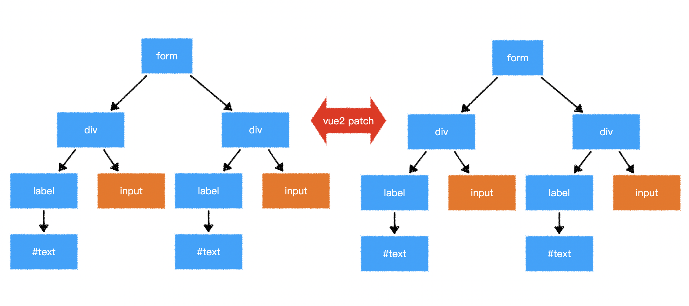

> 客户端渲染效率比vue2提升了1.3~2倍
>
> SSR渲染效率比vue2提升了2~3倍

> 面试题：vue3的效率提升主要表现在哪些方面？


# 效率的提升

## 静态提升

下面的静态节点会被提升

- 元素节点
- 没有绑定动态内容

```js
// vue2 的静态节点
render(){
  createVNode("h1", null, "Hello World")
  // ...
}

// vue3 的静态节点
const hoisted = createVNode("h1", null, "Hello World")
function render(){
  // 直接使用 hoisted 即可
}
```

静态属性会被提升

```html
<div class="user">
  {{user.name}}
</div>
```

```js
const hoisted = { class: "user" }

function render(){
  createVNode("div", hoisted, user.name)
  // ...
}
```


## 预字符串化

```html
<div class="menu-bar-container">
  <div class="logo">
    <h1>logo</h1>
  </div>
  <ul class="nav">
    <li><a href="">menu</a></li>
    <li><a href="">menu</a></li>
    <li><a href="">menu</a></li>
    <li><a href="">menu</a></li>
    <li><a href="">menu</a></li>
  </ul>
  <div class="user">
    <span>{{ user.name }}</span>
  </div>
</div>
```

当编译器遇到大量连续的静态内容，会直接将其编译为一个普通字符串节点

```js
const _hoisted_2 = _createStaticVNode("<div class=\"logo\"><h1>logo</h1></div><ul class=\"nav\"><li><a href=\"\">menu</a></li><li><a href=\"\">menu</a></li><li><a href=\"\">menu</a></li><li><a href=\"\">menu</a></li><li><a href=\"\">menu</a></li></ul>")
```


## 缓存事件处理函数

```html
<button @click="count++">plus</button>
```

```js
// vue2
render(ctx){
  return createVNode("button", {
    onClick: function($event){
      ctx.count++;
    }
  })
}

// vue3
render(ctx, _cache){
  return createVNode("button", {
    onClick: cache[0] || (cache[0] = ($event) => (ctx.count++))
  })
}
```

## Block Tree

vue2在对比新旧树的时候，并不知道哪些节点是静态的，哪些是动态的，因此只能一层一层比较，这就浪费了大部分时间在比对静态节点上

```html
<form>
  <div>
    <label>账号：</label>
    <input v-model="user.loginId" />
  </div>
  <div>
    <label>密码：</label>
    <input v-model="user.loginPwd" />
  </div>
</form>
```




## PatchFlag

vue2在对比每一个节点时，并不知道这个节点哪些相关信息会发生变化，因此只能将所有信息依次比对

```html
<div class="user" data-id="1" title="user name">
  {{user.name}}
</div>
```


> 面试题1：为什么vue3中去掉了vue构造函数？
>
> 面试题2：谈谈你对vue3数据响应式的理解

> 

# 数据响应式和API的变化

## 去掉了Vue构造函数


> 在过去，如果遇到一个页面有多个`vue`应用时，往往会遇到一些问题

```html
<!-- vue2 -->
<div id="app1"></div>
<div id="app2"></div>
<script>
  Vue.use(...); // 此代码会影响所有的vue应用
  Vue.mixin(...); // 此代码会影响所有的vue应用
  Vue.component(...); // 此代码会影响所有的vue应用
                
	new Vue({
    // 配置
  }).$mount("#app1")
  
  new Vue({
    // 配置
  }).$mount("#app2")
</script>
```

在`vue3`中，去掉了`Vue`构造函数，转而使用`createApp`创建`vue`应用

```html
<!-- vue3 -->
<div id="app1"></div>
<div id="app2"></div>
<script>  
	createApp(根组件).use(...).mixin(...).component(...).mount("#app1")
  createApp(根组件).mount("#app2")
</script>
```

> 更多vue应用的api：https://v3.vuejs.org/api/application-api.html

## 组件实例中的API

在`vue3`中，组件实例是一个`Proxy`，它仅提供了下列成员，功能和`vue2`一样

属性：https://v3.vuejs.org/api/instance-properties.html

方法：https://v3.vuejs.org/api/instance-methods.html

## 对比数据响应式

vue2和vue3均在相同的生命周期完成数据响应式，但做法不一样


## 面试题参考答案

面试题1：为什么vue3中去掉了vue构造函数？

```
vue2的全局构造函数带来了诸多问题：
1. 调用构造函数的静态方法会对所有vue应用生效，不利于隔离不同应用
2. vue2的构造函数集成了太多功能，不利于tree shaking，vue3把这些功能使用普通函数导出，能够充分利用tree shaking优化打包体积
3. vue2没有把组件实例和vue应用两个概念区分开，在vue2中，通过new Vue创建的对象，既是一个vue应用，同时又是一个特殊的vue组件。vue3中，把两个概念区别开来，通过createApp创建的对象，是一个vue应用，它内部提供的方法是针对整个应用的，而不再是一个特殊的组件。

```

面试题2：谈谈你对vue3数据响应式的理解

```

vue3不再使用Object.defineProperty的方式定义完成数据响应式，而是使用Proxy。
除了Proxy本身效率比Object.defineProperty更高之外，由于不必递归遍历所有属性，而是直接得到一个Proxy。所以在vue3中，对数据的访问是动态的，当访问某个属性的时候，再动态的获取和设置，这就极大的提升了在组件初始阶段的效率。
同时，由于Proxy可以监控到成员的新增和删除，因此，在vue3中新增成员、删除成员、索引访问等均可以触发重新渲染，而这些在vue2中是难以做到的。

```

# 模板中的变化

## v-model

`vue2`比较让人诟病的一点就是提供了两种双向绑定：`v-model`和`.sync`，在`vue3`中，去掉了`.sync`修饰符，只需要使用`v-model`进行双向绑定即可。

为了让`v-model`更好的针对多个属性进行双向绑定，`vue3`作出了以下修改

- 当对自定义组件使用`v-model`指令时，绑定的属性名由原来的`value`变为`modelValue`，事件名由原来的`input`变为`update:modelValue`

  ```html
  <!-- vue2 -->
  <ChildComponent :value="pageTitle" @input="pageTitle = $event" />
  <!-- 简写为 -->
  <ChildComponent v-model="pageTitle" />

  <!-- vue3 -->
  <ChildComponent
    :modelValue="pageTitle"
    @update:modelValue="pageTitle = $event"
  />
  <!-- 简写为 -->
  <ChildComponent v-model="pageTitle" />
  ```

- 去掉了`.sync`修饰符，它原本的功能由`v-model`的参数替代

  ```html
  <!-- vue2 -->
  <ChildComponent :title="pageTitle" @update:title="pageTitle = $event" />
  <!-- 简写为 -->
  <ChildComponent :title.sync="pageTitle" />

  <!-- vue3 -->
  <ChildComponent :title="pageTitle" @update:title="pageTitle = $event" />
  <!-- 简写为 -->
  <ChildComponent v-model:title="pageTitle" />
  ```

- `model`配置被移除

- 允许自定义`v-model`修饰符

  vue2 无此功能

  

## v-if v-for

`v-if` 的优先级 现在高于 `v-for`

## key

- 当使用`<template>`进行`v-for`循环时，需要把`key`值放到`<template>`中，而不是它的子元素中

- 当使用`v-if v-else-if v-else`分支的时候，不再需要指定`key`值，因为`vue3`会自动给予每个分支一个唯一的`key`

  即便要手工给予`key`值，也必须给予每个分支唯一的`key`，**不能因为要重用分支而给予相同的 key**

## Fragment

`vue3`现在允许组件出现多个根节点


# 组件的变化

## Teleport

## asyncComponent
