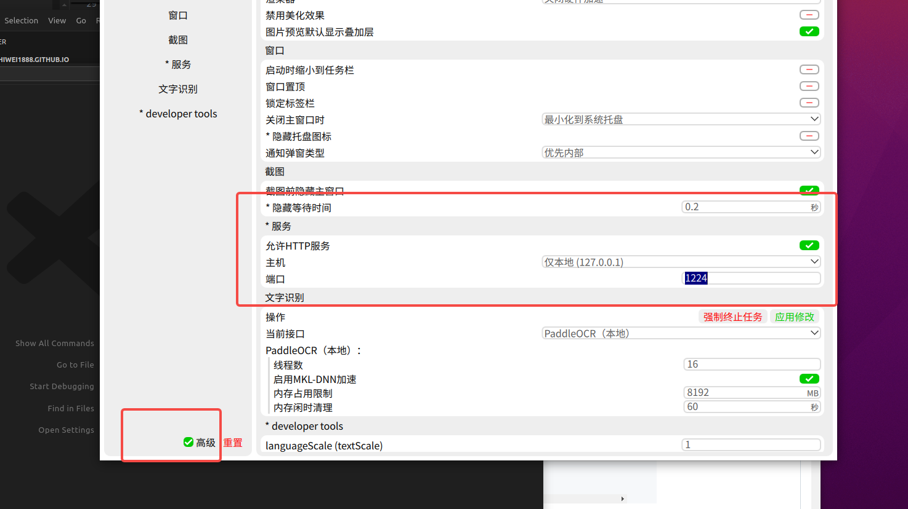

### 中文文字处理（朗读，拼音，组词，手写，笔画）+ 文字识别

### 朗读，拼音，组词

https://theajack.github.io/cnchar/doc/words.html#_1-%E4%BB%8B%E7%BB%8D

### 手写，笔画

https://hanziwriter.org/cn/docs.html

### 文字识别 （电脑打的字，识别率比较高，手写识别率比较低）

https://github.com/naptha/tesseract.js?tab=readme-ov-file

https://www.bilibili.com/video/BV1MP4y167sn/?spm_id_from=333.337.search-card.all.click

### 文字识别 （手写识别率比较高）

https://ai.baidu.com/tech/ocr

个人认证 500 次/月

https://www.xfyun.cn/doc/words/wordRecg/API.html#%E6%8E%A5%E5%8F%A3%E8%AF%B4%E6%98%8E

服务量 10万
有效期 90天
单价 免费

野路子
https://ocr.wdku.net/index_handwriting

### 其他文字识别方案
Umi-OCR 文字识别工具 （免费+中文）
https://github.com/hiroi-sora/Umi-OCR?tab=readme-ov-file
https://www.bilibili.com/video/BV1bxHZeoE3w/?spm_id_from=333.337.search-card.all.click&vd_source=ffda878df0ed45bee1ade91d8f451048

api 文档
https://github.com/hiroi-sora/Umi-OCR_v2/blob/main/docs/README_HTTP.md

