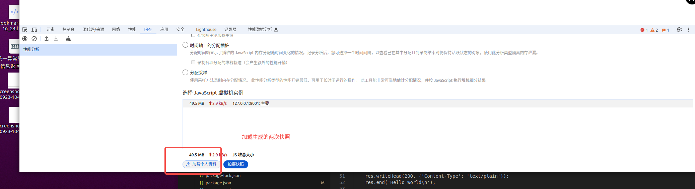
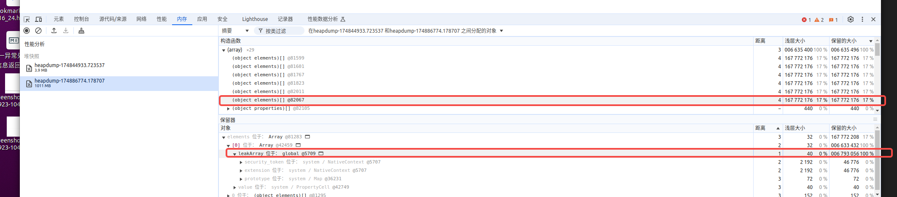

# demo

```
mem.js

const http = require('http');

const heapdump = require('heapdump');


leakArray = [];

// const leakArray = [];


const showMem = function(){

    var mem = process.memoryUsage();
    
    const format = function(bytes){
        return (bytes / 1024 / 1024).toFixed(2) + ' MB';
    }

    console.log(`Memory Usage: ${format(mem.rss - mem.heapUsed)} 堆外, ${format(mem.heapTotal)} heapTotal, ${format(mem.heapUsed)} heapUsed.`);
    // console.log(mem);

}

var leak = function(){

    leakArray.push(new Array(20*1024*1024));

}

http.createServer(function (req, res) {

    leak();

    res.writeHead(200, {'Content-Type': 'text/plain'});
    res.end('Hello World\n');

    showMem();

}).listen(8001, ()=>{
    console.log('Server running at http://127.0.0.1:8001/ pid:' + process.pid);
});

// kill -USR2 pid


```


# 工具 heapdump


## 触发生成内存快照

```
kill -USR2 pid

```

## 分析快照







## 内存泄漏

Node 对内存泄漏十分敏感，在巨大的流量面前，哪怕有一个字节的内存泄漏，也会积少成多。

原因：
缓存：过度使用缓存或缓存管理不当，导致不再使用的数据仍然占用内存。
队列消费不及时：消息队列中的任务堆积，未能及时处理，导致内存占用持续增加
作用域未释放：变量的作用域没有正确释放，尤其是在使用闭包时，可能导致对象无法被垃圾回收机制回收。


参考：

V8引擎[垃圾回收]与[内存泄露]
https://juejin.cn/post/6920218829524041741

Electron V8排查问题之发现的内存泄漏问题如何解决
https://developer.aliyun.com/article/1586548

如何排查 Electron V8 引发的内存 OOM 问题（下）
https://developer.aliyun.com/article/1263248

垃圾回收
https://zh.javascript.info/garbage-collection
