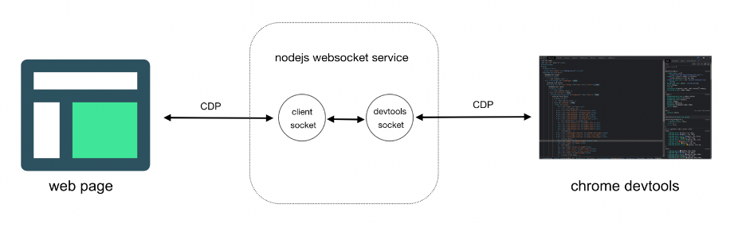

## h5架构升级


## 统一组件库：

vant-ui
https://vant-ui.github.io/vant/#/zh-CN/home


### 业务组件输出：


## JSbridge:


```


URL Schema
window.location.href = "myapp://action?param=value";

注入 JS API
原生应用将自身功能注入到 JavaScript 上下文中，Web 页面可以直接调用这些方法。

Android 示例

webView.addJavascriptInterface(new NativeBridge(this), "NativeBridge");

iOS 示例

webView.configuration.userContentController.addScriptMessageHandler(self, name: "callbackHandler");

window.JsBridge.receiveDataFromApp(data);


回调机制
window.WebViewJavascriptBridge.send(data, function(responseData) {
    // 处理原生回传的数据
});


```

## 性能优化：

性能优化：
资源加载优化：将资源按场景划分，仅加载当前场景所需资源，减少首次加载时间。
文件压缩与合并：
静态资源缓存：本地缓存，减少网络请求次数，提高性能。
CDN加速：使用CDN加速静态资源的加载，提高访问速度。
图片格式选择：选择合适的图片格式，如WebP、AVIF等，减少文件大小。
渲染优化：

接口数据缓存，优先读取缓存数据，

gzip

高频事件（如 scroll、touchmove）应该进行优化，使用函数防抖和函数节流等技术来限制它们的执行频率。
CSS3 动画比 setTimeout 更加高效，应尽可能地使用 requestAnimationFrame 动画。
DOM 结点过多会降低页面的渲染性能，因此应尽量减少 DOM 结点的数量。

https://www.cnblogs.com/weichen913/p/18173518


## 调试工具 

charles 、lightproxy

devtools-remote-debugger




## 其他

```
跨域的几种方式
    jsonp cors 代理

webpack原理

Webpack 的核心思想是一切皆模块。无论是 JavaScript 文件、CSS 文件、图片资源，还是其他静态资源，都可以被当作模块来处理。Webpack 通过模块解析器（loader）和插件（plugin）来处理这些模块。


Webpack 的打包流程可以总结为以下步骤：
读取配置文件：
Webpack 读取 webpack.config.js 或 webpack.config.ts 文件，获取入口文件、输出路径、loader 和 plugin 等配置信息。
解析模块依赖：
从入口文件开始，递归解析模块依赖，构建模块依赖图。
应用 Loader：
根据配置，对模块应用相应的 loader 进行转换。
应用 Plugin：
在打包的各个生命周期阶段，执行 plugin 的逻辑。
生成输出文件：
根据模块依赖图，将所有模块打包成一个或多个输出文件（bundle）。
将输出文件写入到配置的输出路径。


vite 原理

其主要利用浏览器ESM特性导入组织代码，在服务器端按需编译返回，完全跳过了打包这个概念，服务器随起随用。

https://juejin.cn/post/7064853960636989454

v-if 和 v-for能不能一起使用

可以 不建议一起使用

v-if 和 v-for 的优先级：v-for 的优先级高于 v-if，这意味着 v-if 的条件判断是在每次循环迭代中独立执行的。

<div v-for="item in filteredItems" :key="item.id">
  {{ item.name }}
</div>

computed: {
  filteredItems() {
    return this.items.filter(item => item.isVisible);
  }
}


data 为什么要用函数返回

    确保每个组件实例有独立的数据作用域
    防止数据在不同实例之间共享和污染
    提高组件的可复用性和安全性

nextticket

    Vue 的响应式系统是异步更新 DOM 的。当数据发生变化时，Vue 不会立即更新 DOM，而是将更新任务放入一个队列中，在下一个事件循环中统一处理。这种机制可以优化性能，但有时会导致开发者在数据更新后立即操作 DOM 时，无法获取到更新后的 DOM。
    nextTick 的作用是将回调函数延迟到 DOM 更新完成后再执行，从而确保开发者可以在回调中获取到最新的 DOM。

箭头函数和普通函数的区别
https://www.php.cn/faq/607823.html

    1、
    普通函数的 this 是动态的，取决于调用方式。
    箭头函数的 this 是静态的，取决于定义时的上下文。
    2、
    普通函数会绑定 arguments 对象，它是一个类似数组的对象，包含函数调用时传递的所有参数。
    箭头函数不绑定 arguments 对象，但可以通过参数数组解构来替代。
    3、普通函数可以通过 new 关键字被实例化为对象，而箭头函数不能被用作构造函数。
    4、普通函数可以使用 super 关键字来调用父类的方法，而箭头函数不能使用 super。
    5、普通函数可以使用 yield 关键字来实现生成器函数，而箭头函数不能使用 yield。

    const aaa = (...args) => {
      console.log(args)
    }
    aaa(1,2,3,4,5,6,7,8,9,10)

mix混入的优缺点

    优点：代码复用、解耦和模块化、易于维护。
    缺点：可能导致命名冲突、代码可读性降低、维护成本增加。
    替代方案：
        1、Vue 3 的 Composition API
        2、插件
        3、高阶组件（HOC）


promise几种状态 原理 

    Promise 有三种主要状态（State）
    Pending（进行中）：
    Fulfilled（已成功）：
    Rejected（已失败）：

    Promise 的工作原理基于 事件循环和微任务队列 ，确保异步操作的结果可以被高效地处理。


vue的组件的生命周期


| 阶段         | Vue 2 钩子                    | Vue 3 钩子                    | Composition API 钩子         |
|--------------|-------------------------------|-------------------------------|------------------------------|
| 创建         | beforeCreate<br>created       | beforeCreate<br>created       | setup                        |
| 挂载         | beforeMount<br>mounted        | beforeMount<br>mounted        | onBeforeMount<br>onMounted   |
| 更新         | beforeUpdate<br>updated       | beforeUpdate<br>updated       | onBeforeUpdate<br>onUpdated  |
| 销毁         | beforeDestroy<br>destroyed    | beforeUnmount<br>unmounted    | onBeforeUnmount<br>onUnmounted |


ajax在那个生命周期调用 create


history 和hash 是如何实现的

    https://baijiahao.baidu.com/s?id=1769914711262583821&wfr=spider&for=pc
    window.addEventListener("hashchange",funcRef,false)
    利用HTML5 History Interface 中新增的pushState()和replaceState()

    window.addEventListener('popstate', function(event) {
        console.log('URL changed:', window.location.pathname);
        // 在这里处理路由变化
    });

vue几种通信方式

1、props $emit触发事件
2、vuex / pinia
3、Provide / Injec
4、$refs defineExpose({ save, getConfig, getTempAttrsList })
5、Event Bus: 创建一个事件中心，通过它来发送和监听事件，解耦了组件之间的通信。

// event-bus.js
import Vue from 'vue';
export const EventBus = new Vue();

const handler = (data) => {
  console.log(data.message);
};

EventBus.$on('update', handler);
EventBus.$off('update', handler); // 移除监听器

EventBus.$emit('update', { message: 'Hello, World!' });


```


## EventLoop 

```

事件循环的主要工作是协调调用栈、微任务队列和宏任务队列之间的任务执行。其工作流程：

执行主线程代码：
    JavaScript 代码从上到下执行，函数调用会被压入调用栈。
    当调用栈为空时，表示主线程代码执行完毕。
处理微任务队列：
    在每次主线程代码执行完毕后，事件循环会检查微任务队列。
    如果微任务队列中有任务，事件循环会依次执行这些任务，直到微任务队列为空。
处理宏任务队列：
    在微任务队列执行完毕后，事件循环会检查宏任务队列。
    如果宏任务队列中有任务，事件循环会取出一个任务并执行。
重复上述过程：
    事件循环会不断重复上述过程，直到所有任务队列都为空。

常见的微任务包括：Promise、MutationObserver、process.nextTick（Node.js）。
常见的宏任务包括：setTimeout、setInterval、I/O 操作、MessageChannel。


```

## MutationObserver

```
const observer = new MutationObserver((mutationsList, observer) => {
  for (const mutation of mutationsList) {
    if (mutation.type === 'childList') {
      console.log('Child list modified:', mutation);
    } else if (mutation.type === 'attributes') {
      console.log('Attribute changed:', mutation.attributeName);
    }
  }
});

// 进行观察的配置
const config = {
  childList: true,          // 监听目标节点的直接子节点变化
  subtree: true,            // 监听目标节点及其所有后代节点的变化
  attributes: true,         // 监听目标节点的属性变化
  attributeFilter: ['class'], // 仅监听指定的属性
};

// 开始监听目标节点
const targetNode = document.getElementById('my-element');
observer.observe(targetNode, config);


observer.disconnect(); // 停止监听


```

MutationObserver 在不同场景下的应用，包括动态内容加载、属性变化监控、图片懒加载、实时数据更新等

在 Vue 中，可以通过 @vueuse/core 提供的 useMutationObserver 来监视 DOM 变动。
在表单验证场景中，可以监听表单字段的状态或错误消息的变化。


## Promise 如何解决 ajax 的 嵌套噩梦


```
function fetchData() {
  return new Promise((resolve, reject) => {
    $.ajax({
      url: "/api/data",
      success: function(data) {
        resolve(data); // 成功时调用 resolve
      },
      error: function(err) {
        reject(err); // 失败时调用 reject
      }
    });
  });
}

function processData(data) {
  return new Promise((resolve, reject) => {
    $.ajax({
      url: "/api/process",
      data: { input: data },
      success: function(result) {
        resolve(result); // 成功时调用 resolve
      },
      error: function(err) {
        reject(err); // 失败时调用 reject
      }
    });
  });
}

通过将异步操作封装为 Promise，可以使用链式调用来处理多个异步操作，避免嵌套回调：


fetchData()
  .then(data => {
    console.log("Fetched data:", data);
    return processData(data); // 返回下一个 Promise
  })
  .then(result => {
    console.log("Processed result:", result);
    return displayResult(result); // 可以继续链式调用
  })
  .catch(err => {
    console.error("Error:", err); // 统一处理错误
  });


现在可以使用 async/await 进一步简化


```


## Vue 3 的 Composition API 如何替代 mixin


1. 使用自定义组合函数（Composables）

```
Composition API 的核心思想是通过自定义组合函数（Composables）来封装和复用逻辑。这些函数通常以 use 开头，类似于 React 中的 Hooks


示例：封装计数器逻辑

// useCounter.js
import { ref } from 'vue';

export function useCounter() {
  const count = ref(0);
  const increment = () => count.value++;
  return { count, increment };
}


// MyComponent.vue
<script setup>
import { useCounter } from './useCounter';

const { count, increment } = useCounter();
</script>

<template>
  <div>
    <p>{{ count }}</p>
    <button @click="increment">Increment</button>
  </div>
</template>

这种方式避免了 Mixin 中常见的命名冲突问题，并且逻辑更加清晰

```

2. 全局逻辑复用


```

// globalComposables.js
import { ref } from 'vue';

export function useGlobalLogic() {
  const globalData = ref('Global data');
  return { globalData };
}


<script setup>
import { useGlobalLogic } from './globalComposables';

const { globalData } = useGlobalLogic();
</script>

```

3、状态管理

```
对于更复杂的状态管理，可以使用 Vuex 或 Pinia 等状态管理库。这些库与 Composition API 配合得很好，提供了更强大的功能。

// store.js
import { defineStore } from 'pinia';

export const useCounterStore = defineStore('counter', {
  state: () => ({ counter: 0 }),
  actions: { increment() { this.counter++; } }
});


<script setup>
import { useCounterStore } from './store';
import { computed } from 'vue';

const store = useCounterStore();
const counter = computed(() => store.counter);
const incrementCounter = () => store.increment();
</script>

Composition API 的优势：
更好的逻辑复用
更灵活的代码组织
更好的 TypeScript 支持
更细粒度的逻辑控制


```

## 插件如何替代mixin


```

// myPlugin.js
export default {
  install(Vue) {
    // 添加全局方法
    Vue.prototype.$myPluginMethod = function() {
      console.log('This is a plugin method');
    };

    // 添加自定义指令
    Vue.directive('my-directive', {
      bind(el, binding) {
        el.style.color = binding.value || 'red';
      }
    });
  }
};


// main.js
import { createApp } from 'vue';
import App from './App.vue';
import myPlugin from './myPlugin';

const app = createApp(App);
app.use(myPlugin);
app.mount('#app');


<template>
  <div>
    <p v-my-directive="'blue'">This text will be blue</p>
    <button @click="$myPluginMethod">Call Plugin Method</button>
  </div>
</template>


```

## 高阶组件（HOC）如何替代mixin

高阶组件是一个函数，它接收一个组件作为参数，并返回一个新的组件。HOC 可以用来封装和复用组件逻辑，同时避免 Mixin 中常见的命名冲突和逻辑不清晰的问题


```

// withVip.js
import { h } from 'vue';
import OpenVipTip from './OpenVipTip.vue';

export default function WithVip(BaseComponent) {
  return {
    setup(props, { attrs, slots }) {
      const showVipContent = getShowVipContent();

      function getShowVipContent() {
        // 业务逻辑：判断是否显示 VIP 内容
        return true;
      }

      return () => {
        return showVipContent
          ? h(BaseComponent, { ...props, ...attrs }, slots)
          : h(OpenVipTip);
      };
    }
  };
}

<template>
  <EnhancedComponent />
</template>

<script setup>
import MyComponent from './MyComponent.vue';
import WithVip from './withVip.js';

const EnhancedComponent = WithVip(MyComponent);
</script>

Mixin：适合在组件内部复用逻辑，但可能导致命名冲突和逻辑不清晰。
HOC：更适合封装组件逻辑，避免了 Mixin 的一些问题，同时提供了更灵活的代码组织方式

```

场景描述：通过高阶组件可以在不修改原始组件逻辑的情况下，为其添加额外的功能。
权限控制：为组件增加权限检查功能。例如，只有管理员权限的用户才能访问或操作某些组件。


## 节流和防抖

```

节流：在一段时间内只执行一次函数，即使多次触发事件，也只会在最后一次触发后执行。
防抖：在事件触发后，延迟一段时间后执行函数，如果在延迟时间内再次触发事件，则重新计时。

```


## 原型链

每个对象（除 null）都有一个隐式原型属性 __proto__，指向其构造函数的显式原型对象 prototype‌

‌实例对象‌ → ‌构造函数原型‌（prototype）→ ‌上级原型‌ → … → ‌Object.prototype‌ → ‌null‌
// 原型链：cat.__proto__ → Cat.prototype → Object.prototype → null

## 继承

### JavaScript 继承模式对比表

| ==&zwnj;**继承模式**&zwnj;==       | 引用类型共享问题 | 支持传参 | 性能效率     | 适用性           |  
|--------------------|------------------|----------|--------------|------------------|  
| 原型链继承         | ❌   | ❌ | 中      | 简单方法继承 |  
| 构造函数继承       | ✅     | ✅  | 高 ‌   | 独立属性初始化  |  
| 组合继承           | ✅    | ✅ ‌| 中（冗余） | 通用场景  |  
| 寄生组合式继承     | ✅ ‌ | ✅ ‌ | 高    | 高效完整继承 ‌ |  
| ES6 Class 继承     | ✅ ‌       | ✅ ‌ | 高 ‌    | 现代项目开发 ‌ |  

ES6 继承本质是语法糖，底层仍基于寄生组合式继承（避免多次调用父类构造函数）‌

ES6 Class 继承通过 extends 和 super 提供了简洁、直观的语法，解决了传统原型链继承的冗余和复杂性，同时确保继承机制的健壮性（如强制调用 super()）‌23。其底层仍遵循原型链规则，但通过语法糖优化了开发体验，是现代 JavaScript 开发的首选继承模式‌


寄生组合式继承


```

function inheritPrototype(Child, Parent) {
  const prototype = Object.create(Parent.prototype); // 复制父类原型‌
  prototype.constructor = Child; // 修正构造函数指向子类‌
  Child.prototype = prototype; // 设置子类原型‌
}

function Parent(name) {
  this.name = name;
  this.colors = ['red', 'blue'];
}
Parent.prototype.sayName = function() { console.log(this.name); };

function Child(name, age) {
  Parent.call(this, name); // 继承父类实例属性‌:ml-citation{ref="1,3" data="citationList"}
  this.age = age;
}

inheritPrototype(Child, Parent); // 建立原型链关系


```

```

class Animal {
  constructor(name) { this.name = name; }
  eat() { console.log(`${this.name} is eating`); }
}

class Cat extends Animal {
  constructor(name, color) {
    super(name); // 必须调用 super()
    this.color = color;
  }
}

父类的静态方法（static 修饰）会被子类继承，可通过 super 在子类静态方法中调用父类静态方法‌
class Parent {
  static log() { console.log("Parent static method"); }
}
class Child extends Parent {
  static log() {
    super.log(); // 调用 Parent.log()
    console.log("Child static method");
  }
}

```

## for in 和 for of 区别


| 特性         | for...of async/await	          | for...in async/await          |
|--------------|-------------------------------|-------------------------------|
| ‌遍历目标‌	    | 是用来遍历可迭代对象（如数组、字符串、Map、Set 等）的值      | 主要用于遍历对象（Object）的键（key）。       |
| 异步执行顺序	 | 严格顺序执行        | 顺序执行但属性遍历顺序不确定        |
| 推荐场景	        | 需顺序控制       | 不需要顺序控制       |


## for await of 用法

```
async function* asyncGenerator() {
  yield await Promise.resolve(1);
  yield await Promise.resolve(2);
  yield await Promise.resolve(3);
}

(async () => {
  for await (const num of asyncGenerator()) {
    console.log(num); // 依次输出 1、2、3（间隔异步操作完成时间）
  }
})();

```

## HTMLCollection和NodeList有什么区别

HTMLCollection：
通常通过 document.getElementById、document.getElementByTagName、document.getElementByClassName 和 document.getElementByName 等方法获取。
NodeList：
可以通过 Node.childNodes、Document.querySelectorAll 和 Element.querySelectorAll 等方法获取。


## 严格模式和普通模式的区别

严格模式和普通模式的区别：
1. 禁止未声明的变量：
2. 禁止使用 with 语句
3. eval 的限制：eval 的行为被限制。它不会在其作用域中创建变量和函数，并且无法访问所在的上下文中的变量。
4. 在严格模式下，不允许通过修改函数的 caller、callee 属性或 arguments 对象的某些属性来操作函数的调用链。
5. 在严格模式下，如果函数没有指定 this 值，则 this 的值是 undefined，而不是全局对象
6. 严格模式是 ES6 的默认模式：
7. 函数参数不能重复

```

"use strict";
function foo() {
  console.log(this); // undefined
}
foo();

```

## options 请求
作用：
验证服务器是否允许跨域请求
了解服务器支持的 HTTP 方法和头

## OPTIONS 请求在跨域请求中会影响性能吗？

增加网络请求数
服务器可以在 OPTIONS 响应中设置 Access-Control-Max-Age 响应头
例如，设置 Access-Control-Max-Age: 86400 表示预检结果缓存一天。


## vue2 和 vue3 区别


| 特性                | Vue 2                                  | Vue 3                                                                 |
|---------------------|----------------------------------------|-----------------------------------------------------------------------|
| ==&zwnj;**响应式系统**&zwnj;==       | 基于 `Object.defineProperty`          | 基于 `Proxy`，支持动态添加和删除属性                                  |
| ==&zwnj;**API 设计**&zwnj;==         | Options API                           | Composition API + Options API                                         |
| ==&zwnj;**性能**&zwnj;==             | 较低，虚拟 DOM 的 diff 算法在复杂场景下性能较低 | 更高，重写了虚拟 DOM 的 diff 算法，优化了渲染性能                      |
| ==&zwnj;**Tree Shaking**&zwnj;==     | 不支持                                 | 支持，打包时只包含用到的代码，减小了打包体积                           |
| ==&zwnj;**TypeScript 支持**&zwnj;==  | 较弱，需要额外的配置和插件             | 内置支持，提供了更好的类型推断和开发体验                               |
| ==&zwnj;**片段支持**&zwnj;==         | 不支持，组件模板必须有一个根元素       | 支持多根节点（Fragments）                                             |
| ==&zwnj;**Teleport**&zwnj;==         | 不支持                                 | 引入 `Teleport` 组件，可将组件渲染到 DOM 中的任意位置                 |
| ==&zwnj;**自定义渲染器**&zwnj;==     | 支持较弱                               | 提供了更灵活的自定义渲染器 API                                        |
| ==&zwnj;**Suspense**&zwnj;==         | 不支持                                 | 引入 `<Suspense>` 组件，用于处理异步组件的加载状态                    |
| ==&zwnj;**生命周期钩子**&zwnj;==     | `beforeCreate`、`created` 等          | `beforeCreate` 改为 `setup`，其他钩子名前加 `on`，如 `onMounted`      |
| ==&zwnj;**生态兼容性**&zwnj;==       | 生态成熟，有大量第三方库和插件         | 生态正在逐步迁移，部分库可能还不支持 Vue 3                            |
| ==&zwnj;**全局 API**&zwnj;==         | 通过 `new Vue()` 创建实例，全局配置影响所有实例 | 使用 `createApp()` 创建隔离的应用实例，全局 API 改为实例方法           |
| ==&zwnj;**v-model 增强**&zwnj;==     | 不支持多个 `v-model` 绑定              | 支持多个 `v-model` 绑定，如 `v-model:title`                          |
| ==&zwnj;**移除过滤器**&zwnj;==       | 支持过滤器                             | 移除过滤器，推荐用计算属性或方法替代                                   |
| ==&zwnj;**事件总线**&zwnj;==         | 常用事件总线进行组件间通信             | 弃用事件总线，推荐使用 `provide/inject` 或状态管理库                  |


## vue3 如何实现的 对 Tree Shaking 的支持

1、Vue 3 完全基于 ES6 模块系统 （import）和导出（export）语法，编译器可以在编译阶段确定模块之间的依赖关系以及输入和输出的变量Tree Shaking 可以通过静态分析代码，识别出未使用的代码并将其移除
2、Vue 3 使用了先进的编译器（如 Vite、Rollup 等），这些编译器内置了对 Tree Shaking 的支持
3、Vue 3 的 Composition API 提供了更细粒度的功能模块，有助于 Tree Shaking 的实现。例如：
4、避免副作用

```
// 不推荐的做法
console.log('This is a side effect');

// 推荐的做法
export function logMessage(message) {
  console.log(message);
}
```
5、确保打包工具（如 Webpack、Rollup）配置正确，启用 Tree Shaking 功能。以 Webpack 为例：

```
// webpack.config.js
module.exports = {
  optimization: {
    usedExports: true, // 启用Tree Shaking
    minimize: true, // 启用代码压缩
  },
};
```


## vue3 如何重写了虚拟 DOM 的 diff 算法，优化了渲染性能
http://localhost:4000/2024/12/12/vue3/


## createApp 和 new Vue 对比有什么好处？
1、createApp 创建的应用实例是独立的，全局配置和组件仅对当前实例生效，避免了不同应用实例之间的相互影响。
适合大型项目或多团队协作开发，不同子项目可以挂载不同的指令、组件等，互不影响。
2、createApp 支持模块化设计，便于按需引入功能，减少打包体积


## 首屏速度

白屏时间

1、减少首屏资源体积（打包工具的压缩，异步加载，更新较新的版本(按需引入) tree-shaking ,gzip ）去除大的base64体积，尽量少用三方库，图片懒加载

特殊情况的优化操作：
1.首屏数据尽量并行，如何可行让n小数据量接口合并到一个接口中
2.无限滚动，可以分批滚动渲染。
3.骨架屏，loading,先让屏幕不白，减少用户焦虑


什么情况会造成卡顿和渲染慢？

1、一次性操作大量dom

2、进行了复杂度很高的运算


3、vue和react项目中，不必要的渲染太多

vue3
v-show 代替 v-if
循环，动态切换的内容加上key
keep-alive缓存 （）
接口更新粒度尽量小，避免不必要的请求

不变数据，定期时效可以缓存在cookies 或者 localStorage中,比如 token,用户名等

pinia


<!-- 2、减少首屏资源数量（减少http请求数量，合并css，图片） -->


## js 深拷贝有哪些方式


在 JavaScript 中，实现深拷贝有多种方式，以下是常见的几种方法：

### 1. **JSON 方法**
   - **原理**：通过 `JSON.stringify` 将对象序列化为字符串，再通过 `JSON.parse` 将字符串反序列化为新的对象。
   - **代码示例**：
     ```javascript
     const obj = { a: 1, b: { c: 2 } };
     const deepCopy = JSON.parse(JSON.stringify(obj));
     console.log(deepCopy); // { a: 1, b: { c: 2 } }
     ```
   - **优点**：简单易用，代码量少。
   - **缺点**：
     1. 无法处理函数、`undefined`、`Date`、`RegExp` 等特殊类型。
     2. 无法处理循环引用（会报错）。
     3. 无法处理 `Map`、`Set`、`Buffer` 等复杂数据结构。

### 2. **递归实现**
   - **原理**：通过递归遍历对象的每个属性，手动创建新的对象或数组，并将属性值复制到新对象中。
   - **代码示例**：
     ```javascript
     function deepCopy(obj, hash = new WeakMap()) {
         if (obj === null) return null;
         if (obj instanceof Date) return new Date(obj);
         if (obj instanceof RegExp) return new RegExp(obj);
         if (typeof obj !== "object") return obj;
         if (hash.has(obj)) return hash.get(obj);

         let cloneObj = new obj.constructor();
         hash.set(obj, cloneObj);

         for (let key in obj) {
             if (obj.hasOwnProperty(key)) {
                 cloneObj[key] = deepCopy(obj[key], hash);
             }
         }
         return cloneObj;
     }

     const obj = { a: 1, b: { c: 2 } };
     const deepCopyObj = deepCopy(obj);
     console.log(deepCopyObj); // { a: 1, b: { c: 2 } }
     ```
   - **优点**：可以处理大部分数据类型，包括循环引用。
   - **缺点**：代码复杂度较高，性能可能不如其他方法。

### 3. **使用 `structuredClone`**
   - **原理**：`structuredClone` 是一个现代的深拷贝方法，专门用于复制对象和数组，支持多种复杂数据结构。
   - **代码示例**：
     ```javascript
     const obj = { a: 1, b: { c: 2 } };
     const deepCopyObj = structuredClone(obj);
     console.log(deepCopyObj); // { a: 1, b: { c: 2 } }
     ```
   - **优点**：
     1. 支持大部分数据类型，包括 `Map`、`Set`、`Date`、`ArrayBuffer` 等。
     2. 内置处理循环引用。
   - **缺点**：不支持函数、`undefined`、`Infinity` 等特殊值。

### 4. **使用库**
   - **原理**：借助第三方库（如 `lodash`）实现深拷贝。
   - **代码示例**：
     ```javascript
     import _ from "lodash";

     const obj = { a: 1, b: { c: 2 } };
     const deepCopyObj = _.cloneDeep(obj);
     console.log(deepCopyObj); // { a: 1, b: { c: 2 } }
     ```
   - **优点**：功能强大，支持复杂数据结构和循环引用。
   - **缺点**：需要引入额外的库，增加项目体积。

### 5. **其他方法**
   - **`Object.assign` 和扩展运算符（`...`）**：仅支持浅拷贝，不能用于深拷贝。
   - **`cloneNode`**：用于 DOM 元素的深拷贝。

### 总结
- 如果需要简单快速的深拷贝，且不涉及复杂数据结构，可以使用 `JSON` 方法。
- 如果需要支持复杂数据结构和循环引用，推荐使用 `structuredClone` 或第三方库（如 `lodash`）。
- 如果需要完全自定义深拷贝逻辑，可以手动实现递归方法。


```
var personA = {
    aget: function() {
        return 20;
    },
    name: 'jack',
    job: undefined,
    location: null
}

JSON.stringify(personA)

打印：
'{"name":"jack","location":null}'

```


## typescript 定义对象型 type 或者 interface 的时候，如何在原有定义的结构中删除一个属性

在 TypeScript 中，如果你想在定义对象型 `type` 或 `interface` 的时候，从原有定义的结构中删除一个属性，可以使用 `Omit` 泛型工具类型。`Omit` 允许你从一个类型中排除特定的属性。

### 使用 `Omit` 删除属性

#### 1. **定义原始类型**
```typescript
interface User {
    name: string;
    age: number;
    email: string;
}
```

#### 2. **使用 `Omit` 删除属性**
```typescript
type UserWithoutEmail = Omit<User, 'email'>;

const user: UserWithoutEmail = {
    name: "Alice",
    age: 30
};
```

在这个例子中，`UserWithoutEmail` 是从 `User` 接口中派生出来的，但不包含 `email` 属性。

### 自定义实现 `Omit`

如果你使用的是较旧版本的 TypeScript，可能没有内置的 `Omit` 工具类型。你可以手动实现它：

```typescript
type Omit<T, K extends keyof T> = Pick<T, Exclude<keyof T, K>>;
```

### 示例

#### 1. **定义原始类型**
```typescript
interface User {
    name: string;
    age: number;
    email: string;
}
```

#### 2. **使用自定义 `Omit` 删除属性**
```typescript
type UserWithoutEmail = Omit<User, 'email'>;

const user: UserWithoutEmail = {
    name: "Alice",
    age: 30
};
```

### 其他方法

#### 1. **使用 `Pick` 和 `Exclude`**
你也可以直接使用 `Pick` 和 `Exclude` 来实现类似的效果：

```typescript
type UserWithoutEmail = Pick<User, Exclude<keyof User, 'email'>>;
```

#### 2. **使用 `Record`**
如果你需要更灵活的控制，可以使用 `Record`：

```typescript
type UserWithoutEmail = Record<Exclude<keyof User, 'email'>, User[keyof User]>;
```

### 总结

- **`Omit<T, K>`**：这是最直接的方式，用于从类型 `T` 中排除属性 `K`。
- **自定义实现**：如果你的 TypeScript 版本不支持 `Omit`，可以手动实现它。
- **其他方法**：使用 `Pick` 和 `Exclude` 或 `Record` 也可以实现类似的效果。

通过这些方法，你可以在定义对象型 `type` 或 `interface` 的时候，灵活地删除不需要的属性。


ts(TypeScript)常用语法(Omit、Pick、Partial、Required)

https://blog.csdn.net/jojo1001/article/details/121074549


## react hooks 的好处是什么？用过哪些hooks，分别说明什么场景下使用？hooks对应之前react的生命周期？

### React Hooks 的好处

React Hooks 是 React 16.8 引入的新特性，它允许你在函数组件中使用状态和其他 React 特性，而无需编写类组件。Hooks 的主要好处包括：

1. **复用状态逻辑**：Hooks 让你能够在不同的组件之间复用状态逻辑。
2. **简化组件结构**：Hooks 让你能够将组件逻辑分解成更小的、可复用的函数。
3. **更好的可读性和可维护性**：Hooks 让组件逻辑更加清晰，易于理解和维护。
4. **减少样板代码**：Hooks 减少了编写类组件所需的样板代码。

### 常用的 Hooks 及其使用场景

#### 1. `useState`
**用途**：用于在函数组件中添加状态变量。
**使用场景**：需要管理组件内部状态时，例如表单输入、开关按钮等。
```javascript
import React, { useState } from 'react';

function Counter() {
  const [count, setCount] = useState(0);

  return (
    <div>
      <p>Count: {count}</p>
      <button onClick={() => setCount(count + 1)}>Increment</button>
    </div>
  );
}
```

#### 2. `useEffect`
**用途**：用于在函数组件中执行副作用操作（如数据获取、订阅事件等）。
**使用场景**：需要在组件挂载、更新或卸载时执行某些操作，例如获取数据、设置定时器等。
```javascript
import React, { useState, useEffect } from 'react';

function DataFetcher() {
  const [data, setData] = useState(null);

  useEffect(() => {
    fetch('https://api.example.com/data')
      .then(response => response.json())
      .then(data => setData(data));
  }, []); // 空依赖数组表示仅在组件挂载时执行

  return <div>{data ? data : 'Loading...'}</div>;
}
```

#### 3. `useContext`
**用途**：用于在函数组件中订阅 React 上下文。
**使用场景**：需要访问全局状态或主题时，例如多语言切换、主题切换等。
```javascript
import React, { useContext } from 'react';
import { ThemeContext } from './ThemeContext';

function ThemedButton() {
  const theme = useContext(ThemeContext);

  return <button style={theme}>Click me</button>;
}
```

#### 4. `useReducer`
**用途**：用于管理复杂的状态逻辑。
**使用场景**：状态逻辑较为复杂，需要通过 reducer 函数管理时，例如表单验证、购物车逻辑等。
```javascript
import React, { useReducer } from 'react';

function reducer(state, action) {
  switch (action.type) {
    case 'increment':
      return { count: state.count + 1 };
    case 'decrement':
      return { count: state.count - 1 };
    default:
      return state;
  }
}

function Counter() {
  const [state, dispatch] = useReducer(reducer, { count: 0 });

  return (
    <div>
      <p>Count: {state.count}</p>
      <button onClick={() => dispatch({ type: 'increment' })}>Increment</button>
      <button onClick={() => dispatch({ type: 'decrement' })}>Decrement</button>
    </div>
  );
}
```

#### 5. `useRef`
**用途**：用于在函数组件中创建一个可变的引用。
**使用场景**：需要在组件之间共享可变值时，例如管理计时器、DOM 元素等。
```javascript
import React, { useRef } from 'react';

function Timer() {
  const intervalRef = useRef(null);

  useEffect(() => {
    intervalRef.current = setInterval(() => {
      console.log('Tick');
    }, 1000);

    return () => {
      clearInterval(intervalRef.current);
    };
  }, []);

  return <div>Timer</div>;
}
```

#### 6. `useMemo`
**用途**：用于缓存计算结果，避免重复计算。
**使用场景**：需要优化性能，避免不必要的计算时，例如复杂的数学运算、数据处理等。
```javascript
import React, { useState, useMemo } from 'react';

function HeavyComputation({ data }) {
  const [count, setCount] = useState(0);

  const computedData = useMemo(() => {
    // 模拟复杂计算
    return data.map(item => item * 2);
  }, [data]);

  return (
    <div>
      <p>Computed Data: {computedData.join(', ')}</p>
      <p>Count: {count}</p>
      <button onClick={() => setCount(count + 1)}>Increment</button>
    </div>
  );
}
```

#### 7. `useCallback`
**用途**：用于缓存函数，避免函数重新创建。
**使用场景**：需要优化性能，避免不必要的组件重新渲染时，例如传递回调函数给子组件等。
```javascript
import React, { useState, useCallback } from 'react';

function ParentComponent() {
  const [count, setCount] = useState(0);

  const increment = useCallback(() => {
    setCount(count + 1);
  }, [count]);

  return <ChildComponent onIncrement={increment} />;
}

function ChildComponent({ onIncrement }) {
  return <button onClick={onIncrement}>Increment</button>;
}
```

### Hooks 与 React 生命周期的对应关系

#### 1. `useEffect`
- **`componentDidMount`**：当依赖数组为空时，`useEffect` 在组件挂载后执行。
- **`componentDidUpdate`**：当依赖数组有值时，`useEffect` 在组件更新后执行。
- **`componentWillUnmount`**：`useEffect` 的清理函数在组件卸载前执行。

#### 2. `useState`
- **`constructor`**：`useState` 初始化状态，类似于类组件的 `constructor`。

#### 3. `useContext`
- **`context`**：`useContext` 订阅上下文，类似于类组件的 `context`。

#### 4. `useReducer`
- **`state`**：`useReducer` 管理状态，类似于类组件的 `state` 和 `this.setState`。

#### 5. `useRef`
- **`ref`**：`useRef` 创建引用，类似于类组件的 `ref`。

#### 6. `useMemo` 和 `useCallback`
- **优化性能**：`useMemo` 和 `useCallback` 用于优化性能，避免不必要的计算和组件重新渲染。

通过使用 Hooks，你可以更灵活地管理组件的状态和生命周期，使代码更加简洁和可维护。


## useReducer 的使用，和redux中的reducer有什么区别？redux的相关使用方式。


### useReducer 的使用与 Redux 中的 reducer 的区别

#### useReducer 的使用

`useReducer` 是 React 的一个 Hook，用于管理组件内部的状态。它类似于 `useState`，但更适合用于管理复杂的状态逻辑。

**基本使用**：

```javascript
import React, { useReducer } from 'react';

// 定义 reducer 函数
function reducer(state, action) {
  switch (action.type) {
    case 'increment':
      return { count: state.count + 1 };
    case 'decrement':
      return { count: state.count - 1 };
    default:
      return state;
  }
}

// 在组件中使用 useReducer
function Counter() {
  const [state, dispatch] = useReducer(reducer, { count: 0 });

  return (
    <div>
      <p>Count: {state.count}</p>
      <button onClick={() => dispatch({ type: 'increment' })}>Increment</button>
      <button onClick={() => dispatch({ type: 'decrement' })}>Decrement</button>
    </div>
  );
}
```

#### Redux 中的 reducer

Redux 是一个用于管理全局状态的库，它与 React 一起使用时，通常用于管理复杂的全局状态。Redux 中的 reducer 用于定义如何更新状态。

**基本使用**：

1. **定义 reducer**：

```javascript
// counterReducer.js
export default function counterReducer(state = { count: 0 }, action) {
  switch (action.type) {
    case 'INCREMENT':
      return { count: state.count + 1 };
    case 'DECREMENT':
      return { count: state.count - 1 };
    default:
      return state;
  }
}
```

2. **创建 store**：

```javascript
import { createStore } from 'redux';
import counterReducer from './counterReducer';

const store = createStore(counterReducer);
```

3. **在组件中使用 Redux**：

```javascript
import React from 'react';
import { useSelector, useDispatch } from 'react-redux';

function Counter() {
  const count = useSelector(state => state.count);
  const dispatch = useDispatch();

  return (
    <div>
      <p>Count: {count}</p>
      <button onClick={() => dispatch({ type: 'INCREMENT' })}>Increment</button>
      <button onClick={() => dispatch({ type: 'DECREMENT' })}>Decrement</button>
    </div>
  );
}
```

### useReducer 与 Redux 的区别

1. **作用范围**：
   - `useReducer`：用于管理组件内部的状态，适合在单个组件或少量组件之间共享状态。
   - Redux：用于管理全局状态，适合在多个组件之间共享状态，尤其是复杂的应用。

2. **复杂度**：
   - `useReducer`：相对简单，适合简单的状态管理。
   - Redux：相对复杂，需要额外的配置和中间件支持，适合复杂的全局状态管理。

3. **性能**：
   - `useReducer`：性能较好，因为状态更新只影响相关的组件。
   - Redux：性能稍差，因为全局状态更新时，所有订阅的组件都会重新渲染。

4. **使用场景**：
   - `useReducer`：适合在组件内部或少量组件之间管理状态。
   - Redux：适合在多个组件之间共享状态，尤其是需要全局状态管理的场景。

### Redux 的相关使用方式

#### 1. **安装 Redux 和 React-Redux**

```bash
npm install redux react-redux
```

#### 2. **定义 Reducer**

```javascript
// counterReducer.js
export default function counterReducer(state = { count: 0 }, action) {
  switch (action.type) {
    case 'INCREMENT':
      return { count: state.count + 1 };
    case 'DECREMENT':
      return { count: state.count - 1 };
    default:
      return state;
  }
}
```

#### 3. **创建 Store**

```javascript
import { createStore } from 'redux';
import counterReducer from './counterReducer';

const store = createStore(counterReducer);
```

#### 4. **在根组件中提供 Store**

```javascript
import React from 'react';
import { Provider } from 'react-redux';
import store from './store';
import Counter from './Counter';

function App() {
  return (
    <Provider store={store}>
      <Counter />
    </Provider>
  );
}

export default App;
```

#### 5. **在组件中使用 Redux**

```javascript
import React from 'react';
import { useSelector, useDispatch } from 'react-redux';

function Counter() {
  const count = useSelector(state => state.count);
  const dispatch = useDispatch();

  return (
    <div>
      <p>Count: {count}</p>
      <button onClick={() => dispatch({ type: 'INCREMENT' })}>Increment</button>
      <button onClick={() => dispatch({ type: 'DECREMENT' })}>Decrement</button>
    </div>
  );
}

export default Counter;
```

#### 6. **使用 Middleware**

Redux 提供了中间件机制，用于处理异步操作和其他副作用。常见的中间件包括 `redux-thunk` 和 `redux-saga`。

**安装 redux-thunk**：

```bash
npm install redux-thunk
```

**配置中间件**：

```javascript
import { createStore, applyMiddleware } from 'redux';
import counterReducer from './counterReducer';
import thunk from 'redux-thunk';

const store = createStore(counterReducer, applyMiddleware(thunk));
```

**使用异步操作**：

```javascript
// actions.js
export const increment = () => ({ type: 'INCREMENT' });

export const decrement = () => ({ type: 'DECREMENT' });

export const incrementAsync = () => (dispatch) => {
  setTimeout(() => {
    dispatch(increment());
  }, 1000);
};
```

**在组件中使用异步操作**：

```javascript
import React from 'react';
import { useSelector, useDispatch } from 'react-redux';
import { increment, decrement, incrementAsync } from './actions';

function Counter() {
  const count = useSelector(state => state.count);
  const dispatch = useDispatch();

  return (
    <div>
      <p>Count: {count}</p>
      <button onClick={() => dispatch(increment())}>Increment</button>
      <button onClick={() => dispatch(decrement())}>Decrement</button>
      <button onClick={() => dispatch(incrementAsync())}>Increment Async</button>
    </div>
  );
}

export default Counter;
```

### 总结

- **useReducer**：适合在组件内部或少量组件之间管理状态，简单易用。
- **Redux**：适合管理全局状态，尤其在复杂的应用中，提供了强大的状态管理和中间件支持。

通过合理选择和使用 `useReducer` 和 Redux，可以更有效地管理 React 应用中的状态。


## 如何对 react做性能优化？

React 性能优化可以从多个层面进行，包括组件优化、渲染优化、数据管理优化、构建优化等。以下是一些关键的优化技巧和最佳实践：

### 1. 组件优化

#### 使用 `React.memo` 和 `useMemo`
- **`React.memo`**：用于缓存函数组件的渲染结果，避免不必要的重渲染。
  ```javascript
  const ProductCard = React.memo(({ id, name, price, image }) => {
    return (
      <div className="product-card">
        
        <h3>{name}</h3>
        <p>{formatPrice(price)}</p>
      </div>
    );
  }, (prevProps, nextProps) => {
    return prevProps.id === nextProps.id && prevProps.price === nextProps.price;
  });
  ```
- **`useMemo`**：用于缓存计算结果，避免重复计算。
  ```javascript
  const filteredProducts = useMemo(() => {
    return products.filter(product => {
      return Object.entries(filters).every(([key, value]) => product[key] === value);
    });
  }, [products, filters]);
  ```

#### 使用 `useCallback`
- **`useCallback`**：用于缓存回调函数，避免在每次渲染时创建新的函数实例。
  ```javascript
  const handleFilter = useCallback((newFilters) => {
    setFilters(newFilters);
  }, []);
  ```

### 2. 渲染优化

#### 虚拟化技术
- **`react-window` 和 `react-virtualized`**：用于优化长列表的渲染，只渲染可视区域的元素。
  ```javascript
  import { FixedSizeList as List } from 'react-window';

  const VirtualizedList = ({ items }) => (
    <List
      height={500}
      itemCount={items.length}
      itemSize={35}
      width={300}
    >
      {({ index, style }) => (
        <div style={style}>{items[index]}</div>
      )}
    </List>
  );
  ```

#### 懒加载与按需加载
- **`React.lazy` 和 `Suspense`**：用于实现组件的按需加载，减少初次加载时间。
  ```javascript
  const LazyComponent = lazy(() => import('./LazyComponent'));

  function App() {
    return (
      <Suspense fallback={<div>Loading...</div>}>
        <LazyComponent />
      </Suspense>
    );
  }
  ```

### 3. 数据管理优化

#### 使用 Redux 或 Context API
- **Redux**：用于管理全局状态，避免通过多层组件传递 props。
  ```javascript
  import { createStore } from 'redux';
  import { Provider, useSelector, useDispatch } from 'react-redux';

  const store = createStore(counterReducer);

  function App() {
    return (
      <Provider store={store}>
        <Counter />
      </Provider>
    );
  }
  ```

- **Context API**：用于在组件树中传递状态，避免 props drilling。
  ```javascript
  const MyContext = createContext();

  const MyComponent = () => {
    const context = useContext(MyContext);
    return <div>{context}</div>;
  };
  ```

### 4. 构建优化

#### 使用 Webpack 优化打包
- **Tree Shaking**：去除未使用的代码，减少打包体积。
- **代码分割**：将代码分割成多个 bundle，按需加载。
  ```javascript
  optimization: {
    splitChunks: {
      chunks: 'all',
    },
  },
  ```

#### 使用 `webpack-bundle-analyzer`
- **分析依赖包**：找出不必要的依赖包，进行优化。
  ```bash
  npm install --save-dev webpack-bundle-analyzer
  ```

### 5. 性能分析工具

#### 使用 React DevTools 和 Chrome DevTools
- **React DevTools**：用于分析组件的渲染性能，找出性能瓶颈。
- **Chrome DevTools**：用于分析应用的性能，包括网络请求、内存使用等。

### 6. 其他优化技巧

#### 为列表项添加唯一 `key` 属性
- **`key` 属性**：帮助 React 的 diff 算法高效地复用节点，减少节点的创建和删除操作。
  ```javascript
  const listItems = this.state.items.map(item => (
    <li key={item.id}>{item.text}</li>
  ));
  ```

#### 避免在 `render` 函数中直接定义函数
- **函数定义**：将函数保存到组件的成员对象中，避免每次渲染生成新的函数实例。
  ```javascript
  class MyComponent extends React.Component {
    handleButtonClick = () => {
      // 函数逻辑
    };

    render() {
      return <button onClick={this.handleButtonClick}>Click Me</button>;
    }
  }
  ```

### 7. 使用 React Query 进行高效的数据获取
- **React Query**：用于数据获取、缓存和同步，简化数据管理流程。
  ```javascript
  import { QueryClient, QueryClientProvider, useQuery } from 'react-query';

  const queryClient = new QueryClient();

  function App() {
    return (
      <QueryClientProvider client={queryClient}>
        <MyComponent />
      </QueryClientProvider>
    );
  }

  function MyComponent() {
    const { data, error, isLoading } = useQuery('fetchData', fetchDataFunction);

    if (isLoading) return <div>Loading...</div>;
    if (error) return <div>Error: {error.message}</div>;

    return <div>Data: {JSON.stringify(data)}</div>;
  }
  ```

通过以上这些优化技巧，可以显著提升 React 应用的性能，改善用户体验。


## react.memo,useMemo,useCallback的使用场景和区别？

在 React 中，`react.memo`、`useMemo` 和 `useCallback` 是三个常用的性能优化工具，它们分别用于不同的场景。下面将详细介绍它们的使用场景和区别。

### 1. `react.memo`

#### 使用场景
`react.memo` 是一个高阶组件（HOC），用于缓存函数组件的渲染结果，避免不必要的重渲染。它会在组件的 props 没有发生变化时，直接返回之前渲染的缓存结果。

#### 示例
```javascript
import React, { memo } from 'react';

const ProductCard = memo(({ id, name, price, image }) => {
  return (
    <div className="product-card">
      
      <h3>{name}</h3>
      <p>{price}</p>
    </div>
  );
}, (prevProps, nextProps) => {
  return prevProps.id === nextProps.id && prevProps.price === nextProps.price;
});
```


### 2. `useMemo`

#### 使用场景
`useMemo` 是一个 Hook，用于缓存函数内部的计算结果，避免重复计算。它会在依赖项发生变化时重新计算，否则直接返回缓存的结果。

#### 示例
```javascript
import React, { useState, useMemo } from 'react';

const App = () => {
  const [count, setCount] = useState(0);
  const [products, setProducts] = useState([]);
  const [filters, setFilters] = useState({});

  const filteredProducts = useMemo(() => {
    return products.filter(product => {
      return Object.entries(filters).every(([key, value]) => product[key] === value);
    });
  }, [products, filters]);

  return (
    <div>
      <button onClick={() => setCount(count + 1)}>Increment</button>
      <div>Count: {count}</div>
      <div>Filtered Products: {filteredProducts.length}</div>
    </div>
  );
};
```

### 3. `useCallback`

#### 使用场景
`useCallback` 是一个 Hook，用于缓存函数，避免在每次渲染时创建新的函数实例。它会在依赖项发生变化时重新创建函数，否则直接返回缓存的函数。

#### 示例
```javascript
import React, { useState, useCallback } from 'react';

const App = () => {
  const [count, setCount] = useState(0);
  const [products, setProducts] = useState([]);
  const [filters, setFilters] = useState({});

  const handleFilter = useCallback((newFilters) => {
    setFilters(newFilters);
  }, []);

  return (
    <div>
      <button onClick={() => setCount(count + 1)}>Increment</button>
      <div>Count: {count}</div>
      <FilterComponent onFilter={handleFilter} />
    </div>
  );
};
```

#### 区别
- **`useCallback`**：用于函数级别的缓存，避免函数的重复创建。
- **`react.memo`**：用于组件级别的缓存，避免组件的重复渲染。
- **`useMemo`**：用于函数内部的缓存，避免重复计算。

### 总结

| 工具          | 使用场景                          | 缓存内容              | 缓存条件              |
|---------------|-----------------------------------|-----------------------|-----------------------|
| `react.memo`  | 组件级别的缓存，避免重复渲染      | 组件的渲染结果        | props 没有变化        |
| `useMemo`     | 函数内部的缓存，避免重复计算      | 计算结果              | 依赖项没有变化        |
| `useCallback` | 函数级别的缓存，避免函数重复创建  | 函数                  | 依赖项没有变化        |

通过合理使用 `react.memo`、`useMemo` 和 `useCallback`，可以显著提升 React 应用的性能，减少不必要的渲染和计算。


## 类组件和函数组件的区别？

类组件和函数组件是 React 中两种主要的组件类型，它们在语法、功能和使用场景上有一些区别。以下是它们的主要区别和各自的特点：

### 1. **语法和定义方式**

#### 类组件
类组件是通过继承 `React.Component` 或 `React.PureComponent` 来定义的。它们使用类的语法，并且需要在类中定义 `render` 方法。

```javascript
import React, { Component } from 'react';

class ClassComponent extends Component {
  constructor(props) {
    super(props);
    this.state = {
      count: 0,
    };
  }

  componentDidMount() {
    // 生命周期方法
  }

  render() {
    return (
      <div>
        <p>Count: {this.state.count}</p>
        <button onClick={() => this.setState({ count: this.state.count + 1 })}>
          Increment
        </button>
      </div>
    );
  }
}
```

#### 函数组件
函数组件是通过定义一个函数来创建的。它们使用函数的语法，并且可以直接返回 JSX。

```javascript
import React, { useState } from 'react';

function FunctionComponent() {
  const [count, setCount] = useState(0);

  return (
    <div>
      <p>Count: {count}</p>
      <button onClick={() => setCount(count + 1)}>Increment</button>
    </div>
  );
}
```

### 2. **状态管理**

#### 类组件
类组件使用 `this.state` 来管理状态，并通过 `this.setState` 来更新状态。

```javascript
this.state = {
  count: 0,
};

this.setState({ count: this.state.count + 1 });
```

#### 函数组件
函数组件使用 `useState` Hook 来管理状态。

```javascript
const [count, setCount] = useState(0);

setCount(count + 1);
```

### 3. **生命周期方法**

#### 类组件
类组件有完整的生命周期方法，如 `componentDidMount`、`componentDidUpdate` 和 `componentWillUnmount`。

```javascript
componentDidMount() {
  // 在组件挂载后执行
}

componentDidUpdate(prevProps, prevState) {
  // 在组件更新后执行
}

componentWillUnmount() {
  // 在组件卸载前执行
}
```

#### 函数组件
函数组件使用 `useEffect` Hook 来实现副作用操作，类似于类组件的生命周期方法。

```javascript
useEffect(() => {
  // 在组件挂载后执行
  return () => {
    // 在组件卸载前执行
  };
}, []);

useEffect(() => {
  // 在组件更新后执行
}, [依赖项]);
```

### 4. **性能优化**

#### 类组件
类组件可以使用 `React.PureComponent` 来进行性能优化，`React.PureComponent` 会在 `props` 或 `state` 没有变化时避免不必要的渲染。

```javascript
class PureClassComponent extends React.PureComponent {
  // 组件逻辑
}
```

#### 函数组件
函数组件可以使用 `React.memo` 来进行性能优化，`React.memo` 会在 `props` 没有变化时避免不必要的渲染。

```javascript
const MemoizedFunctionComponent = React.memo(FunctionComponent);
```

### 5. **Hooks 的使用**

#### 类组件
类组件不能直接使用 Hooks，因为 Hooks 是为函数组件设计的。

#### 函数组件
函数组件可以使用 Hooks 来管理状态、副作用、上下文等。

```javascript
import React, { useState, useEffect, useContext } from 'react';

function FunctionComponent() {
  const [count, setCount] = useState(0);
  const theme = useContext(ThemeContext);

  useEffect(() => {
    // 副作用操作
  }, [count]);

  return (
    <div>
      <p>Count: {count}</p>
      <button onClick={() => setCount(count + 1)}>Increment</button>
    </div>
  );
}
```

### 6. **代码简洁性**

#### 类组件
类组件的语法相对复杂，需要定义类、构造函数、`render` 方法等。

#### 函数组件
函数组件的语法更简洁，直接返回 JSX，适合简单的组件逻辑。

### 7. **使用场景**

#### 类组件
类组件适合复杂的组件逻辑，尤其是需要使用生命周期方法和管理多个状态的场景。

#### 函数组件
函数组件适合简单的组件逻辑，尤其是需要快速开发和维护的场景。随着 Hooks 的引入，函数组件的功能越来越强大，可以替代大多数类组件的使用场景。

### 总结

| 特性               | 类组件                          | 函数组件                          |
|--------------------|---------------------------------|---------------------------------|
| **语法**           | 类语法                          | 函数语法                          |
| **状态管理**       | `this.state` 和 `this.setState` | `useState` Hook                   |
| **生命周期方法**   | 完整的生命周期方法              | `useEffect` Hook                  |
| **性能优化**       | `React.PureComponent`           | `React.memo`                      |
| **Hooks 使用**     | 不能直接使用 Hooks              | 可以使用 Hooks                    |
| **代码简洁性**     | 较复杂                          | 较简洁                            |
| **使用场景**       | 复杂逻辑和生命周期方法          | 简单逻辑和快速开发                |

通过合理选择和使用类组件和函数组件，可以更有效地开发和维护 React 应用。

## 有状态组件和无状态组件的区别？

在 React 中，组件可以根据是否管理自己的状态分为有状态组件（Stateful Components）和无状态组件（Stateless Components）。以下是它们的主要区别：

### 1. **定义和状态管理**

#### 有状态组件
- **定义**：有状态组件是指那些管理自己内部状态的组件。它们可以是类组件或函数组件。
- **状态管理**：有状态组件使用 `this.state`（类组件）或 `useState` Hook（函数组件）来管理状态。

**类组件示例**：
```javascript
import React, { Component } from 'react';

class StatefulClassComponent extends Component {
  constructor(props) {
    super(props);
    this.state = {
      count: 0,
    };
  }

  increment = () => {
    this.setState({ count: this.state.count + 1 });
  };

  render() {
    return (
      <div>
        <p>Count: {this.state.count}</p>
        <button onClick={this.increment}>Increment</button>
      </div>
    );
  }
}
```

**函数组件示例**：
```javascript
import React, { useState } from 'react';

function StatefulFunctionComponent() {
  const [count, setCount] = useState(0);

  const increment = () => {
    setCount(count + 1);
  };

  return (
    <div>
      <p>Count: {count}</p>
      <button onClick={increment}>Increment</button>
    </div>
  );
}
```

#### 无状态组件
- **定义**：无状态组件是指那些不管理自己内部状态的组件。它们只接收 props 并根据 props 渲染 UI。
- **状态管理**：无状态组件不管理自己的状态，它们的状态由父组件或其他外部状态管理工具（如 Redux）提供。

**类组件示例**：
```javascript
import React from 'react';

class StatelessClassComponent extends React.Component {
  render() {
    return (
      <div>
        <p>Count: {this.props.count}</p>
        <button onClick={this.props.onIncrement}>Increment</button>
      </div>
    );
  }
}
```

**函数组件示例**：
```javascript
import React from 'react';

function StatelessFunctionComponent({ count, onIncrement }) {
  return (
    <div>
      <p>Count: {count}</p>
      <button onClick={onIncrement}>Increment</button>
    </div>
  );
}
```

### 2. **性能**

#### 有状态组件
- **性能**：有状态组件在每次状态更新时会重新渲染，可能会导致性能问题，尤其是在复杂的组件树中。
- **优化**：可以使用 `React.PureComponent`（类组件）或 `React.memo`（函数组件）来优化性能，避免不必要的渲染。

**类组件优化示例**：
```javascript
import React, { PureComponent } from 'react';

class OptimizedStatefulClassComponent extends PureComponent {
  constructor(props) {
    super(props);
    this.state = {
      count: 0,
    };
  }

  increment = () => {
    this.setState({ count: this.state.count + 1 });
  };

  render() {
    return (
      <div>
        <p>Count: {this.state.count}</p>
        <button onClick={this.increment}>Increment</button>
      </div>
    );
  }
}
```

**函数组件优化示例**：
```javascript
import React, { useState, memo } from 'react';

const OptimizedStatefulFunctionComponent = memo(() => {
  const [count, setCount] = useState(0);

  const increment = () => {
    setCount(count + 1);
  };

  return (
    <div>
      <p>Count: {count}</p>
      <button onClick={increment}>Increment</button>
    </div>
  );
});
```

#### 无状态组件
- **性能**：无状态组件通常性能更好，因为它们不管理自己的状态，只根据 props 渲染 UI。
- **优化**：可以使用 `React.memo`（函数组件）来优化性能，避免不必要的渲染。

**函数组件优化示例**：
```javascript
import React, { memo } from 'react';

const OptimizedStatelessFunctionComponent = memo(({ count, onIncrement }) => {
  return (
    <div>
      <p>Count: {count}</p>
      <button onClick={onIncrement}>Increment</button>
    </div>
  );
});
```

### 3. **使用场景**

#### 有状态组件
- **使用场景**：需要管理内部状态的组件，例如表单、计数器、用户交互组件等。
- **优点**：适合需要频繁更新状态的场景，代码逻辑清晰，易于管理。

#### 无状态组件
- **使用场景**：不需要管理内部状态的组件，例如展示性组件、UI 组件等。
- **优点**：代码简洁，性能较好，易于复用和测试。

### 4. **代码简洁性**

#### 有状态组件
- **代码复杂度**：类组件的代码相对复杂，需要定义类、构造函数、`render` 方法等。
- **函数组件**：使用 Hooks 后，函数组件的代码简洁性有所提升，但仍然需要管理状态。

#### 无状态组件
- **代码简洁度**：无状态组件的代码通常更简洁，因为它们不需要管理状态，只需要根据 props 渲染 UI。

### 总结

| 特性               | 有状态组件                          | 无状态组件                          |
|--------------------|------------------------------------|------------------------------------|
| **定义**           | 管理自己的状态                      | 不管理自己的状态                    |
| **状态管理**       | 使用 `this.state` 或 `useState`     | 状态由父组件或其他外部状态管理工具提供 |
| **性能**           | 可能较差，需要优化                  | 通常较好                          |
| **优化工具**       | `React.PureComponent` 或 `React.memo` | `React.memo`                       |
| **使用场景**       | 需要管理内部状态的组件              | 不需要管理内部状态的组件            |
| **代码简洁性**     | 较复杂                              | 较简洁                              |

通过合理选择和使用有状态组件和无状态组件，可以更有效地开发和维护 React 应用。

## 宏任务和微任务,比如 promise 和 setTimeout 判断打印的结果

好的，以下是一些关于 JavaScript 事件循环（Event Loop）、宏任务（macrotask）和微任务（microtask）的题目，涉及 `Promise` 和 `setTimeout` 的执行顺序。这些题目可以帮助你更好地理解事件循环的工作机制。

### 题目 1

```javascript
console.log('Script start');

setTimeout(() => {
  console.log('setTimeout');
}, 0);

Promise.resolve().then(() => {
  console.log('Promise then');
});

console.log('Script end');
```

**问题**：请预测上述代码的输出顺序。

**答案**：
1. Script start
2. Script end
3. Promise then
4. setTimeout

**解析**：
- `setTimeout` 是宏任务，会被推入宏任务队列。
- `Promise.resolve().then` 是微任务，会被推入微任务队列。
- 事件循环先执行同步代码，然后执行微任务队列中的任务，最后执行宏任务队列中的任务。

### 题目 2

```javascript
console.log('Script start');

setTimeout(() => {
  console.log('setTimeout 1');
  Promise.resolve().then(() => {
    console.log('Promise then 1');
  });
}, 0);

Promise.resolve().then(() => {
  console.log('Promise then 2');
  setTimeout(() => {
    console.log('setTimeout 2');
  }, 0);
});

console.log('Script end');
```

**问题**：请预测上述代码的输出顺序。

**答案**：
1. Script start
2. Script end
3. Promise then 2
4. setTimeout 1
5. Promise then 1
6. setTimeout 2

**解析**：
- `setTimeout` 是宏任务，会被推入宏任务队列。
- `Promise.resolve().then` 是微任务，会被推入微任务队列。
- 事件循环先执行同步代码，然后执行微任务队列中的任务，最后执行宏任务队列中的任务。
- 在 `setTimeout 1` 的回调中，`Promise.then` 会生成一个新的微任务。
- 在 `Promise then 2` 的回调中，`setTimeout` 会生成一个新的宏任务。

### 题目 3

```javascript
console.log('Script start');

Promise.resolve().then(() => {
  console.log('Promise then 1');
  setTimeout(() => {
    console.log('setTimeout 1');
  }, 0);
});

setTimeout(() => {
  console.log('setTimeout 2');
  Promise.resolve().then(() => {
    console.log('Promise then 2');
  });
}, 0);

console.log('Script end');
```

**问题**：请预测上述代码的输出顺序。

**答案**：
1. Script start
2. Script end
3. Promise then 1
4. setTimeout 2
5. Promise then 2
6. setTimeout 1

**解析**：
- `setTimeout` 是宏任务，会被推入宏任务队列。
- `Promise.resolve().then` 是微任务，会被推入微任务队列。
- 事件循环先执行同步代码，然后执行微任务队列中的任务，最后执行宏任务队列中的任务。
- 在 `Promise then 1` 的回调中，`setTimeout` 会生成一个新的宏任务。
- 在 `setTimeout 2` 的回调中，`Promise.then` 会生成一个新的微任务。

### 题目 4

```javascript
console.log('Script start');

setTimeout(() => {
  console.log('setTimeout 1');
  Promise.resolve().then(() => {
    console.log('Promise then 1');
  });
}, 0);

Promise.resolve().then(() => {
  console.log('Promise then 2');
  setTimeout(() => {
    console.log('setTimeout 2');
  }, 0);
});

setTimeout(() => {
  console.log('setTimeout 3');
  Promise.resolve().then(() => {
    console.log('Promise then 3');
  });
}, 0);

console.log('Script end');
```

**问题**：请预测上述代码的输出顺序。

**答案**：
1. Script start
2. Script end
3. Promise then 2
4. setTimeout 1
5. Promise then 1
6. setTimeout 3
7. Promise then 3
8. setTimeout 2

**解析**：
- `setTimeout` 是宏任务，会被推入宏任务队列。
- `Promise.resolve().then` 是微任务，会被推入微任务队列。
- 事件循环先执行同步代码，然后执行微任务队列中的任务，最后执行宏任务队列中的任务。
- 在 `Promise then 2` 的回调中，`setTimeout` 会生成一个新的宏任务。
- 在 `setTimeout 1` 的回调中，`Promise.then` 会生成一个新的微任务。
- 在 `setTimeout 3` 的回调中，`Promise.then` 会生成一个新的微任务。

### 题目 5

```javascript
console.log('Script start');

Promise.resolve().then(() => {
  console.log('Promise then 1');
  Promise.resolve().then(() => {
    console.log('Promise then 2');
    setTimeout(() => {
      console.log('setTimeout 1');
    }, 0);
  });
});

setTimeout(() => {
  console.log('setTimeout 2');
  Promise.resolve().then(() => {
    console.log('Promise then 3');
  });
}, 0);

console.log('Script end');
```

**问题**：请预测上述代码的输出顺序。

**答案**：
1. Script start
2. Script end
3. Promise then 1
4. Promise then 2
5. setTimeout 2
6. Promise then 3
7. setTimeout 1

**解析**：
- `setTimeout` 是宏任务，会被推入宏任务队列。
- `Promise.resolve().then` 是微任务，会被推入微任务队列。
- 事件循环先执行同步代码，然后执行微任务队列中的任务，最后执行宏任务队列中的任务。
- 在 `Promise then 1` 的回调中，`Promise.then` 会生成一个新的微任务。
- 在 `Promise then 2` 的回调中，`setTimeout` 会生成一个新的宏任务。
- 在 `setTimeout 2` 的回调中，`Promise.then` 会生成一个新的微任务。

通过这些题目，你可以更好地理解 JavaScript 事件循环的工作机制，以及 `Promise` 和 `setTimeout` 的执行顺序。


## 英文的自我介绍，如何更好的融入团队？在团队中有冲突，如何处理？

### Self-Introduction and Team Integration

#### Self-Introduction
Hey there! I'm [Your Name], a frontend developer with [X] years of experience. I love creating user-friendly and responsive web apps using modern tech like HTML5, CSS3, JavaScript, and frameworks such as React, Angular, and Vue.js. I'm also into web performance optimization and cross-browser compatibility, making sure the apps I build are fast and accessible.
I'm really interested in the latest frontend trends, like PWAs, SSR, and using TypeScript for better code quality. I know my way around build tools like Webpack and Babel, and I enjoy optimizing the build process to make development smoother.
In my last job at [Company Name], I worked on some high-impact projects, including [Project Name], where I was responsible for [specific responsibilities and achievements]. I'm excited to bring my skills and experience to your team and help make your projects a success.

#### How to Better Integrate into the Team
- **Open Communication**: I'll be honest and open with my team. I'll join in on meetings, share my thoughts, and listen to others. This helps build trust and a collaborative vibe.
- **Active Listening**: I'll try to understand the team's goals and challenges. By listening closely to my colleagues, I can align my work with the team's objectives and make meaningful contributions.
- **Collaboration and Teamwork**: I'll work with team members on different projects, sharing my expertise and learning from others. A team is stronger when everyone works together and uses each other's unique skills.
- **Adaptability**: Every team has its own way of doing things. I'll be flexible and adjust my work style to fit in with the team's processes and culture.
- **Continuous Learning**: I'm committed to learning and growing professionally. I'll stay updated on the latest frontend tech and best practices, and I'll share what I know through code reviews, workshops, and mentoring.
- **Positive Attitude**: I'll keep a positive attitude and support my team members. A positive work environment is key for productivity and innovation.

#### Handling Conflicts in the Team
Conflicts happen in teams, but they can be resolved with the right approach:
- **Stay Calm and Professional**: When a conflict comes up, it's important to stay calm and professional. Don't react emotionally; focus on the issue rather than personal differences.
- **Listen to All Perspectives**: Make sure everyone involved in the conflict has a chance to speak. Active listening helps uncover the root of the problem and find a solution that everyone can agree on.
- **Focus on the Issue, Not the Person**: Keep the discussion focused on the specific issue, not on personal attacks. This helps maintain a respectful and productive dialogue.
- **Collaborative Problem Solving**: Work with the team to find a solution that addresses everyone's concerns. Encourage open discussion and brainstorming to explore different options.
- **Involve a Mediator if Necessary**: If the conflict can't be resolved within the team, consider bringing in a neutral third party, like a manager or HR representative, to help facilitate the resolution.
- **Follow Up**: After the conflict has been resolved, check in with the team members to make sure the solution is working and there are no lingering issues. This helps rebuild trust and keep the team environment positive.

By following these strategies, I'm confident I can fit in well with the team and contribute to a positive and productive work environment. I'm looking forward to working with you all and growing together as a team.

### 自我介绍与团队融合

#### 自我介绍
大家好！我是[你的名字]，拥有[X]年经验的前端开发者。我喜欢用HTML5、CSS3、JavaScript等现代技术，以及React、Angular和Vue.js等框架来创建用户友好且响应迅速的网页应用。我也热衷于网页性能优化和跨浏览器兼容性，确保我开发的应用既快速又易于访问。
我对前端开发的最新趋势非常感兴趣，比如渐进式网页应用（PWAs）、服务器端渲染（SSR），以及使用TypeScript来提升代码质量。我对Webpack和Babel等构建工具也颇为熟悉，并且喜欢优化构建流程，让开发更加顺畅。
在我之前于[公司名称]的工作中，我参与了一些影响力大的项目，其中包括[项目名称]，在那里我负责[具体的职责和成就]。我非常期待能将我的技能和经验带到你们的团队中，助力你们的项目取得成功。

#### 如何更好地融入团队
- **开放沟通**：我会对团队保持诚实和开放。积极参与会议，分享我的想法，同时也认真倾听他人的意见。这有助于建立信任，营造协作的氛围。
- **积极倾听**：我会努力去理解团队的目标和挑战。通过仔细倾听同事们的看法，我能更好地将我的工作与团队的目标对齐，做出有意义的贡献。
- **协作与团队合作**：我会与团队成员共同参与不同项目，分享我的专业知识，同时向他人学习。当每个人都携手合作，发挥各自的独特技能时，团队才会更加强大。
- **适应能力**：每个团队都有自己的工作方式。我会保持灵活，调整自己的工作风格，以适应团队的流程和文化。
- **持续学习**：我致力于不断学习和专业成长。我会紧跟最新的前端技术动态和最佳实践，并通过代码审查、研讨会和指导等方式与团队分享我的知识。
- **积极态度**：我会保持积极的心态，支持我的团队成员。积极的工作环境对于提高生产力和创新能力至关重要。

#### 处理团队中的冲突
冲突在团队中是正常的，但通过正确的方法可以有效解决：
- **保持冷静和专业**：当冲突出现时，保持冷静和专业至关重要。不要情绪化，专注于问题本身，而不是个人差异。
- **倾听所有观点**：确保所有参与冲突的团队成员都有机会表达自己的看法。积极倾听有助于了解冲突的根源，并找到双方都能接受的解决方案。
- **关注问题而非人**：将讨论集中在具体问题上，而不是人身攻击。这有助于保持尊重和富有成效的对话。
- **协作解决问题**：与团队合作，寻找能够解决每个人关切的解决方案。鼓励开放讨论和头脑风暴，以探索不同的选择。
- **必要时引入调解人**：如果冲突无法在团队内部解决，可以考虑引入中立的第三方，如经理或人力资源代表，来帮助促进解决过程。
- **后续跟进**：在冲突解决后，与团队成员跟进，确保解决方案有效，并且没有遗留问题。这有助于重建信任，保持积极的团队环境。

通过遵循这些策略，我相信我可以很好地融入团队，为创造一个积极和富有成效的工作环境做出贡献。我期待着与大家共同合作，共同成长。

## typescript 更多准备

https://www.bilibili.com/video/BV1wR4y1377K/?spm_id_from=333.337.search-card.all.click&vd_source=ffda878df0ed45bee1ade91d8f451048

## react 更多的基础

https://www.bilibili.com/video/BV1ZB4y1Z7o8?spm_id_from=333.788.videopod.episodes&vd_source=ffda878df0ed45bee1ade91d8f451048&p=2

https://github.com/boh5/itheima-learn-react18


## react 面试题

https://www.bilibili.com/video/BV1Yw1FYrExD/?spm_id_from=333.337.search-card.all.click&vd_source=ffda878df0ed45bee1ade91d8f451048

https://www.bilibili.com/video/BV1xjrrYBEeB/?spm_id_from=333.337.search-card.all.click

https://www.bilibili.com/video/BV1WxCGYdEjN/?spm_id_from=333.337.search-card.all.click&vd_source=ffda878df0ed45bee1ade91d8f451048

