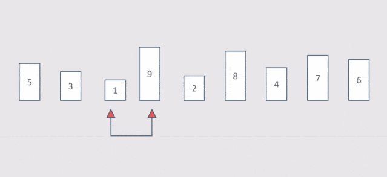

### 数据结构与算法

可以容纳数据的结构被称为数据结构。
算法是用来对数据结构进行处理的方法
数据结构是静态的。
算法是动态的。


### 线性数据结构（一维数据结构）

线性数据结构强调存储与顺序

### 数组

1、存储在物理空间上是连续的
2、底层的数组长度是不可变的
3、数组的变量，指向了数组的第一个元素的位置
a[1] a[2] []表示存储地址的偏移， 通过偏移查询数据性能最好

优点： 查询数据性能最好
缺点：
1、因为空间必须得连续，所以如果数组比较大，当空间碎片比较多的时候，容易存不下。
2、因为数组的长度是固定的，所以数组的内容难以被添加和删除


### 链表

我想传递一个链表，必须传递链表的根节点。
每一个节点，都认为自己是根节点

链表的特点：

1、空间上不是连续的。
2、没存放一个值，都要多开销一个引用空间。

优点：

1、只要内存足够大，就能存的下，不用担心空间碎片的问题。
2、链表的插入和删除操作，非常快。
3、链表可以存放任意类型的数据。

缺点：
1、查询数据性能差
2、链表不能随机访问。
3、每个节点都要多开一个引用空间。当节点内数据越大，这部分多开销的内存影响越小


### 链表的逆置

```

function Node(val) {
    this.val = val;
    this.next = null;
}
// 遍历链表
function traverseLinkedList(head) {
    let current = head;
    while (current !== null) {
        console.log(current.val); // 访问当前节点的值
        current = current.next;   // 移动到下一个节点
    }
}

// 迭代方式
function reverseLinkedList(head) {
    let prev = null;
    let current = head;
    while (current !== null) {
        let nextNode = current.next;
        current.next = prev;
        prev = current;
        current = nextNode;
    }
    return prev; // 新的头节点
}

// 递归方式
function reverseLinkedListRecursive(head) {
    if (head === null || head.next === null) {
        return head;
    }
    let newHead = reverseLinkedListRecursive(head.next);
    head.next.next = head;
    head.next = null;
    return newHead;
}


var node1 = new Node(1);
var node2 = new Node(2);
var node3 = new Node(3);
var node4 = new Node(4);
var node5 = new Node(5);
node1.next = node2;
node2.next = node3;
node3.next = node4;
node4.next = node5;

console.log(node1);


console.log("Original Linked List:");
traverseLinkedList(node1);


// const result = reverseLinkedList(node1);

// console.log(result);

// console.log("Reversed Linked List:");
// traverseLinkedList(result);


const res1 = reverseLinkedListRecursive(node1);

console.log(res1);

console.log("Reversed Linked List:");
traverseLinkedList(res1);

```

### 冒泡排序

时间复杂度分析

最坏情况：
当数组是逆序时，冒泡排序需要进行最多的比较和交换操作。
外层循环执行 ( n ) 次（其中 ( n ) 是数组的长度）。
内层循环在第一次迭代时执行 ( n-1 ) 次，在第二次迭代时执行 ( n-2 ) 次，依此类推，直到最后一次迭代执行 1 次。
因此，总的比较次数为： [ (n-1) + (n-2) + \cdots + 1 = \frac{n(n-1)}{2} ]
这个和是一个二次函数，时间复杂度为 ( O(n^2) )。

平均情况：
在平均情况下，数组元素是随机排列的。
冒泡排序仍然需要进行大约 ( \frac{n(n-1)}{2} ) 次比较和交换操作。
因此，平均时间复杂度也是 ( O(n^2) )。

最好情况：
当数组已经有序时，冒泡排序只需要进行一次完整的遍历来确认没有需要交换的元素。
这种情况下，内层循环只执行一次，总的比较次数为 ( n-1 )。
因此，最好时间复杂度为 ( O(n) )。
空间复杂度
冒泡排序是一种原地排序算法，它不需要额外的存储空间来存储数组元素，因此空间复杂度为 ( O(1) )。




```


var arr2 = [10, 9, 20, 30, 15, 25, 35, 40, 45, 50];
let num = 0;
// 冒泡排序
function bubbleSort(arr) {
    for (let i = 0; i < arr.length; i++) {
        for (let j = 0; j < arr.length - i - 1; j++) {
            num++;
            if (arr[j] > arr[j + 1]) {
                let temp = arr[j];
                arr[j] = arr[j + 1];
                arr[j + 1] = temp;
                
            }
        }
    }
}

bubbleSort(arr2)
console.log(arr2, num); // 输出排序后的次数 45 次，数组排序 如何变都是 45 次 O(n^2)


var arr = [9, 10, 15, 20, 25, 30, 35, 40, 45, 50]
num = 0;
// 优化后的冒泡排序
function bubbleSort2(arr) {
    let n = arr.length;
    let swapped;
    do {
        swapped = false;
        for (let i = 0; i < n - 1; i++) {
            if (arr[i] > arr[i + 1]) {
                // 交换 arr[i] 和 arr[i + 1]
                let temp = arr[i];
                arr[i] = arr[i + 1];
                arr[i + 1] = temp;
                swapped = true;
            }
            num++
        }
        // 每次遍历后，最大的元素会被放到最后，所以可以减少一次遍历
        n--;
    } while (swapped);
    return arr;
}


let sortedArray = bubbleSort2(arr);
console.log("Sorted Array:", sortedArray);
console.log(num); // 输出排序后的次数 9 次, O(n)

```